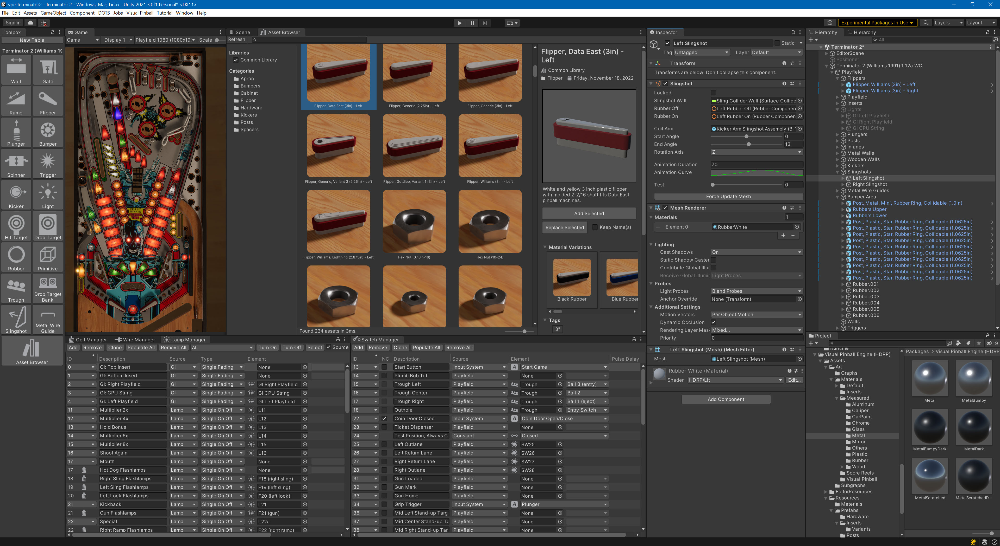

# Visual Pinball Engine

*An engine for creating and re-creating pinball machines, virtually.*

  

VPE is a toolkit with the goal of making it easy to create pinball machines 
digitally. It uses [Unity's High Definition Render Pipeline](https://unity.com/srp/High-Definition-Render-Pipeline)
and comes with extensive editor tooling that aims to provide all the features
needed for such a task. VPE can read [Visual Pinball](https://github.com/vpinball/vpinball)'s
file format and uses Visual Pinball's physics code for the simulation during gameplay.

For a more detailed overview, header over to the [website](https://docs.visualpinball.org/creators-guide/introduction/overview.html). It's also where all the new features get documented.

## History

The project started in late 2019 and is still actively being developed. We're part of the
virtual pinball community and as such, this project is a community effort. The following is
a list of relevant posts that document the progress of VPE so far.

- [Feburary 2020](https://www.vpforums.org/index.php?showtopic=43651) - First public post with VPX import working
- [Feburary 2020](https://www.vpforums.org/index.php?showtopic=43651&page=7#entry443589) - It's alive!
- [March 2020](https://www.vpforums.org/index.php?showtopic=43651&page=11#entry445624) - PinMAME is working
- [May 2020](https://www.vpforums.org/index.php?showtopic=43651&page=12#entry451724) - Physics game loop ported over from Visual Pinball
- [June 2020](https://www.vpforums.org/index.php?showtopic=43651&page=14#entry452533) - More physics
- [August 2020](https://www.vpforums.org/index.php?showtopic=43651&page=21#entry456911) - Most editor tools ported from VPX
- [October 2020](https://www.vpforums.org/index.php?showtopic=43651&page=26#entry459299) - Physics are complete, documentation site, scripting, MPF
- [October 2020](https://www.vpforums.org/index.php?showtopic=43651&page=28#entry461034) - Materials, rendering
- [November 2020](https://www.vpforums.org/index.php?showtopic=43651&page=29#entry461922) - Rendering
- [December 2020](https://www.vpforums.org/index.php?showtopic=43651&page=31#entry464464) - More rendering
- [March 2021](https://www.vpforums.org/index.php?showtopic=43651&page=32#entry470686) - Game logic
- [April 2021](https://www.vpforums.org/index.php?showtopic=43651&page=34#entry476326) - Segment display shader
- [June 2021](https://vpuniverse.com/forums/topic/5362-wip-visual-pinball-in-unity-2021-edition/) - Retrospect and the future
- [September 2021](https://vpuniverse.com/forums/topic/5362-wip-visual-pinball-in-unity-2021-edition/?do=findComment&comment=55715) - Prefabs, data, wiring, export and more
- [December 2021](https://vpuniverse.com/forums/topic/5362-wip-visual-pinball-in-unity-2021-edition/?do=findComment&comment=57681) - Insert lights rendering
- [December 2021](https://vpuniverse.com/forums/topic/5362-wip-visual-pinball-in-unity-2021-edition/?do=findComment&comment=58676) - Visual Scripting POC
- [January 2022](https://vpuniverse.com/forums/topic/5362-wip-visual-pinball-in-unity-2021-edition/?do=findComment&comment=59658) - It runs on an iPad!
- [February 2022](https://vpuniverse.com/forums/topic/5362-wip-visual-pinball-in-unity-2021-edition/?do=findComment&comment=60788) - Lighting
- [July 2022](https://vpuniverse.com/forums/topic/5362-wip-visual-pinball-in-unity-2021-edition/?do=findComment&comment=64348) - Visual Scripting, Physics, Asset Library, Tutorials, VR/AR, the future
- [December 2022](https://vpuniverse.com/forums/topic/5362-wip-visual-pinball-in-unity-2021-edition/?do=findComment&comment=67277) - Asset library, world space, score motors
- [January 2024](https://vpuniverse.com/forums/topic/9733-visual-pinball-in-unity-2024/) - From DOTS to Bursted Jobs, Kinematic Colliders
- [February 2025](https://vpuniverse.com/forums/topic/11571-visual-pinball-engine-2025-updates/) - Unrestricted transformations, Sounds, Packaging, Retrospective

During that time, we've also written [a guest article at thisweekinpinball.com](https://www.thisweekinpinball.com/a-peek-into-the-digital-creator-community/) about our community..

## VPE Repositories

The "core" of VPE (i.e. the `VisualPinball.Engine` project) is a pure C# port
of the original Visual Pinball. It has no dependencies to any proprietary third
parties, and provides the data layer.

This repository is part of a number of packages. It is what we're referring to as the **main package**, which
also includes the core project.

## Screenshots

We've put them in [a Wiki](https://github.com/freezy/VisualPinball.Engine/wiki/Unity-Screenshots). :)

## Credits

Special thanks go to JetBrains for their awesome IDE and support of the Open Source Community!

## License

Since [4616dcbb](https://github.com/freezy/VisualPinball.Engine/commit/4616dcbb), [GPL-3.0](LICENSE). Before [4616dcbb](https://github.com/freezy/VisualPinball.Engine/commit/4616dcbb), [GPL-2.0](https://github.com/freezy/VisualPinball.Engine/blob/32fd8f48d11ba961b50c72cd7f82fc4c34eba26e/LICENSE).
