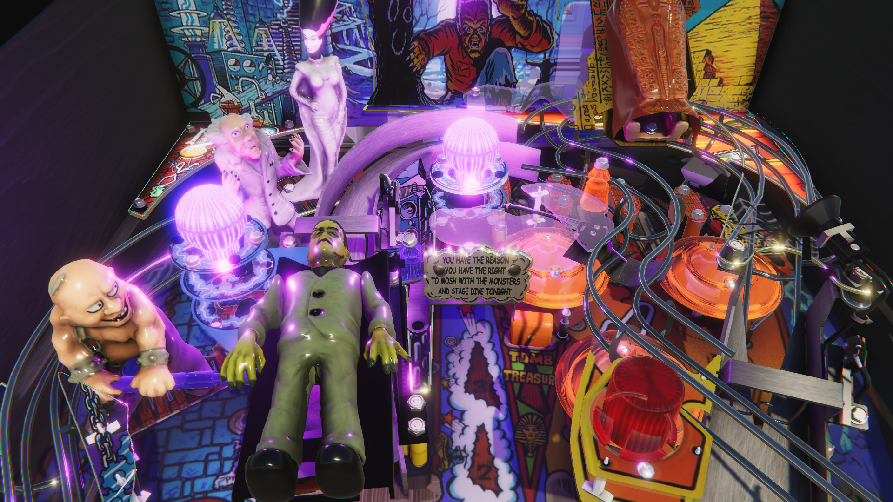

# Visual Pinball Engine for C#

*A library that implements world's favorite pinball simulator.*

***Work in progress***

## Why?

Today we have nice game engines like Unity or Godot that support C# out of the
box. The goal of VPE is to easily provide what Visual Pinball makes so great to
other "current gen" engines, while keeping backwards-compatibility.

## What?

Visual Pinball roughly consists of the following sub systems, which VPE will 
fully support:

- File format, i.e. reading and writing `.vpx` files
- A data API, i.e. editing properties of all the game items
- Media handling, i.e. dealing with sounds and images 
- A game loop, which includes:
  - Rigid body physics, i.e. movement based on mass and gravity
  - Collision detection
  - Animations
  - A transformation API, i.e. something that tells the renderer what to update
- The scripting engine

## How?

The "core" of VPE (i.e. the `VisualPinball.Engine` project) is a pure C# port
of the original Visual Pinball. It has no dependencies to any proprietary third
parties, and provides everything but the rendering engine. It is free and open
source.

We're currently focusing on Unity as a game engine, but anything about Unity
applies to Godot or other C#-based engines as well. C# allows [extending third
party classes](https://docs.microsoft.com/en-us/dotnet/csharp/programming-guide/classes-and-structs/extension-methods),
which means we can ship another DLL that just by including in your application
will add functionality to VPE.

More concretely, we include a bridge library that allows you to render VPE in
Unity. More on that [here](VisualPinball.Unity).

<small>A render of Monster Bash in Unity, imported from a `.vpx` file.</small>

## Current Status

VPE is still under development, so there is nothing much to test. If you're a
developer and you'd like to contribute, let us know, we have a Discord channel.

## License

GPLv2, see [LICENSE](LICENSE).
