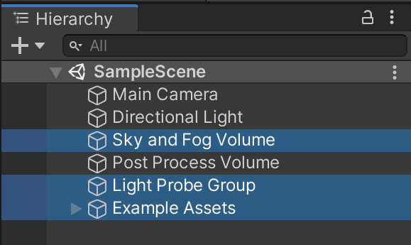
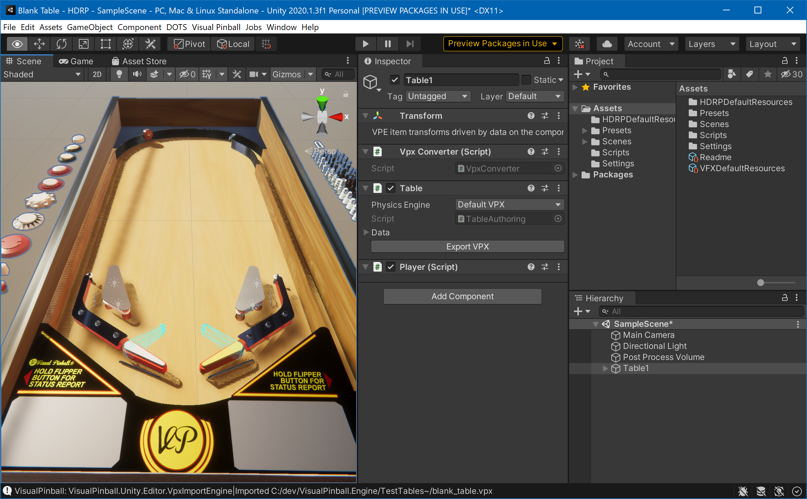

# Visual Pinball Engine

## Overview

The Visual Pinball Engine (which we call "VPE") is an open source pinball simulation software that you can use to create pinball games. It runs under Windows, Mac and Linux. It's based on the famous Visual Pinball (often called "VP", or "VPX", for its latest version 10), meaning VPE's physics world behaves the same as in VPX, and it can read and write the same file format.

VPE uses Unity for its underlying game architecture. Unity is one of the leading game engines and provides VPE with an advanced render pipeline that produces high-quality visuals and is maintained and continuously updated to work with upcoming hardware features.

Unity also comes with an amazing editor, which VPE extends to make the table creation process as easy as possible.

> [!Note] Technically, VPE is what we call a "library". A library is per se not executable, because it needs a host application. 
>
> We will provide such a host application in the long run, but for now, you need to create a new Unity project and add VPE as a package in order to run it.


## Audience

This documentation is mainly aimed at table creators ("authors"). Since it also covers the scripting aspect, it also contains code-related documentation.

VPE is currently not in a state where players are involved, so documentation about how to setup VPE to play will follow at a later stage if necessary.

## Feature List

# First Steps

## Installing VPE

### Unity

In order to start creating or tweaking tables with VPE, the first thing you'll need to install is [Unity](https://unity3d.com/get-unity/download). You will need a developer account, which is free.

> [!Note] As long as you don't use VPE for a game that makes $100K or more in revenue or funding, the free [Personal](https://store.unity.com/compare-plans) plan is sufficient for you.

Unity uses a software called *Unity Hub* to update itself and provide quick access to your projects. The install process is straight-forward and documented [here](https://docs.unity3d.com/Manual/GettingStartedInstallingHub.html) if you run into troubles.

When installing Unity, use the latest **2020.1** version. You can leave all the other options unchecked.

Once Unity is downloaded and installed, you'll need to create a new project. Unity has multiple render pipelines, and you'll be asked which render pipeline to use in your project:


You have the choice between:

- **2D** - For 2D games. VPE doesn't support this renderer.
- **3D** - Unity's original built-in renderer.
- **High Definition RP** - Unity's new [HDRP](https://docs.unity3d.com/Packages/com.unity.render-pipelines.high-definition@0.0.0/manual/index.html), used for high-end platforms.
- **Universal Render Pipeline** - Unity's [URP](https://docs.unity3d.com/Packages/com.unity.render-pipelines.universal@8.2/manual/index.html) is aimed at mobile and low-end platforms.

We recommend using HDRP. It's not as mature as the built-in renderer, but it's able to achieve better visuals, and it's what Unity will be pushing forwards in the future.

> [!Note] If you're just creating a throw-away project for testing out gameplay, the built-in renderer still seems more stable and is faster to set up.
> 
> We also support the URP, but it's not as well tested as the other two pipelines.

Next, enter a project name and a location for your project. We recommend putting the render pipeline into the name, because in the future you might test out other pipelines and thus need to create additional projects.

> [!Tip] We recommend creating a `VPE` folder in your user directory (which is called `%userprofile%`), that contains all the VPE-related files. So in this example that'd be `%userprofile%\VPE\Test Table - HDRP`, which usually resolves to `C:\Users\{username}\VPE\Test Table - HDRP`.
>
> You're of course free to set this up however you want, but that's what we'll be referring to in the rest of the documentation.

Clicking *Create* launches the Unity editor, pulls in all the dependencies for the new project, and compiles them. This can take a minute or two.

#### HDRP Setup

If you create a HDRP project, Unity provides you with a sample scene: 


It's best to get rid of it right away. In the hierarchy, select:



and press `delete`.

Equally, to clean up space, get rid of the assets in the project view:


### VPE

Now you have your project and scene set up, let's bring VPE into the game. Go to the project page and [download the source code](https://github.com/freezy/VisualPinball.Engine). You do that by clicking on the green *Code* button, and choose *Downlaod ZIP*.

As mentioned above, we recommend extracting this into the `%userprofile%\VPE\VisualPinball.Engine` folder:


In Unity, go to *Window -> Package Manager*. Click on the "plus" icon on the top left corner, and choose *Add package from disk*. Choose `package.json` in the root folder of where you've extracted the VPE source code.


This will take a moment until Unity downloads and compiles all of VPE's dependencies. When done, you should now have a *Visual Pinball* menu in the editor.

## Running VPE

Let's see if we can get some simple game play. Open VPX, create a new "blank" table, and save it somewhere. In Unity, go to *Visual Pinball -> Import VPX* and choose the saved `.vpx` file.

You should see Visual Pinball's blank table in the Editor's scene view now:


Now, we don't see much of our table. That's because the scene view's camera doesn't really point on it. Using the right mouse button and the `A` `W` `S` `D` keys while keeping right mouse button pressed, fly somewhere you have a better view of the table.

> [!Note] Check Unity's documentation on [Scene view navigation](https://docs.unity3d.com/Manual/SceneViewNavigation.html) how to easily move the camera of the scene view.

Now you have the camera of the scene view somewhat aligned.



> [!Tip] A pinball table is a relatively small object, so Unity's Gizmo icons are huge. You can make them smaller with the [Gizmos menu](https://docs.unity3d.com/Manual/GizmosMenu.html) by using the *3D Icons* slider.

But that's not the camera used during gameplay. The *Scene View* really allows you to fly anywhere, zoom in on things you're working on, switch from orthagonal view to perspective, and so on. It's where you get work done.

During game play, another camera is used. It's the one already in your scene (called *Main Camera*), and you can look through it by switching to the [Game View](https://docs.unity3d.com/Manual/GameView.html) window.

This camera you can move using Unity's gizmos, by selecting it in the hierarchy and moving and tilting it around. 

> [!Tip] A quick way to fix the game camera is to align it with the scene view camera. To do that, select the camera in the hierarchy, then click on the *GameObject* menu and select *Align with view*.

Now, click on the play button. This will run your scene. Test that the shift keys move the flippers. Press `B` to add a new ball. If it's not already choppy, it will get after a dozen or so balls, because VPE currently doesn't destroy them.

The choppiness is also due to the editor attached to the game, fetching all kind of data during gameplay, and the code not being optimized.

This should all go away if you choose *Build and Run* under the *File* menu. Running it as "build" should give you 60+ frames during gameplay.

> [!Tip] If you want to enter play mode quicker, you can check the experimental play mode option described [here](https://blogs.unity3d.com/2019/11/05/enter-play-mode-faster-in-unity-2019-3/).

## Updating VPE

VPE is under heavy development, so it's frequently updated, usually multiple times per week. In order to not have to delete your `VisualPinball.Engine` folder each time and download and extract the entire code on each update, we recommend using git.

Git is a distributed version control system. It's very sophisticated but can also be a bit overwhelming to use. However, with the cheat sheets below you should be able to handle it.

First you need to [download git](https://git-scm.com/downloads). Make sure it's on your `PATH` environment variable. There are free GUIs for git such as [Fork](https://git-fork.com/), [GitKraken](https://www.gitkraken.com/) or [Source Tree](https://www.sourcetreeapp.com/), but we'll focus on command line instructions here.

Open a command prompt by pressing the Windows key and typing `cmd`, followed by the enter key. Make sure that git is installed by typing `git --version`. This should return something like `git version 2.18.0.windows.1`.

Second, go to the folder where you want to have VPE installed. If there is already a folder where you've extracted VPE from before, delete it. 

Following the recommended file structure, you would type:

```cmd
cd %userprofile%\VPE
git clone https://github.com/freezy/VisualPinball.Engine.git
```

This downloads VPE into `%userprofile%\VPE\VisualPinball.Engine` and keeps a link to GitHub. In the future, if you want to update VPE, it's matter of going into the folder and pull the changes:

```cmd
cd %userprofile%\VPE\VisualPinball.Engine
git pull
```

However, you might have fiddled in the VPE folder to test out stuff, and git complains it can't update. Here is a way to discard all local changes and pull in what's on GitHub:

```cmd
git fetch --prune
git checkout -- **
git reset --hard origin/master
```

> [!Warning] Should you have *committed* changes (as in, you've developed something, and added and commited it to git), this will also discard those changes. But if you have done that you're probably a seasoned developer and know what you're doing, right? :)


## Tutorial

# VPE Manual

## Game Items

## Pinball Mechanisms

## Scripting

## Physics

## Plugins

# About VPE

## About this Documentation

### Authors
### License and Copyright

## FAQ

## Glossary

## Contributing to VPE