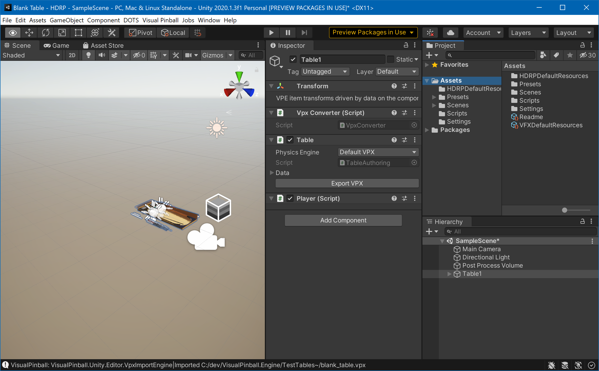
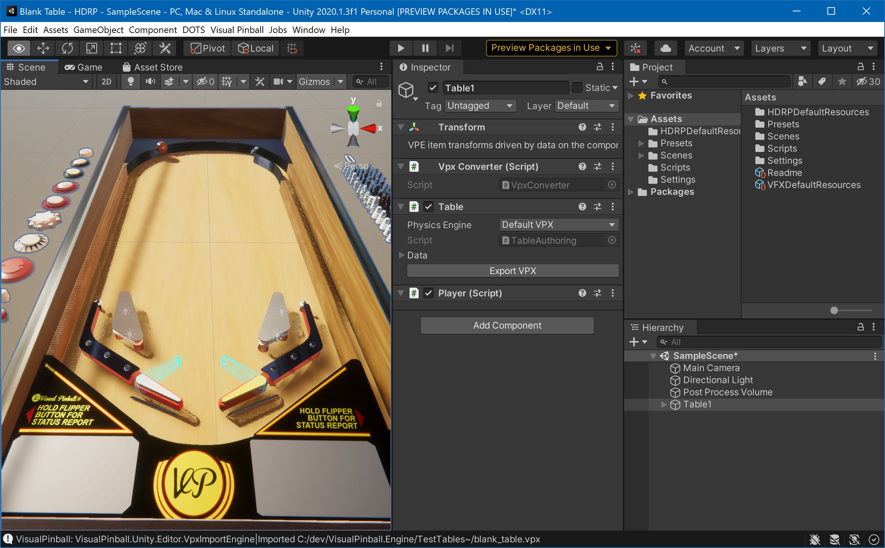

# Running VPE

Now we can get begin with some simple game play. Open VPX, create a new "blank" table, and save it somewhere. In Unity, go to *Visual Pinball -> Import VPX* and choose the new `.vpx` file.

You should now see Visual Pinball's blank table in the Editor's scene view:

Now, we don't see much of our table. That's because the scene view's camera doesn't really point on it. Using the right mouse button and the `A` `W` `S` `D` keys while keeping right mouse button pressed, fly somewhere you have a better view of the table.

> [!NOTE]
> Check Unity's documentation on [Scene view navigation](https://docs.unity3d.com/Manual/SceneViewNavigation.html) for a more complete list of ways to move the camera around the scene.

Now that you have the camera of the scene view somewhat aligned.

> [!TIP]
> A pinball table is a relatively small object, so Unity's "gizmo" icons marking scene objects are huge. You can make them smaller with the [Gizmos menu](https://docs.unity3d.com/Manual/GizmosMenu.html) by using the *3D Icons* slider.

The view in the scene tab is not the camera used in game. The *Scene View* really allows you to fly anywhere, zoom in on things you're working on, switch from orthagonal view to perspective, and so on. It's where you get work done.

During game play, another camera is used. It's the one already in your scene hierarchy (called *Main Camera*), and you can look through it by switching to the [Game View](https://docs.unity3d.com/Manual/GameView.html) window.

This camera can be moved using Unity's gizmos, by selecting it in the hierarchy and moving and tilting it around. 

> [!TIP]
> A quick way to fix the game camera is to align it with the scene view camera. To do that, select the camera in the hierarchy, then click on the *GameObject* menu and select *Align with view*.

Now, click on the play button. This will run your scene. Test that the shift keys move the flippers. Press `B` to add a new ball. If it's not already choppy, it will get after a dozen or so balls, because VPE currently doesn't destroy them.

The choppiness is also due to running the game inside the editor, fetching data during gameplay, and the code not being optimized.

This should all go away if you choose *Build and Run* under the *File* menu. Running it as "build" should give you 60+ frames per second during gameplay, depending on your hardware.

> [!TIP]
> If you want to enter play mode more quickly, you can check the experimental play mode option described [here](https://blogs.unity3d.com/2019/11/05/enter-play-mode-faster-in-unity-2019-3/).
