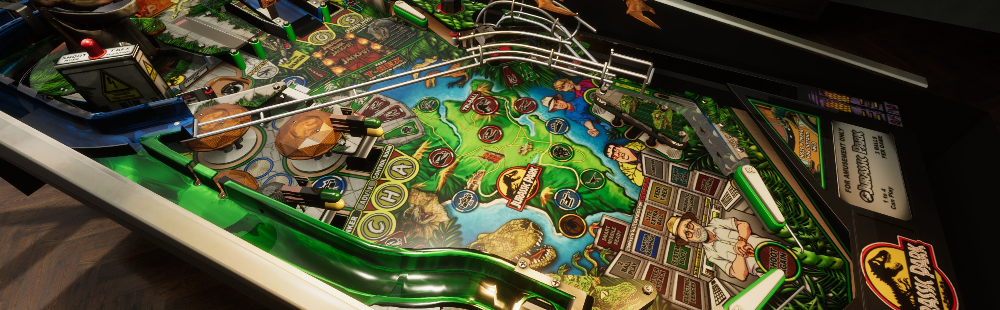

# Overview

The Visual Pinball Engine (which we call "VPE") is an open source pinball simulation software that you can use to create pinball games. It runs under Windows, Mac and Linux. It's based on the famous Visual Pinball (often called "VP", or "VPX", for its latest version 10), meaning VPE's physics world behaves the same as in VPX, and it can read and write the same file format.

VPE uses Unity for its underlying game architecture. Unity is one of the leading game engines and provides VPE with an advanced render pipeline that produces high-quality visuals and is maintained and continuously updated to work with upcoming hardware features.

Unity also comes with an amazing editor, which VPE extends to make the table creation process as easy as possible.

> [!NOTE] 
> Technically, VPE is what we call a "library". A library is per se not executable, because it needs a host application. 
>
> We will provide such a host application in the long run, but for now, you need to create a new Unity project and add VPE as a package in order to run it.

## Audience

This documentation is mainly aimed at table creators ("authors"). Since it also covers the scripting aspect, it also contains code-related documentation.

VPE is currently not in a state where players are involved, so documentation about how to setup VPE to play will follow at a later stage if necessary.
