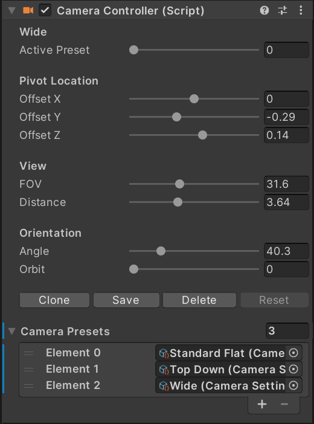

---
description: VPE allows to quickly cycle through different camera settings while editing the table.
---

# Editor Camera

The Editor Camera is a POV Camera for viewing the table in Unity's game view.  

The Game view in Unity is an analog to the built application when doing standard Unity development. For VPE, this view serves as a preview window if the final rendering of the table and is the runtime view when playing tables in the editor.  Control of the camera is done using the Camera Controller component on the Editor Camera object. 

**Basic Adjustment**
The camera orbits around a pivot point that can be translated around the table using the offset values.  The offsets are relative to the active table center.  The angle, orbit and distance values control the camera position.  Below is a table of the parameters.

|Property| Description |
|--|--|
| Active Preset | The currently active preset from the presets of available camera settings.  Three are provided as defaults and any number can  stored for future use.  These presets are saved with the project and will carry over from table to table.  |
|Offset X| Offsets the pivot on the X axis, left and right as you are looking at the table.|
|Offset Y| Offsets the pivot in the Y axis, up from the table surface. |
|Offset Z| Offsets the pivot forward and back along the Z axis.|
|FOV| Adjusts the camera field of view.  Lower values reduce perspective and flatten features where as higher values increase the sense of depth.|
|Distance| Moves the camera closer to or further away from the table along its view axis.|
|Angle| Raises or lowers the camera angle relative to the plane of the table. An eln of Zero is parallel with the table, a value of 90 is perpendicular to the playfield.|
|Orbit| Orbit rotates the camera around the pivot point, moving left and right talkative to a players normal view.|

**Camera Presets**
The camera controller provides the ability to create and quickly change between camera views.  This is used for quickly cycling to a specific view or element during the creation process.

|Property | Description |
|--|--|
|Clone| Creates a clone of the existing preset. Used to start with one for adjustment without losing the existing.  The new clone will be added after the last value in the preset list.|
|Save| Saves the current settings to the current active preset. | 
|Delete| Deletes the currently active preset. |
|Reset | Resets the current settings to the settings from the saved active preset.|
|Horizontal Speed| Controls the speed of the horizontal mouse axis when rotating at runtime.|
|Vertical Speed | Controls the speed of the vertical mouse axis when rotating at runtime. | 
|Translation speed| Controls the speed when translating the pivot point at runtime.|
|Invert Horizontal Axis| Inverts the orbiting direction.|
|Invert Vertical Axis| Inverts the elevation changes.|
|Use Inertia| When true, dragging imparts a bit of momentum to the camera resulting an ease out behavior.|

The camera controller was added as a utility that allows easy access to the most common features necessary for table development.  However, any camera controller can be made or added.  If you choose to use another camera controller it is recommended that you duplicate the camera that is under the Editor Camera object hierarchy.  It has been configured to match the VPE rendering setup and has a Camera clip plane component that controls the near and far clipping planes which is necessary to prevent various artifacts. 

> [!note]
> In most 3D engines, a depth buffer is used for many rendering features such as shadows, transparency sorting and various post process effects. This buffer is a greyscale representation of the distance of a pixel from the camera.
> As such, it has a limited value range that must be spread to cover the entire scene. The larger the range, the less precision the buffer will have. By closely cropping the range, the precision can be increased.

 **Runtime Controls**
During play mode, the camera controller allows you to adjust the view using the mouse in the game view.  

To control the camera the default controls are:

|Default Key| Action |
|--|--|
| Left Mouse Orbit + Vertical axis | Adjusts the camera elevation.|
|Left Mouse Button + Horizontal axis| Adjusts the camera orbit.|
|Right Mouse Button + Vertical axis| Adjusts the pivot Offset forward and back.|
|Right Mouse Button + Horizontal axis| Adjusts the pivot Offset left and right.|
|Mouse Scroll Wheel| Adjusts the camera distance.|
|Control + Mouse scroll wheel| Adjusts the camera FOV.|

Control configuration can be changed by editing the VPE default key bindings.

