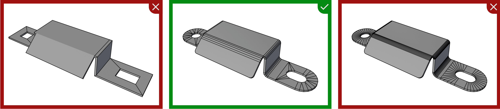
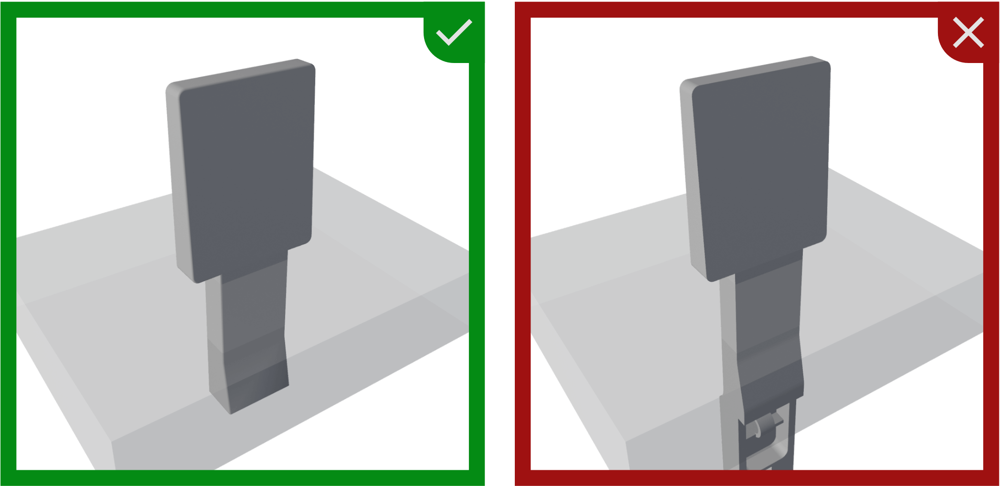
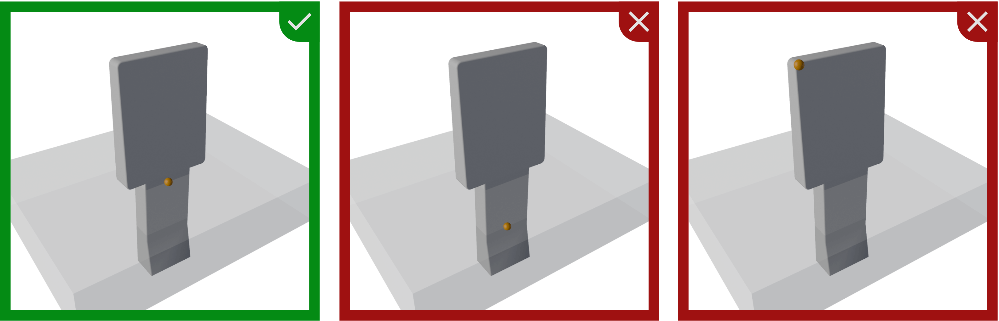
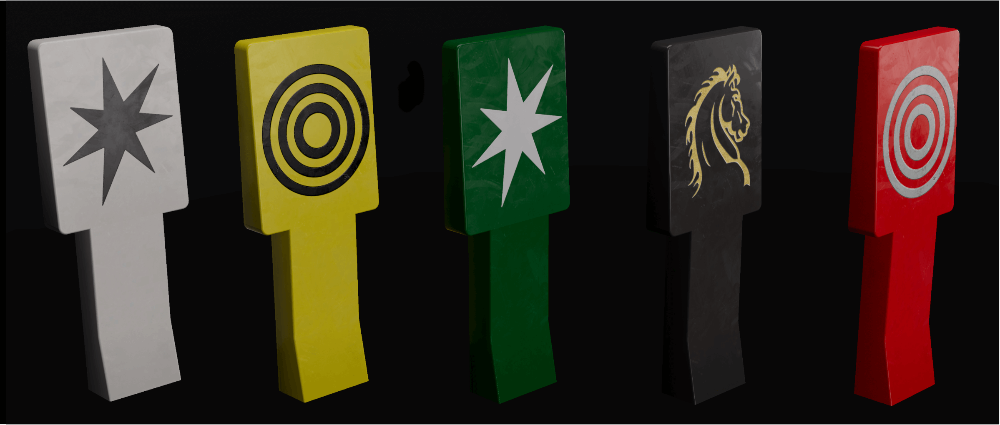
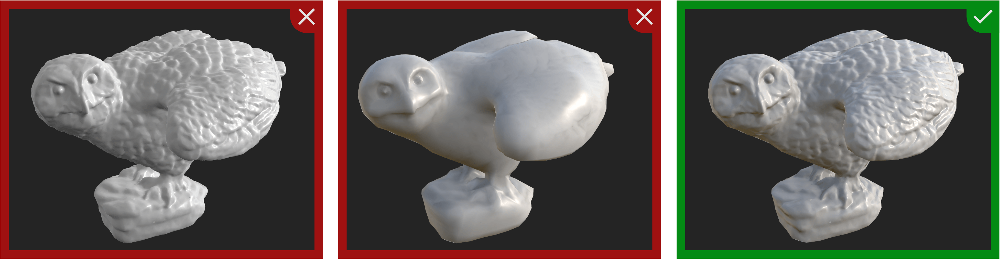
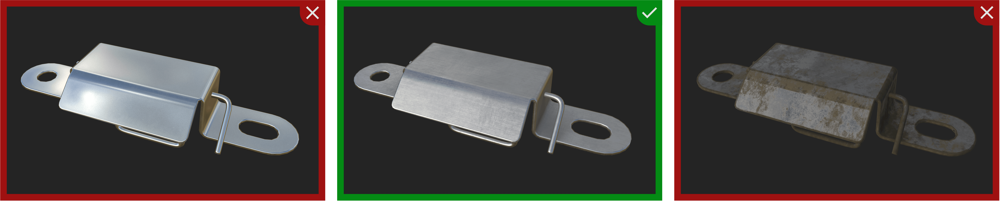

# Asset Library Style Guide

This document serves as a comprehensive style guide for all 3D assets in the pinball asset library. Our goal is to maintain assets that are high **quality**, visually **consistent**, **optimized** for performance, and **customizable**. These guidelines should be followed for the vast majority of assets; exceptions can be made in special cases.

> [!note]
> Throughout this guide, you'll see examples highlighted in red and green. They signify whether you should follow these examples.
> 
>  
> 
> That said, please consider this guide as work in progress.

## Design Language

We're aiming for a photorealistic look, as opposed to stylized visuals. Shapes should match those in the real world and maintain accurate proportions and sizes.

## Target Hardware

We're targeting desktop PC hardware. This means we should be able to make use of the latest graphics features while still being able to run on older hardware.

## Geometry Guidelines

This section covers modeling practices, i.e. how to create meshes consisting of vertices, edges, and faces.

### Topology

Topology describes how vertices and edges form the shapes of your model. While there are many ideas on best practices, here are the essentials for game-ready assets:

- Use quads where possible and avoid n-gons.
- Maintain clean topology with proper edge flow, if possible.
- Apply proper smoothing groups/hard edges for accurate normal calculation (shade smooth/flat in Blender).
- Avoid non-manifold geometry and floating vertices - make the mesh watertight.

If you're converting CAD models which aren't polygon-based, you'll likely need to apply some [retopology](https://en.wikipedia.org/wiki/Retopology). The same applies to 3D scans.

 
<i>A STEP model imported into Blender (left), versus the re-modeled version (right).</i>

### Poly Count

In [polygonal modeling](https://en.wikipedia.org/wiki/Polygonal_modeling), the poly count refers to the number of polygons used in a model. In game engines, quads and n-gons are converted to triangles, so we measure by the number of triangles. Higher triangle counts allow for more detail but increase rendering time.

Follow these poly count guidelines:

- Small objects (e.g., spinners, drop targets) can typically stay under 500 triangles.
- Standard playfield objects (e.g., flippers, bumpers) can range from about 500 to 2,000 triangles.
- Hero pieces (large ramps, toys): higher counts are acceptable, but remain mindful of necessary detail.

 
<i>A gate bracket at 108 triangles (left), 420 (middle) and 906 triangles (right)</i>

### Scale and Orientation

Unity uses a [left-handed](https://en.wikipedia.org/wiki/Right-hand_rule) coordinate system, where X points to the right, Y up, and Z forward. Your models should be oriented accordingly.

 
<i>The various orientations we're dealing with.</i>

For scale, use **meters** as your unit of measurement. It's crucial to model in real-world units to ensure correct proportions between assets, as improper scaling makes it difficult to accurately size components. Ensure that scaling is applied directly to the model's geometry, eliminating the need for rescaling within the game engine.

### Complexity

While we encourage providing details that might only be visible when pivoting around the table, nobody will examine what's below the playfield or hidden inside of other meshes.

Therefore, don't include geometry that won't be visible.

 
<i>A drop target with the entire footing which is hidden by the playfield on the right, and reduced on the left.</i>

### Pivot Point

The pivot point, also known as *object origin* or *local origin*, defines where your model appears for a given position in 3D space.
 
- Static objects should always have their vertical axis (the Y axis in Unity, or Z axis in VPX) of the pivot point at playfield height, so setting it to 0 will position the object on the playfield.
- Objects that rotate need their pivot point on the rotation axis. If such an object is parented to another (static) object, the parent should also have its vertical origin at playfield height.
- On the horizontal plane, the pivot point should be in the center unless the object's topology suggests another more logical position.

 
<i>A drop target with the origin placed at different locations.</i>

### UV Maps

All models must be [UV-mapped](https://en.wikipedia.org/wiki/UV_mapping).

- UVs should be unwrapped with minimal stretching.
- Maintain 2-4 pixel padding between UV islands to prevent texture bleeding.
- Keep UV shells proportional to their 3D size to maintain consistent texel density.
- Organize UVs within the 0-1 UV space.

### Decals

If your model contains art that varies from instance to instance, use a [decal mesh](https://docs.unity3d.com/Packages/com.unity.render-pipelines.high-definition@17.2/manual/understand-decals.html). Decals should be used where you would find literal decals or imprints in the real world. Examples include spinners, aprons, targets, and bumpers.

On the right side you see two drop target meshes which their corresponding decal meshes in orange.

The decal geometry should be in a separate object parented to the main object. The UVs of the decal mesh should be laid out in a way that allows its textures to be created with non-specialized image editors.

 
<i>Be sure to keep the aspect ratio without distortion when UV-mapping decals.</i>

> [!note]
> #### Why Decals?
> Decals are great because they make your workflow more flexible and are at the same time more performant:
> - Flexible, because it allows us to texture our models in a generic way so that they can be used in any context. Imagine a drop target with a star on it. Without decals, the star would be baked into the texture, and if anybody else would want reuse that target with different art on it, they would need to recreate the texture. With decals, they only need to swap out the decal texture.
> - Performance, because Unity is optimized for having thousands of decals in a scene, allowing us to use higher-resolution textures for our decals without having to waste resources on the rest of the object.

### Colliders

VPE uses separate meshes for collision for some items (currently drop targets and hit targets). These collider meshes must be included in the model.

- Their pivot point must align with the pivot point of the main mesh.
- The scale must be applied and correspond to the main mesh's scale.
- They shouldn't include any UVs.

You can see a hit target mesh with its collider mesh in orange on the right side.

### LODs

Regarding [LODs](https://en.wikipedia.org/wiki/Level_of_detail_(computer_graphics)) (Levels of Detail), we're only using one LOD. This guideline is based on the compact size of the playfield, where most elements would be rendered at the same LOD anyway. Additionally, most assets will be under 1,000 triangles, making the performance impact of LODs minimal.

## Material Guidelines

We use physically based rendering ([PBR](https://en.wikipedia.org/wiki/Physically_based_rendering)) for realistic visuals. In Unity HDRP, this generally means using the [Lit Shader](https://docs.unity3d.com/Packages/com.unity.render-pipelines.high-definition@17.2/manual/lit-material.html).

> [!note]
> We're still determining whether authors will be able to choose other shaders, create their own, or if usage will be restricted. We'll update this section as soon as we have more information. For now, we focus on authoring using the Lit Shader.

### Texture Maps

In the PBR workflow, these texture maps are most relevant:

- Color map (also called diffuse or albedo map)
- Normal map (often called bump map)
- Metallic map
- Smoothness map (which is an inverted roughness map)
- Ambient occlusion map

Unity also supports emissive maps, detail maps, and others depending on the material type, but we'll focus on those mentioned above.

### Color Maps

The color map contains RGB values that represent surface color without lighting information.

If your asset or parts of your asset exist in multiple color variations, consider using only gray tones and tinting the material with the Lit shader's base color. This approach makes it customizable without having to render out textures for each color variant (and is also more memory-efficient).

 
<i>A drop target with the same base material but different tints, and three different decal materials.</i>

As mentioned above, don't bake art that varies into the texture; use decals instead. Single-color decals that come in multiple color variations should also use a gray-tone color map and be tinted through the Decal Shader directly, making them more easily customizable without requiring multiple material instances.

### Normal Maps

[Normal Maps](https://en.wikipedia.org/wiki/Normal_mapping) simulate lighting effects on surface details without adding geometry. Generally, if a detail doesn't have any silhouette-defining features and isn't deep enough to cast visible shadows, flatten it and bake it as a normal map.

 
<i>A playfield toy at 185k tris (left), 2.7k tris without normal map (middle) and with normal map (right).</i>

Edges are particularly important for achieving realistic visuals. In the real world, light always reflects off edges because they are never perfectly sharp. To simulate this, you should always bevel your edges. For models with few prominent edges, you can add bevels in the geometry. However, baking the bevel into a normal map is typically more efficient.

 
<i>A gate with beveled geometry at 3.6k tris (left), at 420 tris without normal map (middle) and with normal map (right).</i>

To summarize, use normal maps for:

- Surface details (scratches, small dents, panel seams)
- Shallow details (<5mm in real scale)
- Beveled edges
- Text or logo embossing
- Pattern detailing

### Metallic / Smoothness Maps

With a metallic map, you can define on pixel level whether your material is metallic, or not. 
- Only use this if your material covers both metallic and non-metallic parts of your model. Otherwise, use the metallicness property of the Lit Shader directly.
- You should only use values of 0 or 1, as partially metallic materials don't exist in the real world.

The smoothness map (the inverse of a roughness map) defines how regularly light is reflected at the micro-surface level. A value of 1 behaves like a mirror, while a value of 0 is more like an eraser.

 
<i>Metallicness set to 1 with smoothness going from 0 to 1.</i>

### Texture Map Resolution

All texture maps must use power-of-two dimensions for width and height (e.g., 256, 512, 1024). They don't have to be square.

 
<i>Metallicness set to 1 with smoothness going from 0 to 1.</i>

We're aiming for a resolution of about 6 pixels per millimeter (approximately 150 DPI). For a playfield texture, this means roughly 4096×8192 pixels. Use this resolution when possible, but don't upscale images — the highest resolution should be from your source. This applies to both color and normal maps. For metallic/smoothness maps, half the resolution of the color map is a good balance between performance and visual fidelity.

> [!note]
> You can determine the resolution by looking at your UV map and the size of the asset. Let's take the gate from the previous section as an example.
>
> 1. Take a large section of your mesh, and measure it. The larger, the more precise it will be. Here I'm measuring the top surface, from where the bevel starts: 
>    
> 2. Next, identify that section on your UV map, and note where in UV space they are: 
>     
>    As you can see, they go from 0.360 to 0.955 on the X axis.
> 3. In terms of dimensions, we now have the following:
>    - Width in UV space: 0.955 - 0.36 = 0.595 
>    - Width in real world space: 29.2mm
> 4. At 6px / mm, that makes 6px * 29.2mm = 175.2px for the 0.595 UVs
> 5. To get the resolution of the whole UV map: 175.2px / 0.592 = 296px
> 
> So, a texture map at 296×296 would correspond to 6px / mm. Since we're at power of twos, we can go for either 512×512 or 256×256.   

### Wear

Generally, all items should show visible signs of wear, rather than appearing brand new from the factory. This adds realism and character to the assets (and hopefully Blender versions as well).

 
<i>They certainly have each their look. But in order to keep consistency, you should follow the example in the middle.</i>

### Standard Materials

Many materials in the asset library will appear in multiple assets. To keep a consistent look across all assets, you should use existing materials. We're providing Substance Painter Smart Materials for metals and plastics.

ℹ️ &nbsp;Table coming soon

## Attribution

When submitting assets to the library, please include your name or handle for proper attribution. If you've adapted assets from other sources, ensure you have the necessary rights and include appropriate credits.

## Where to Submit

Don't submit yet! 😄

We're still figuring out the best structure and repository for our asset library (our [current repo](https://github.com/VisualPinball/VisualPinball.Unity.AssetLibrary) is getting too large). There will also be additional guidelines about metadata.

This section will be updated when we're ready!
