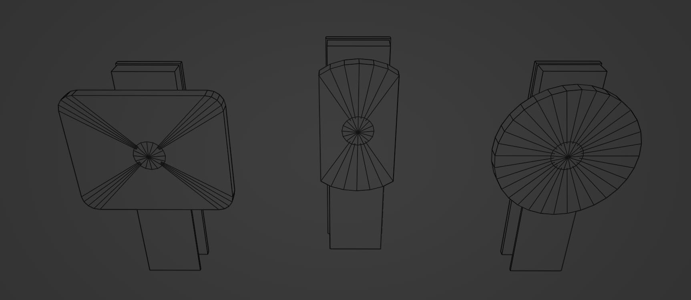
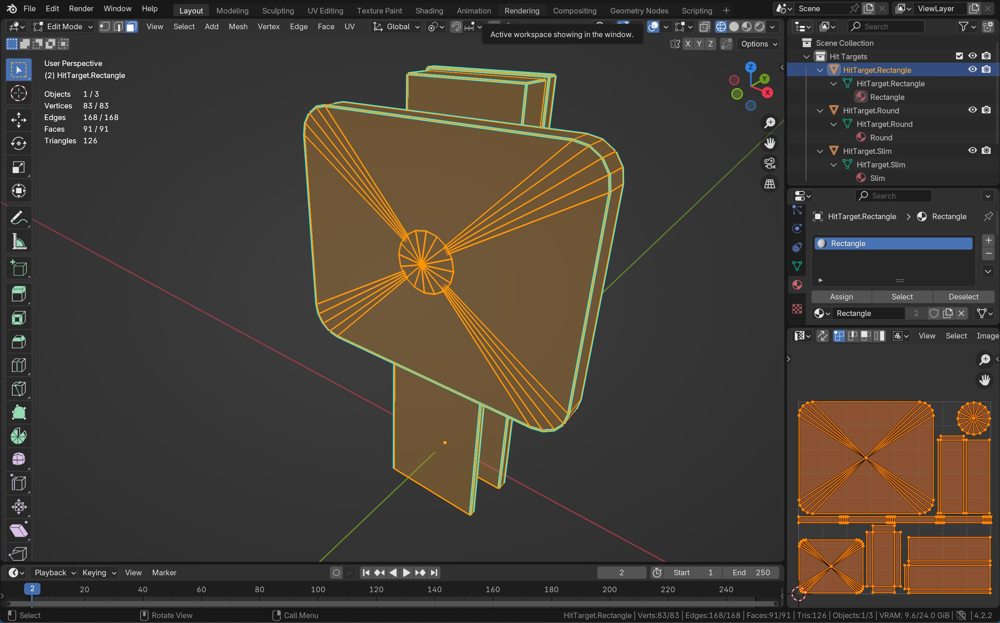

---
uid: asset_library
title: Asset Library
description: The asset library is a collection of all the assets used in your pinball project, such as prefabs, 3D models, materials and sounds.
---
# Asset Library

The asset library is a centrally maintained collection of pinball assets that table authors can use in their table builds. It comes with a browser, a tagging system, search and preview.

## Contributing

All assets are free to use, and anybody can contribute to it.

### Material Separation

When starting off, you usually already have some geometry, and in case you're about to contribute multiple assets, you're probably wondering how apply your materials. When dealing with multiple objects, there are generally **two approaches** how to apply materials to them.

Let's say we want to add a bunch of hit targets. This is the geometry we have:



With both approaches, these files will be generated: 

- `Hit Targets.fbx` - The exported `.fbx` file.
- `Hit Target - Rectangle.prefab` - The Unity prefab of the rectangular hit target.
- `Hit Target - Rectangle, Slim.prefab` - The prefab of the slim hit target. 
- `Hit Target - Round.prefab` - The round hit target

Let's look at how the two approaches apply materials to these objects.

#### Approach 1 - One material per object

This way of applying materials is to use a single material for every object. This works best if no part of the object contains any transparency or subsurface scattering or any other special attributes that are not part of Unity's PBR workflow.



The UV mapping in this case is quite standard - map the entire object to one texture set.

After creating the materials and baking them out to the maps, it renders as if multiple materials were applied to the object, but technically, it's a single material:


<small><center>*The base map, mask map and normal map of the rectangle hit target material.</center></small>*

This would result in the following files:

- `Drop Target - Rectangle.mat` - The Unity material applied to the entire mesh
- `Drop Target - Rectangle - BaseMap.png` - The color map of the material
- `Drop Target - Rectangle - MaskMap.png` - The mask map of the material
- `Drop Target - Rectangle - Normal.png` - The normal map of the material

> [!NOTE]
> For brevity, we'll skip the other two materials that cover the slim and round hit target.

#### Approach 2 - Texture atlas

Instead of grouping per object, we could also group by "physical" material, i.e. one material for the plastic, one for the metal, and one for the rubber, but applied to all three objects.


Here are the texture maps for the plastic material. It's valid for all three hit targets, and what's called a *texture atlas*:


This would result in the following files:

- `Drop Targets - Plastic.mat` - The Unity material
- `Drop Targets - Plastic - BaseMap.png` - The color map of the plastic material
- `Drop Targets - Plastic - MaskMap.png` - The mask map of the plastic material
- `Drop Targets - Plastic - Normal.png` - The normal map of the plastic material

> [!NOTE]
> For brevity, we'll skip the other two materials that cover the metal and rubber material.

#### Which Approach is Best?

Both approaches have pros and cons. In terms of performance, the pros and cons depend on whether the scene (a pinball table) is likely to include many of the objects you're creating. If that's the case, then the better approach is #2, the texture atlas:

- Less draw calls, as multiple objects can share the same material and texture set.
- More optimized memory, since a single material and texture set can be more efficient than multiple individual materials and textures. 
- More batching-friendly, as objects using the same material can be dynamically batched by Unity.

There is also a non-technical advantage: It's easier to create variations of your materials. For instance, if you want to create a worn version of the plastic, you'd simply bake out a new set of maps which you can then apply independently to your objects, versus having to do it individually for each object.

However, if the objects are less likely to be all present in the scene, then approach #1 probably the better choice:

- More optimized memory, since none of the textures are unused
- Easier UV-mapping, since UV-mapping multiple objects to a single map can be more challenging and less trivial to understand than to a single object.

In general practice, for small objects that have lots of variations and that are likely to find themselves together on the same table, we're using a texture atlas. This includes screws, rods, washers, spacers, posts, and so on. For more complex objects, we're using a single material or even multiple materials per object. This includes bumpers, targets, flippers, gates, spinners, etc. These are generally objects that don't have any variation per table.

## Naming Conventions

Asset naming is somehow important because it can help the user figure out the relations between assets. There are several things to name:

- **Prefab** - The name of the Unity prefab that shows up in the asset browser.
- **Model File** - The model file, i.e. the `.fbx` or `.obj` files.
- **Material Slot** - The names of the material slots within the model file.
- **Unity Material** - The name of the material within Unity.
- **Texture File** - The name of the various maps generated per material.

> [!NOTE]  
> There is also the original model source of the program used to model, e.g. Blender. How to name this is up to the user, since that's not typically a file that is part of the project. However, for the asset library, we're including the `.blend` files, and they have a naming convention, too.

To complicate things more, the relations between prefabs, models, and materials can different.

- A model file can contain multiple meshes, e.g. we keep all VPX gates in one .fbx file.
- A prefab might consists of multiple meshes, sometimes from multiple files, e.g. the bumper ring and base are common in many bumper variations.
- A mesh might use multiple materials, but a material can also be used for multiple meshes (see the two aproaches above).
- A material usually uses multiple textures, or maps, but in the vast majority of cases, these maps are specific to the material.

### Prefabs

Prefabs are the files that appear in the asset library. They link the mesh together with the materials and the Unity components necessary for the prefab to work. We name them as descriptively as possible:

```
<prefab description> (<prefab variation>)
```

The `<prefab description>` goes from more to less specific, using commas. The `<prefab variation>` is the least specific part of the description. If an asset is an original VPX asset, `<prefab variation>` is "VPX".

Examples:
- `Bumpers/Williams/Bumper (Williams).prefab`
- `Kickers/VPX/Kicker, Cup 2 (VPX).prefab`
- `Hardware/6 Gauge/Hex Nut, Flanged (6-32).prefab`
- `Posts/Plastic Posts/Post, Plastic, Star, Double, Rubber Rings, Collidable (1.0625in).prefab`

### Model Files

Model files are what's exported from your 3D software. They are usually `.fbx`, `.glb` or `.obj` files, although `.fbx` is (still) recommended. These are where Unity pulls the mesh data from.

Their naming isn't essential since they are rarely user facing, and we usually keep only one model file per folder, so they're named after their folder name, but still in a way it makes it clear what they are.

Examples:
- `Bumpers/Williams/Bumper (Williams).fbx`
- `Kickers/VPX/Kicker, Cup 2.fbx`
- `Hardware/6 Gauge/Hardware 6-gauge.fbx`
- `Posts/Plastic Posts/Plastic Posts.fbx`

### Material Slots

Material slots are how the materials in the model file are named. If you're using Substance Painter, that's the default way how your generated maps will be named. However, this is only relevant if you're using multiple materials for an object, since one-object materials (approach 1 above) have the same name as the prefab.

For texture atlases, the slots should be named as short as possible and describe the material, for example `Base` for the bumper base, or `Cap`.

For materials that cover the entire object, they should be named like the object.

### Unity Materials

Unity materials are visible by the table creators, so it's important to name them in a way that makes clear what they are. Depending on whether you're using texture atlases or not, they should include the name of the material.

Examples:

- `Bumpers/Williams/Bumper (Williams) - Base.mat`
- `Bumpers/Williams/Bumper (Williams) - Ring.mat`
- `Kickers/VPX/Kicker, Cup 2.mat`
- `Hardware/6 Gauge/Hardware 6-gauge - Metal.mat`
- `Hardware/6 Gauge/Hardware 6-gauge - Nylon.mat`
- `Posts/Plastic Posts/Plastic Post - Metal.mat`
- `Posts/Plastic Posts/Plastic Post - Plastic, Red.mat`
- `Posts/Plastic Posts/Plastic Post - Plastic, Yellow.mat`

### Texture Maps

Texture files are closely related to a material, so we'll name them the same and append the type of map.

Examples:

- `Bumpers/Williams/Bumper (Williams) - Base - BaseMap.png`
- `Bumpers/Williams/Bumper (Williams) - Base - Normal.png`
- `Kickers/VPX/Kicker, Cup 2 - BaseMap.png`
- `Hardware/6 Gauge/Hardware 6-gauge - Metal - BaseMap.png`
- `Posts/Plastic Posts/Plastic Post - Plastic, Red - MaskMap.png`
- `Posts/Plastic Posts/Plastic Post - Plastic, Red - Normal.png`
