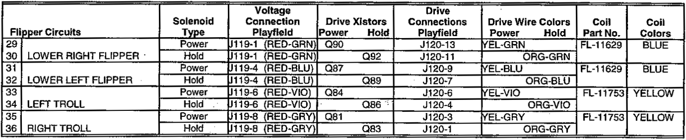
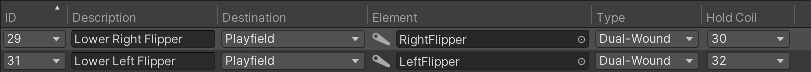

# Coil Manager

On a real pinball table most moving parts, including the flippers, are triggered by [coils](https://en.wikipedia.org/wiki/Inductor) (also called [solenoids](https://en.wikipedia.org/wiki/Solenoid)). In VPE it's the job of the [gamelogic engine](xref:gamelogic_engine) to trigger them when needed.

Just as the coils are physically wired to the power driver board on a regular machine they can be virtually connected in VPE using the coil manager under *Visual Pinball -> Coil Manager*.

## Setup

Every row in the coil manager corresponds to a logical wire going from a gamelogic engine output to the coil. As with switches, a single coil can be linked to multiple outputs, and an output can be linked to multiple coils.

### IDs

The first column, **ID** shows the name that the gamelogic engine exports for each coil.

> [!note]
> As we cannot be 100% sure that the gamelogic engine has accurate data about the coil names, you can also add coil IDs manually, but that should be the exception.

### Description

The **Description** column is optional. If you're setting up a re-creation, you would typically use this for the coil name from the game manual. It's purely for your own benefit, and you can keep this empty if you want.

### Destination

The **Destination** column defines where the element in the following column is located. There are three options:

- *Playfield* lets you select a game element on the playfield that features the coil
- *Device* lets you choose a *coil device*, a mechanism which may include multiple coils, such as a [trough](xref:troughs).
- *Lamp* sets the coil to be configured in the lamp manager (see [flashers in the lamp manager](xref:lamp_manager#flashers) for more details).

### Element

The **Element** column is where you choose which specifc element in the destination column should be activated. VPE can receive coil events for bumpers, flippers, kickers and plungers and coil devices.

> [!note]
> Bumpers are currently hard-wired, i.e. their switch will directly trigger the coil without going through the gamelogic engine. That means they don't need to be configured in the switch or coil manager. VPE will make this configurable in the future.

### Type

In the **Type** column you can define whether the coil is single-wound or dual-wound. There's an excellent page about the differences in [MPF's documentation](https://docs.missionpinball.org/en/latest/mechs/coils/dual_vs_single_wound.html). In short, dual-wound coils have two circuits, one for powering the coil, and one for holding it, while single-wound coils only have one.

This changes how the coil powers off:

- For **single-wound** coils, VPE uses the same coil's events for powering on and off.
- For **dual-wound** coils, it uses the *on* event from the main coil and the *off* event from the hold coil.

### Hold Coil

When the coil type is set to *Dual-Wound*, this column defines the hold coil event, i.e. the event on which the coil powers off.

Dual-wound coils are fairly common. For example, *Medieval Madness* has the following dual-wound coils:

<small>*From the Medieval Madness manual*</small>

In VPE, the two flippers would map to the following configuration:

