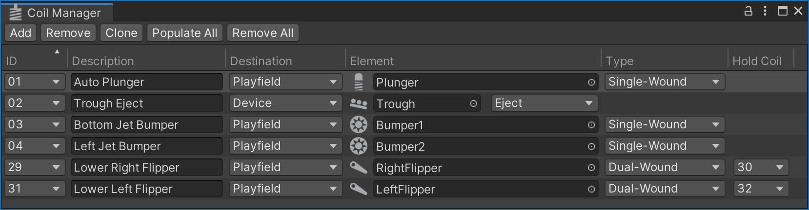

# Coil Manager

On a real pinball table, most moving parts, including the flippers, are triggered by [coils](https://en.wikipedia.org/wiki/Inductor) (also called [solenoids](https://en.wikipedia.org/wiki/Solenoid)). It's the job of the [gamelogic engine](~/creators-guide/manual/gamelogic-engine.md) to trigger them when needed.

On a typical table there are usually several coils that need to be wired up to the controller board. In VPE, you can do that with the coil manager under *Visual Pinball -> Coil Manager*.

## Setup

Every row in the coil manager corresponds to a wire going from the gamelogic engine output to the coil. Similar to switches, a coil can be linked to multiple outputs, and an output can be linked to multiple coils.

### IDs

The first column **ID** shows the coil names that the gamelogic engine expects to be wired up.

> [!note]
> As we cannot be 100% sure that the gamelogic engine has accurate data about the coil names, you can also add coil IDs yourself, but that should be the exception.

### Description

The **Description** column is an optional free text field. If you're setting up a re-creation, that's where you typically put what is in the game manual. It's purely for your own benefit, and you can keep this empty if you want.

### Destination

The **Destination** column defines where the element in the next column is located. Currently, VPE only supports playfield items with one coil. In the future, VPE will support devices with multiple coils, which will also be listed here.

### Element

The **Element** column is where you choose the playfield element with the coil. VPE can receive coil events for bumpers, flippers, kickers and plungers.

> [!note]
> Bumpers are currently hard-wired, i.e. their switch will directly trigger the coil without going through the gamelogic engine. That means they don't need to be configured in the switch- or coil manager. VPE will make this configurable in the future.

### Type

There are two modes in which a coil can be triggered:

- **On/Off** has two distinct events, one for enabling, and one for disabling the coil. For example, a flipper coil gets enabled when the player presses the flipper button, and disabled when the button is released.
- **Pulse** only receives one trigger event which makes the coil enable and disable automatically after a given delay.

### Off

This column only applies to pulse coils, and defines the period of time the coil will stay under current. After that period expires, the coil will turn off.

> [!note]
> In most cases, the *Off* delay is not important. It means only the enable event is going to be used. However, since VPE's coils all have a state, you can define how long it lasts.
