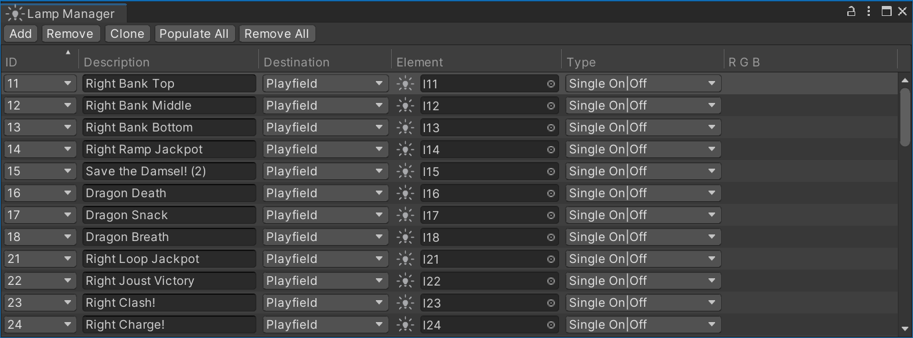
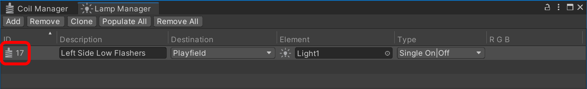

# Lamp Manager

VPE uses the Unity game engine to accurately simulate the many types of lamps a real pinball machine might use, and connect them to the gamelogic engine. Lamps have a standard set of parameters, which can be tweaked in the editor. Lamps in a game are dynamic, so the gamelogic engine can toggle them, fade them, and even change their color.

To link each of the playfield lamps to the gamelogic engine and configure how they behave during gameplay, the *Lamp Manager* is used. You can find it under *Visual Pinball -> Lamp Manager*.

> [!note]
> We use the terms *lights* and *lamps* as follows:
> - With **light** we're referring to one of the Unity rendering engine's [lights](https://docs.unity3d.com/Packages/com.unity.render-pipelines.high-definition@10.2/manual/Light-Component.html). It's a simulated light source which doesn't have to be a physical element on the table, but can also refer to the sun, some directional scene light, or other types of lighting used in the rendering.
> - With **lamp** we're referring to a virtual "bulb" that is present on the table. It's a logical component VPE uses during gameplay, decoupled from the actual visual display.

## About Lamps

Physical machines have many different implementations when it comes to lighting. The vast majority of solid state machines from the 1970s until the early 2010s used a **lamp matrix**, where lamps were addressed by row/column, and each individual lamp could only be fully on or off. Historically, incandescent light bulbs were used, which resulted in a brief warm-up period until they reached full brightness (and a cool-down period when turned off). To simulate this, VPE adopted the fade-in and fade-out properties for lights from Visual Pinball.

Later machines used single colored **LEDs** that were each directly connected to a controller board (see also: [Lights vs LEDs](https://docs.missionpinball.org/en/latest/mechs/lights/lights_versus_leds.html)). Unlike matrix lamps, the intensity of LEDs could be finely controlled by the game software.

More recently, games started using **RGB-LEDs** that can change color as well as brightness during gameplay. In VPE, these can be handled in two different ways:
- As three single connections from the gamelogic engine, one for each color channel (this is what PinMAME provides, for example.)
- With a single RGB connection, where the gamelogic engine always provides the full color (used by MPF, or custom table logic.)

Additionally, most pinball machines come with **GI strands**, which are a set of bulbs used for global illumination of the playfield. All lights in a strand are addressed at once, so one gamelogic GI strand maps to multiple lamps on the playfield.

Finally, some high-powered lamps such as flashers may appear under the gamelogic engine's **coil outputs**, since those lamps operate on higher voltage and have the same properties as coils.

## Setup

Every row in the lamp manager corresponds to a logical connection between the gamelogic engine and a lamp on the playfield. A lamp may be linked to multiple outputs, and an output can be linked to multiple lamps.

### IDs

The first column, **ID** shows the name that the gamelogic engine exports for each lamp.

> [!note]
> Since we cannot be 100% sure that the gamelogic engine has accurate data about the lamp names, you can also add lamp IDs manually, but that should be the exception.

### Description

The **Description** column is optional. If you're setting up a recreation, you would typically use this for the lamp name from the manual. It's purely for your own benefit, and you can leave this empty if you want.

### Destination

The **Destination** column defines where the lamp is located. Currently, *Playfield* is the only option.

### Element

Under the **Element** column, you choose which lamp among the game items on the playfield should be controlled.

### Type

The **Type** column defines how the signal is interpreted by the lamp. This is important, because the gamelogic engine typically sends integer values to the lamp. There are four types:

- *Single On|Off* - Typically lamps from the lamp matrix. They can only be on or off. Receiving `0` will turn the lamp off, any other value will turn it on.
- *Single Fading* - Individual lamps which can be dimmed by the gamelogic engine. Received values can range from `0` to `255`, where `0` turns the lamp off, and `255` sets it to full intensity.
- *RGB Multi* - An RGB lamp that can change its color during gameplay. Lamps of this type receive three connections, one from each red, green and blue. Each color channel receives values as a fading lamp.
- *RGB* - An RGB lamp that receives its data from a single connection. This is the only mode where the lamp doesn't receive an integer, but an entire color value.

### R G B

If the type of the previous column has been set to *RGB Multi*, here is where you link each wire to a color. Note that the *red* channel is always the one shown under the *ID* column, so changing the red link will also change the ID (and vice versa).

## Flashers

When using a gamelogic engine that simulates real hardware such as PinMAME, high-powered lamps like flashers usually show up as coils connected to the driver board. 

To support this VPE allows routing coil outputs to lamps. For that, go to the [Coil Manager](coil-manager.md) and select *Lamp* as **Destination**:

This will make the coil show up in the lamp manager where you can configure it:

Note that you cannot change the *ID* of the lamp, because it's still linked to the coil. Also, removing or changing the coil destination will remove the entry from the lamp manager. Changing the ID in the coil manager will also update it in the lamp manager.

## GI Strands

There is currently no special support for GI strands. In Visual Pinball, you can put GI lamps into a collection and address the whole collection at once via script. VPE doesn't have this feature yet. In order to hook up GI lamps, you can add an entry for each lamp and link all of them to the same ID.

We'd like to make this easier in the future, so we're thinking of integrating this into the editor directly.

## Editor vs Runtime

While editing the table in the Unity editor, you may find it helpful to disable lamps you're not editing. During runtime, VPE first turns all lamps off, then turns on the constant lamps, and then transfers control of the lamps to the gamelogic engine.

If you are running the game in the editor, the lamp manager shows the lamp statuses in real time:

