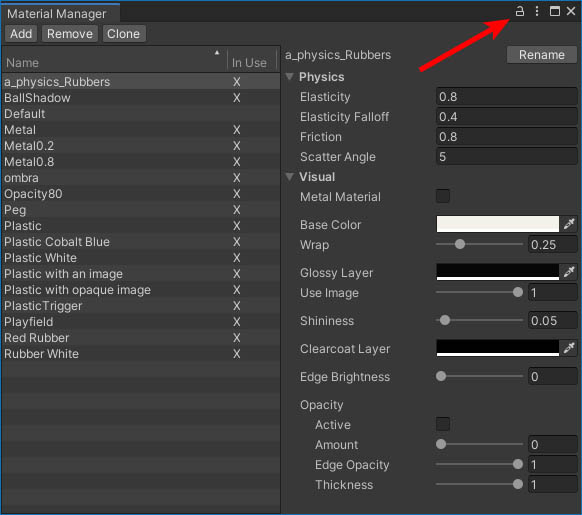

# Working with Multiple Tables

When working on a creation, you might want to load other tables to pick assets from. For that, Visual Pinball lets you open multiple tables allowing to switch and copy elements between them relatively quickly.

With VPE, you can create or import multiple tables into your scene. VPE's manager panels will switch context when an element from a different table is selected in either the Scene view or the Hierarchy.

> [!tip]
> You can lock a manager window to the selected table by clicking on the small lock in the top right corner:
>
> 

> [!warning]
> We don't have multi-table support during runtime yet. The idea is that in the future, you would be able to select which table is the runtime table.

> [!warning]
> Moving elements between multiple tables is not implemented yet, there is an [open issue](https://github.com/freezy/VisualPinball.Engine/issues/149).
