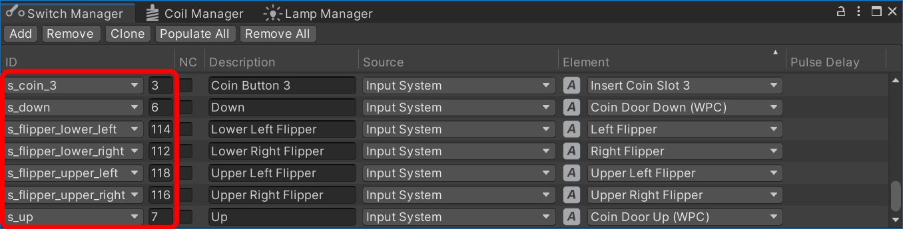

# Switch Manager

During gameplay, the [gamelogic engine](~/creators-guide/manual/gamelogic-engine.md) needs to know what is happening on the playfield. For that, real pinball tables have switches on the playfield that signal when a ball rolls over or settles in a certain position. These switches are also built into targets, bumpers, kickers, and other mechanisms (see *[Supported Game Mechanisms](#supported-game-mechanisms)* below).

Wiring these switches up to the gamelogic engine with code can be a tedious process, so VPE provides a graphical interface where you can do it easily. If you've named them appropriately it can even guess which switch maps to which game item.

You can open the switch manager under *Visual Pinball -> Switch Manager*.

<small>Switch matrix from *Medieval Madness*.</small>

## Setup

Imagine every row as a wire connecting the physical switch to the gamelogic engine. The relation between the two is *0..n -> 0..n*, meaning you can link multiple switches to one input or a single switch to multiple inputs.

### IDs

The first column **ID** shows the names of each switch that the gamelogic engine is aware of. There are two values to fill out here:

1. The first, the dropdown value, is the ID that *VPE* will use to identify the switch. 
2. The second, an integer value, is the ID the *gamelogic engine* is using.

This allows the gamelogic engine to make certain switches more explicit. For example, PinMAME has the same switch mapping all ROMs of a given game. These switches have a readable ID, which then translates into the numeric "magic value" that PinMAME uses internally.

<small>Global PinMAME switches of WPC games.</small>

> [!note]
> As we cannot be 100% sure that the gamelogic engine has accurate data about the switch names, you can also add switch IDs yourself, but those should be the exception.

### NC

The "NC" stands for **Normally Closed**. In short, enabling this inverts the value sent to the gamelogic engine.

As for the long explanation, think about how switches work. Mechanical switches are usually *normally open (NO)*, meaning they are open by default and close when the ball rolls over them (or, if it's a button, when the button is pressed). 

But some switches behave differently. In opto-switches for instance, the light beam closes the circuit by default, and a ball rolling through it (and thus blocking the light) opens the switch. These type of switches are *normally closed (NC)*.

> [!note]
> In the very first screenshot, you'll notice that the trough switches are normally closed. This is because MM uses a modern trough with opto-switches. There is also the coin door we'd like to have closed by default and open the switch when the coin door is open.

### Description

The **Description** column is optional. If you're setting up a re-creation, you would typically use this for the switch name from the game manual. It's purely for your own benefit, and you can keep this empty if you want.

### Source

The **Source** column defines where the element in the following column originates. There are four options:

- *Playfield* lets you choose a game item from the playfield
- *Input System* lets you choose an input action from a pre-defined list, e.g. cabinet switches
- *Constant* sets the switch once at the beginning of the game to the given value.
- *Device* lets you choose a switch device containing the switch. Switch devices are mechanisms that include multiple switches, for example [troughs](../manual/mechanisms/troughs.md).

### Element

The **Element** column is where you choose which element triggers the switch. 

For **Playfield** sources, you can choose a game item that triggers switch events. Currently, VPE only emits switch events for items that would do so in real life, i.e. bumpers, flippers, gates, targets, kickers, spinners and triggers. 

> [!note]
> We realize that you might want to use other game items like ramps and walls to emit switch events as well, and we will address this at some point, but for now we're keeping it simple.

If **Input System** is selected, you choose which input action to use (it's an "action", because it's not an permanent key binding). Actions may have default key bindings, but the final bindings to a key or other input will be defined in the host application (the VPE player).

If the source is a **Device**, then there are two values to select. The actual switch device, and which switch of that device should be connected to the gamelogic engine.

Finally, if **Constant** is selected, you choose the value that will be permanently set at the beginning of the game.

### Pulse Delay

Internally, VPE connects switches to events. For example, a trigger on the playfield has a `Hit` event, which occurs when the ball rolls into the trigger's collision zone, and an `UnHit` event when the ball leaves that zone. These two events close and open the trigger's switch.

However, not all mechanisms behave like that. For example a spinner emits a single `Spin` event. So to prevent the switch from being closed indefinitely VPE automatically re-opens it after a given delay.

We call that the **Pulse Delay**. "Pulse", because it gets triggered by one event and reopens after a brief delay. 

In most cases, you can leave the default delay of 250ms. What's important is that the gamelogic engine gets notified not too long after the switch was closed. Note that if pulse delay is set to 0, the switch will stay closed.

## Supported Game Mechanisms

Below a list of game mechanisms that contain built-in switches.

|             | Closes                                                  | Opens                                                                         |
|-------------|--------------------------------------------------------|------------------------------------------------------------------------------|
| **Bumper**  | On ball collision                                      | *After pulse delay*                                                    |
| **Flipper** | On EOS, i.e. when the flipper reaches its end position | When the flipper switch is opened, i.e. the flipper starts moving down again |
| **Gate**    | When ball is passing through the gate                  | When ball has passed through                                                 |
| **Target**  | On collision                                           | *After pulse delay*                                                    |
| **Kicker**  | When ball enters the kicker                         | When ball's outside the kicker                                               |
| **Spinner** | On each spin                                           | *After pulse delay*                                                    |
| **Trigger** | When the ball rolls over the trigger                   | When the ball is outside of the trigger                                      |