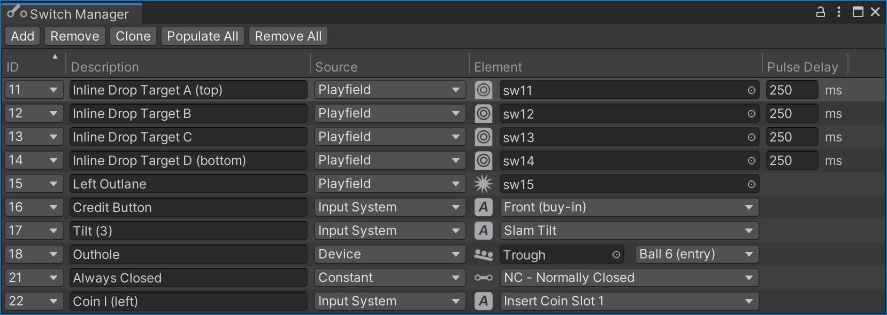

# Switch Manager

During gameplay, the [gamelogic engine](~/creators-guide/manual/gamelogic-engine.md) needs to know what is happening on the playfield. For that reason, real pinball tables have switches all over the playfield that signal when a ball rolls over a certain position. These switches are also built into targets, bumpers, kickers, and some other items (see *[Supported Game Mechanisms](#supported-game-mechanisms)* below).

Wiring these switches up to the gamelogic engine per code can be a tedious process. That's why VPE provides a graphical interface where you can do it easily. It even can guess which switch maps to which game item, if you've named them accordingly.

You can open the switch manager under *Visual Pinball -> Switch Manager*.

## Setup

Imagine every row as a wire connecting the physical switch to the gamelogic engine. The relation between the two is *0..n -> 0..n*, meaning you can link multiple switches an input and a switch to multiple inputs.

> [!note]
> We use the terms "open" and "close" for switches, since that's what they do in real life. In electrical terms these are called "NC" (normally closed) and "NO" (normally open). In summary, these terms are synonyms:
> 
> | Technical | Status | Common Term | In code |
> |-----------|--------|-------------|---------|
> | NO        | Open   | Off         | `false` |
> | NC        | Closed | On          | `true`  |

### IDs

The first column **ID** shows the switch names that the gamelogic engine expects to be wired up.

> [!note]
> As we cannot be 100% sure that the gamelogic engine has accurate data about the switch names, you can also add switch IDs yourself, but that should be the exception.

### Description

The **Description** column is an optional free text field. If you're setting up a re-creation, that's where you typically put what's in the game manual. It's purely for your own benefit and you can keep this empty if you want.

### Source

The **Source** column defines where the element in the next column is located. There are three options:

- *Playfield* lets you choose a game item in the playfield
- *Input System* lets you choose an input action from a pre-defined list, i.e. cabinet switches
- *Constant* sets the switch at the beginning of the game to the given value.

### Element

The **Element** column is where you choose which element triggers the switch. 

For **Playfield**, you can choose a game item that triggers switch events. Currently, VPE only emits switch events for items that would do the same in real life, i.e. bumpers, flippers, gates, targets, kickers, spinners and triggers. 

> [!note]
> We realize that you might want to use other game items like ramps and walls to emit switch events as well, and we will address this at some point, but for now we're keeping it simple.

If **Input System** is selected, you choose which input action to use. We call it "input action", because it's not an actual key binding. While actions have default key bindings, the final bindings will be defined in the host application (the VPE player). So what VPE is dealing with in terms of keyboard input is what we call *input actions*.

Finally, if **Constant** is selected, you choose the value that will be permanently set at the beginning of the game.

### Pulse Delay

Internally, VPX connects switches to events. For example, a trigger on the playfield has a `Hit` event, which occurs when the ball rolls into the trigger's zone, and an `UnHit` event when the ball leaves that zone. These two events close and open the trigger's switch. 

However, not all mechanisms behave like that. For example a spinner just emits one `Spin` event. So in order to not let the switch closed indefinitely, VPE automatically re-opens it after a given delay.

We call that the **Pulse Delay**. "Pulse", because it gets triggered by one event and opens immediately right after. 

In most cases, you can leave the default delay of 250ms. What's important is that gamelogic engine gets notified not too long after the switch was closed. Note that when setting it to 0, the switch will stay closed.

## Supported Game Mechanisms

Below a list of game mechanisms that contain built-in switches.

|             | Close                                                  | Open                                                                         |
|-------------|--------------------------------------------------------|------------------------------------------------------------------------------|
| **Bumper**  | On ball collision                                      | *Opens after pulse delay*                                                    |
| **Flipper** | On EOS, i.e. when the flipper reaches its end position | When the flipper switch is opened, i.e. the flipper starts moving down again |
| **Gate**    | When ball is passing through the gate                  | When ball has passed through                                                 |
| **Target**  | On collision                                           | *Opens after pulse delay*                                                    |
| **Kicker**  | When ball goes into the kicker                         | When ball's outside the kicker                                               |
| **Spinner** | On each spin                                           | *Opens after pulse delay*                                                    |
| **Trigger** | When the ball rolls over the trigger                   | When the ball is outside of the trigger                                      |