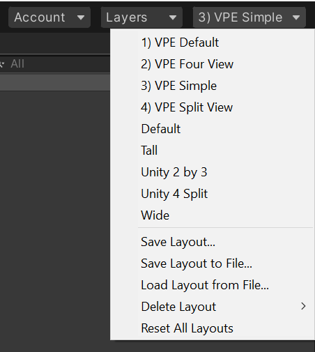

# Unity Layouts

Unity allows you to [customize your workspace](https://docs.unity3d.com/2020.2/Documentation/Manual/CustomizingYourWorkspace.html). Any panel can be docked onto another panel or detached from the editor.

Since VPE comes with quite a few custom panels, we provide a bunch of pre-defined templates for you to choose from. You're of course free to create your own. You can toggle between layouts by selecting a layout on the top right corner of the editor:

