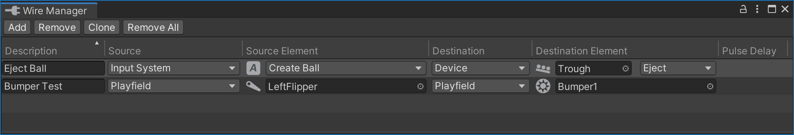

# Wire Manager

Using the [Switch Manager](switch-manager.md), you can wire playfield and cabinet switches to the [Gamelogic Engine](../manual/gamelogic-engine.md). Similarly, the [Coil Manager](coil-manager.md) and [Lamp Manager](#) let you connect playfield elements to the outputs of the Gamelogic Engine.

The **Wire Manager** allows you to *bypass* the gamelogic engine and connect switches directly to coils and lamps. This can be useful for debugging, but also for game logic that might not be covered by the gamelogic engine.

You can open the wire manager under *Visual Pinball -> Wire Manager*.

## Setup

Every row in the wire manager's table corresponds to a connection between a switch and an element that takes an input. You can connect multiple switches to one element or a single switch to multiple elements. In the following, we call the switch the *source* and the element it is connected to the *destination*.

### Description

The first column **Description** is optional. It can help better organize all the connections, but can be left empty if you want.

### Source

The **Source** column defines the type of source you are connecting to. There are four types:

- *Playfield* lets you select any game item that qualifies as a source from the playfield.
- *Input System* lets you select an input action from a pre-defined list, e.g. cabinet switches.
- *Constant* sets the destination to a constant value.
- *Device* lets you select a source device. Such devices are mechanisms that include multiple sources, i.e. [troughs](../manual/mechanisms/troughs.md).

### Source Element

The **Source Element** column is where you select which element acts as the source.

For **Playfield** sources, you can select a game item that triggers switch events. Currently, VPE emits switch events for items that would do so in real life, i.e. bumpers, flippers, gates, targets, kickers, spinners and triggers.

If **Input System** is selected, you select which input action to use. Actions may have default key bindings, but the final bindings to a key or other input will be defined in the host application (the VPE player).

If the source is a **Device**, then there are two values to select. The actual source device, and which switch of that device should be connected to the gamelogic engine.

Finally, if **Constant** is selected, you select the value that will be permanently set at the beginning of the game. This might me useful for lamps that are always on.

### Destination

Under **Destination** you can select the type of the element that will *receive* the switch changes. There are two types to choose from:

- *Playfield* lets you select any game item that qualifies as a destination from the playfield
- *Device* lets you choose a destination device. Such devices are mechanisms that include multiple coils or lamps, i.e. [troughs](../manual/mechanisms/troughs.md).

### Destination Element

The **Destination Element** column is where you select which specific element in the destination column should receive switch changes. If *Device* was selected in the previous column, both the actual device and the element within the device have to be selected.

### Pulse Delay

Internally, VPE connects switches to events. Some switchable game items only emit the *switch closed* event. Such items are spinners and targets. These are elements where the re-opening of the switch does not have any semantic value.

In order for those to not stay closed forever, VPE closes them after a given delay. We call this the **Pulse Delay**. This field is only visible if the input source is a pulse-driven source.
