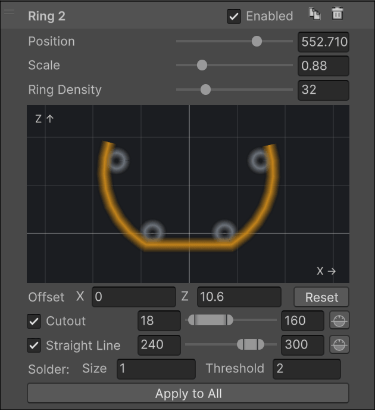
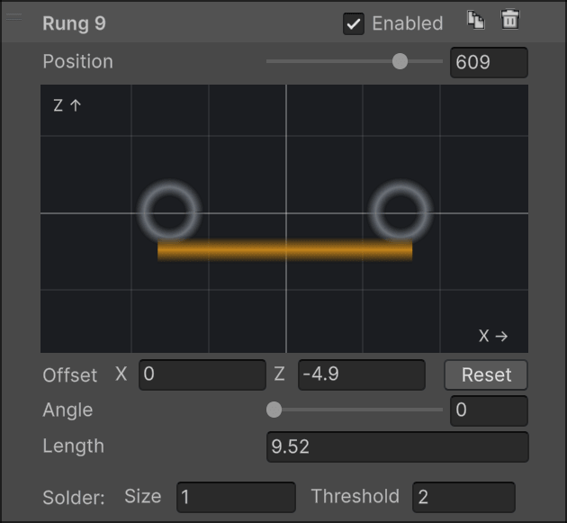
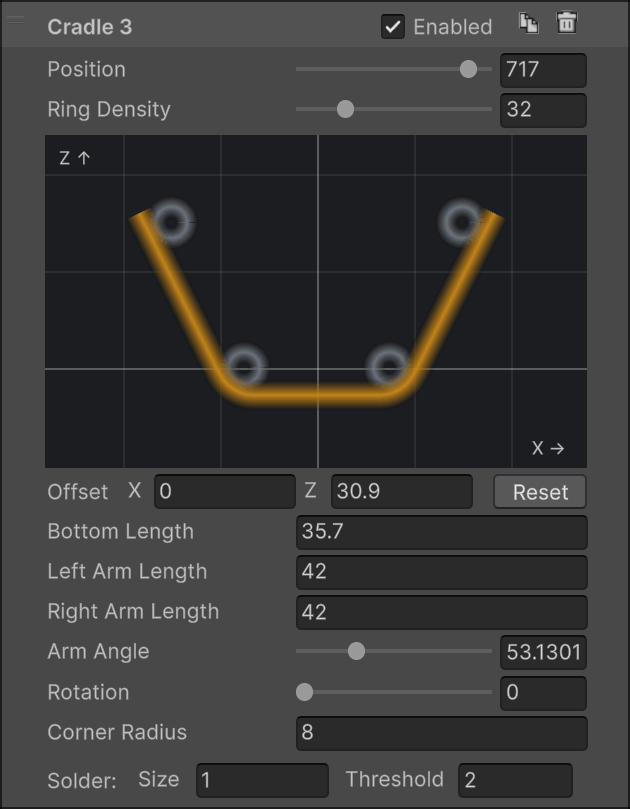
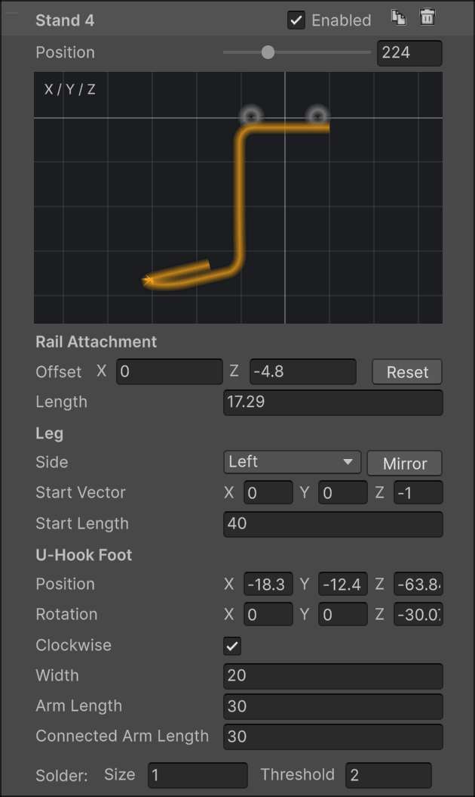
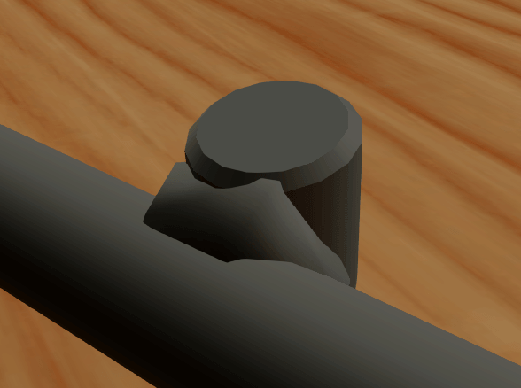
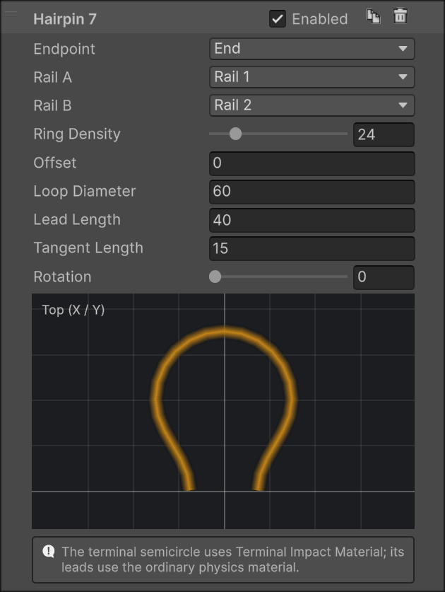
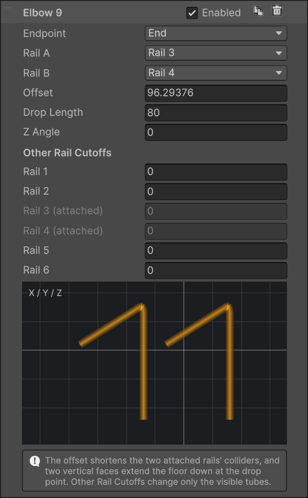
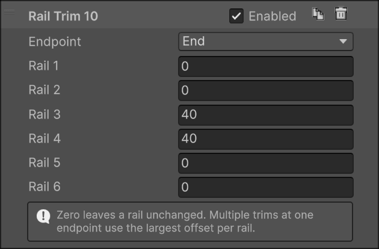

# Fixtures

Wires on their own float. Fixtures are the metalwork that holds a real rail together and attaches it to the playfield: rings around the bundle, rungs between the bottom rails, legs down to the wood, and the hairpins and elbows where the rail ends.

There are two families. **Supports** (ring, rung, cradle, stand) sit at a **Position** along the route, and you can have as many as you like. **End fittings** (hairpin, elbow, rail trim) attach to the start or the end of an open route and reshape the rails there.

All of them share a few rules:

- Every fixture uses the rail's global **Wire Diameter** and render material.
- A fixture's position is a distance along the route and has nothing to do with layouts. Its shape, though, is fitted to the wires at that point: change the layout there and the fixture refits in place. Reshape the spline and the fixture travels with the route.
- Each panel previews the evaluated shape, with the rails it touches in gray.
- **Enabled** hides a fixture from the render mesh only. It stays in the collider, so a hidden elbow or rail trim still shortens the channel. Use it to compare variants, not to keep spare fixtures around.
- Supports are soldered to the rails they touch. See [Solder](#solder).
- Dragging a fixture in the list changes its numbering only.

## Supports

### Ring

A ring around the whole bundle. It's fitted automatically: centered on the active wires at its position, and sized to just touch the outermost one. The fit follows the layout, so a ring inside a transition shrinks or grows with the wires.

- **Scale** multiplies the fitted radius. 1 hugs the wires.
- **Ring Density** is the number of tube segments around a full circle. A partial ring gets its proportional share.
- **Offset X / Z** slides the whole ring in the cross-section.
- **Cutout** removes an angular range, leaving an open arc with capped ends. **Straight Line** replaces a range with a straight chord, for the flat-topped or flat-bottomed brackets many rails use. Both can be active at once.

Angles run counter-clockwise from the right: 0° is to the right of the rail, 90° straight up, 180° left, 270° down. A range may wrap past 360°. The small horizon button beside each range keeps its width but re-centers it on straight up or straight down, whichever is closer, so both ends sit at the same height. Use it to level a chord you've roughed in with the slider.

**Apply to All** copies everything except Position to every other ring on the rail. Tune one, then apply.

### Rung

A straight rung between the two bottom rails, wires 1 and 2. Its span is measured from wire surface to wire surface.

- **Angle** turns it around the center of the wire bundle. 0° is horizontal, 90° vertical.
- **Length** is a signed adjustment to the span. Positive sticks out past both rails, negative pulls the ends in.
- **Offset X / Z** moves the rung in the cross-section.

The rung disappears wherever either bottom rail is inactive.

### Cradle

A rung with an arm rising from each end: the U-shaped bracket that cradles a habitrail from below. Its default shape is fitted to the default four-wire layout, with the arms leaning out at 53.13° and just touching the outside of the bottom and raised rails.

- **Bottom Length** is the width of the straight bottom wire.
- **Left / Right Arm Length** set each arm. Set one to 0 to leave it out. With both at 0 you have a plain capped rung.
- **Arm Angle** is the angle between the two arms.
- **Rotation** turns the whole fixture around the route.
- **Corner Radius** rounds the bend where each arm meets the bottom.
- **Ring Density** only affects the rounded corners. Bends are never stepped by more than 15° regardless, so a low value can't flatten them.

The fixture stays anchored where its default shape fits, so editing lengths and angles reshapes it in place instead of sliding it around. Two limits are enforced quietly: the corner radius can't go below half the wire diameter, and an arm set to a small positive length is raised to the shortest length that fits its rounded corner. With fewer than four active rails, the fixture is anchored under whatever wires remain. Use the offsets to place it.

### Stand

A leg from the rail down to the playfield, ending in the U-shaped hook that gets screwed down. The stand is one continuous wire: an attachment across the two bottom rails, a leg, and a foot.

**Rail Attachment** behaves like a rung, with the same **Offset** and signed **Length**.

**Leg**

- **Side** chooses which end of the attachment the leg leaves from. Changing it moves the leg to the other rail and nothing else. **Mirror** flips the entire stand, foot included, to the other side of the rail.
- **Start Vector** is the direction the leg sets off in, in route-local coordinates: X across the rail, Y along it, Z up. The default (0, 0, -1) goes straight down. **Start Length** is how far it travels before bending toward the foot. Give it some Y and the leg leans along the route, which is how the long diagonal struts on real rails are made.

**U-Hook Foot**

- **Position** and **Rotation** place the foot relative to the leg's attachment point, in the same route-local frame. Rotate it flat to sit on the playfield, or upright to mount against a wall.
- **Width** is the width across the U, **Arm Length** the free arm, **Connected Arm Length** the arm the leg joins. The leg always meets that point, so moving the foot re-routes the leg.
- **Clockwise** flips the winding of the U.

Every bend in the leg is rounded to the wire diameter. The stand is omitted where either bottom rail is inactive, or when the leg would fold straight back through its attachment.

### Solder

Wherever a support's wire touches a rail, the generator adds a small solder blob.

- **Solder Threshold** is the largest surface gap that still counts as touching, 2 units by default. It's an absolute distance: a thicker wire doesn't get a more forgiving threshold.
- **Solder Size** scales the blob. All three dimensions scale, so doubling it gives eight times the volume.

Blobs are placed deterministically and don't jump around between rebuilds. End fittings don't get solder. They are continuous with the rails.

## End fittings

End fittings need an open route. Hairpins and elbows take over two rails at one endpoint, **Rail A** and **Rail B**, and only one fitting can own a rail at a given end. If another fitting or a rail trim already shortens one of the rails you pick, the fitting isn't generated and its panel tells you why.

### Hairpin

Joins two rails into one semicircle past the end of the route, the shape that ends most habitrails where the ball drops out. The rails blend into the loop through smooth leads, without a notch.

- **Loop Diameter** is the centerline diameter of the semicircle. Make it wider than the rail spacing and the leads flare out to meet it.
- **Lead Length** is how far past the endpoint the loop's center sits.
- **Tangent Length** controls how gradually each lead leaves its rail. It's capped at about half the lead, so a lead can't overshoot.
- **Rotation** turns the loop around the route, for a loop that stands up or lies flat.
- **Offset** pulls the loop back from the endpoint. The two attached rails are shortened by the same distance, so the loop stays welded to their ends. Use it to end a rail's loop before the other wires do.
- **Ring Density** is the tube resolution around the loop, for rendering only.

The loop's collider is a coarse square tube along the leads and the arc, and its Offset shortens the two rails in the collider as well. The arc is its own collider part and uses the **Terminal Impact Material** from the Ball Channel Collider section when one is assigned, so the last hit as the ball leaves the rail can be softer or livelier than the rails themselves. See [Physics](geometry.md#physics).

### Elbow

Two rails that bend straight down, side by side: the mouth of a rail feeding a hole, a scoop or a subway.

- **Offset** moves the elbow inward from the endpoint and shortens the two attached rails to that point. 0 bends right at the endpoint.
- **Drop Length** is the total vertical distance from the start of the bend.
- **Z Angle** turns the bend around the vertical, for an elbow that twists as it descends.
- **Other Rail Cutoffs** shorten each remaining rail by its own distance from the endpoint, so upper guide wires can stop before the elbow without a separate rail trim. The attached rails are fixed at 0.

The bend radius equals the wire diameter (an elbow shorter than that tightens it). In the collider, the two attached rails are trimmed at the elbow and the two floor facets the ball rests on are extended straight down by the drop length, so the ball is guided into the hole rather than falling off a cliff. Other Rail Cutoffs are visual only.

### Rail Trim

Not a shape, just a distance per rail, measured inward from one endpoint. Use it when individual rails should start or end at different points without adding a layout: a top wire that stops short, a guide that starts late. 0 leaves a rail alone.

A trim can cross any number of layouts. It cuts both the tube, with a beveled cap, and the collider. Several trims at the same endpoint combine by taking the largest value per rail, so their order never matters. Where a trim leaves too few rails to form a channel, that stretch of the route has no collider.

