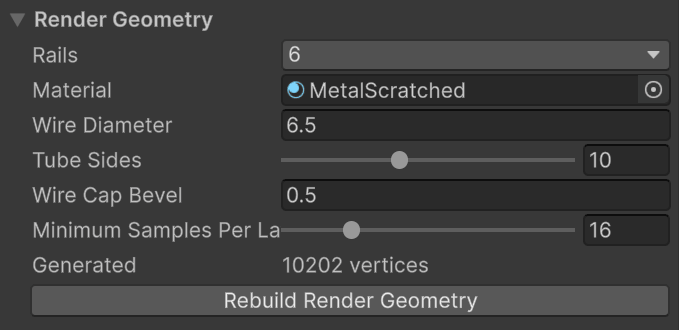
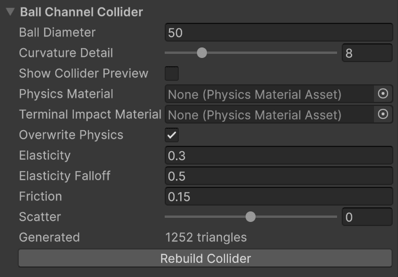
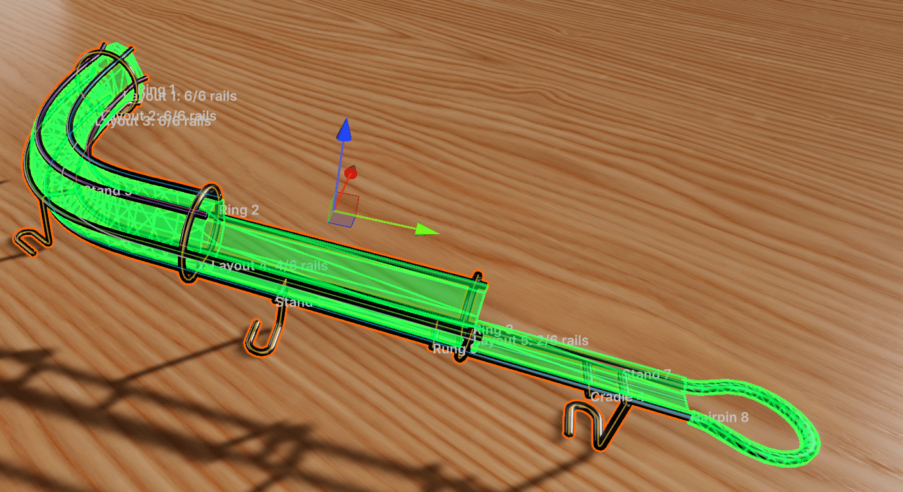

# Generated Geometry

Nothing you see of a wire rail is modeled by hand. The component keeps two meshes up to date from the route, the layouts and the fixtures: a render mesh of tubes, and a collider. Both are regenerated whenever anything changes, and neither is saved with the scene. They're rebuilt on load. Should a mesh ever look stale, **Rebuild Render Geometry** and **Rebuild Collider** force the issue, and each section shows its current vertex or triangle count so you can keep an eye on cost.

## Render Geometry

- **Rails** is the wire count, described under [Wire Layouts](layouts.md#how-many-wires).
- **Material** is applied to everything the rail generates. Leave it empty for the render pipeline's default material.
- **Wire Diameter** is the thickness of every wire in the rail, fixtures included. The default of 6.5 units is a typical habitrail wire next to a 50 unit ball.
- **Tube Sides** is the polygon count around each tube, 6 to 16. Ten looks round at playing distance.
- **Wire Cap Bevel** chamfers every exposed wire end by one segment so that cut ends catch the light. It's clamped to half the wire diameter. Ends that butt into an elbow or a hairpin are left square so the joint is flush.
- **Minimum Samples Per Layout Span** is the base number of rings along each span. Bends are refined on their own: wherever a wire turns more than 5° between two rings, rings are added, up to three levels deep. Raise the base value only for long, gently curving spans that still look faceted.

Wires are capped only where they actually end: at the ends of the route, at a trim, at a layout boundary where the wire is inactive on the other side, or at a non-continuous transition. A wire that continues, even through a jump in position, is one unbroken tube.

## Ball Channel Collider

The collider is not a tube around each wire. That would cost a lot of triangles and, worse, leave seams between the wires for the ball to catch on. Instead, the component works out where a ball of **Ball Diameter** would rest in the bundle, finds the point on each wire it would touch, and lays a flat facet through each contact point. The facets are joined into one channel profile, and the profile is swept along the route. The ball rolls on a smooth, continuous channel that behaves the way the wires would, at a fraction of the geometry.

**Ball Diameter** changes only this fit. It doesn't resize the visible wires, nor the ball in the game.

<small>Show Collider Preview draws the channel in green. Note the open top, and the faceted floor between the two bottom rails.</small>

### What the profile looks like

The profile is refitted wherever the layout changes, and adapts to how many wires are active:

| Active wires | Channel |
|---|---|
| 1 | A narrow flat strip under the ball |
| 2 | A faceted floor, open at the top |
| 3 | Floor plus a wall on the Third Rail side |
| 4 | Floor and both walls, open at the top |
| 5 or 6 | Floor, walls and a roof, unless the ball fits through the top |

The last rule matters for rails with top wires. If the clear gap between the two wires bounding the top is wider than the ball, the channel stays open there and the ball can leave the rail upward, as it could in reality. If the gap is narrower, the roof closes. Within one span between layouts, the opening has to stay between the same two wires. If your design moves the opening to a different pair, or closes it partway, add a layout at the point where that changes. The inspector says so when it's needed.

**Curvature Detail** controls how densely the channel is sampled along the route. Curved and changing spans get more rows, straight spans stay sparse no matter how many knots they contain. Raise it if a tight bend shows visible flats in the collider preview.

### Physics

By default the channel uses the values under **Overwrite Physics**: elasticity, falloff, friction and scatter, as on any VPE collider. Untick it to use a **Physics Material** asset instead. While it's ticked, the asset is ignored.

**Terminal Impact Material** is the exception. It applies only to the arc of a [hairpin](fixtures.md#hairpin), and it applies whenever it's assigned, overwrite or not. That's deliberate: the impact that ends a rail is the one you most often want to tune on its own.

### How fixtures affect the collider

- A **rail trim** cuts the channel at the trim distance. Beyond it, the profile is refitted from the rails that remain. If they can't form a channel (a lone upper wire, say), that stretch has no collider.
- An **elbow** trims its two rails and extends the floor straight down at the bend. Its other-rail cutoffs don't touch the collider.
- A **hairpin** trims its two rails by its Offset and adds a coarse square tube along its leads and arc.
- Rings, rungs, cradles and stands are visual only.
- A fixture's **Enabled** toggle hides it visually only. The collider is built from all fixtures.

### When the collider can't be built

If the channel's shape changes fundamentally inside a single span (a roof appearing, or the top opening jumping to different wires), the collider isn't built at all and the inspector shows the reason in red. A rail without a collider is a rail the ball falls through, so treat the message as a blocker. The fix is nearly always a layout at the point where the profile changes.

Validation is lazy. The inspector shows *Collider validation is pending* until the Ball Channel Collider section is expanded or its preview is on. Play mode always builds it.
