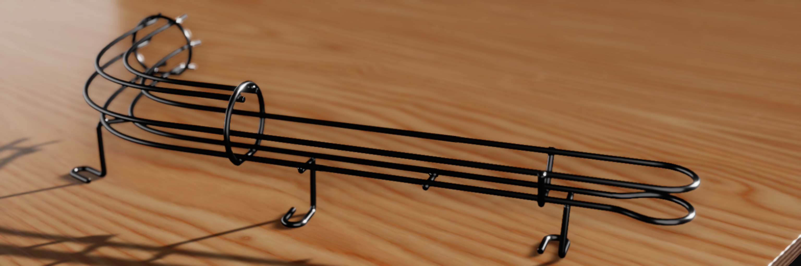
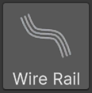

# Wire Rails

Wire rails are the bent-steel ramps, habitrails and guides that carry the ball above the playfield. In VPE, a wire rail is one component. You draw a route with a Unity spline, describe how the wires sit around that route, add rings and supports where a real one would have them, and the component generates both the visible tubes and a collider the ball rolls in.

## How to think about it

A wire rail is four ideas stacked on top of each other:

1. **The route** is a spline (like a Curve in Blender). It's the centerline every wire follows, and its knots are the what you position by hand in the Scene view.
2. **Wire layouts** describe the cross-section: which wires exist, and where each one sits to the left, right, above or below the centerline. A layout is placed at a distance along the route and holds until the next one. Between two layouts, the wires glide from one arrangement to the other.
3. **Fixtures** are the metalwork that holds the wires together: rings, rungs, stands, and the fittings at either end of the rail.
4. **Generated geometry** is what comes out: a render mesh of tubes, and a separate *ball channel* collider fitted to the space the ball actually occupies rather than to each wire.

The route and the cross-section are edited independently, and that's the point. Adding a knot never changes the wires, and adding a layout never changes the route.

## Create a wire rail

Click **Wire Rail** in the toolbox, or choose *GameObject -> Pinball -> Wire Rail*. VPE creates a Wire Rail GameObject under the playfield with a straight 500 unit route and a four-wire habitrail layout: two bottom rails the ball rests on, and two raised rails that keep it from falling out.

That is already a working rail. It renders, and in play mode the ball rolls along it. Everything from here on is refinement:

- [Shape the route](xref:wire_rail_route) in the Scene view and grade its height.
- [Change the wire layout](xref:wire_rail_layouts) where the rail opens up, narrows, or gains and loses wires.
- [Add fixtures](xref:wire_rail_fixtures) so the rail looks built rather than floating.
- [Tune the generated geometry](xref:wire_rail_geometry), from tube resolution to how the collider treats the ends of the rail.

## Units

Everything you type into the Wire Rail inspector is in VPX units, like the rest of the table. A standard ball is 50 units across, and the default wire is 6.5 units thick. See [Units and 3D Space](xref:units_3d_space) for how those map to Unity units.

## What it doesn't do yet

- No import from or export to `.vpx` files. Wire rails are authored in VPE only.
- No branching. One component is one route. A junction is two components meeting.
- No switch events. A wire rail is only a collider. If the game needs to know the ball is on it, put a trigger there.
