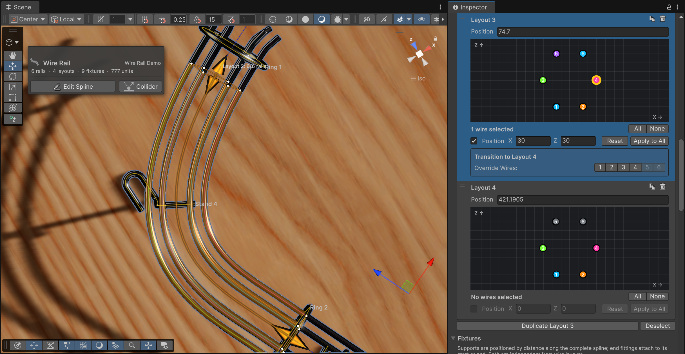
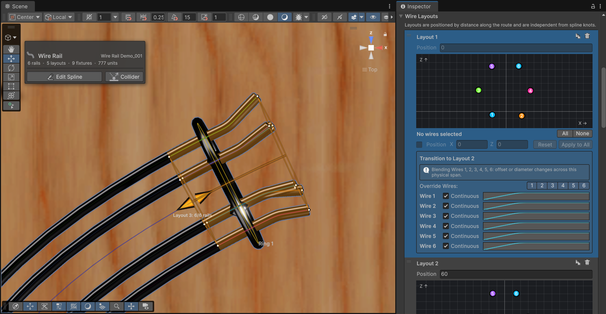

# Wire Layouts

A layout is a snapshot of the cross-section at one point of the route. For each of the rail's wires it says whether the wire exists here, and where it sits. The layout holds from its position until the next layout, and between two layouts the wires glide from one arrangement to the other.

A new rail has a single layout at the start of the route, which is all a rail with a constant cross-section needs. You add layouts where the cross-section changes: where a guide opens into a two-wire habitrail, where a rail narrows to funnel the ball, or where an extra wire begins.

<small>A six-wire layout with wire 3 selected. Disabled wires draw gray.</small>

## How many wires

**Rails**, in the *Render Geometry* section, sets how many wires the rail has, from one to six. The count applies to the whole rail. Individual layouts then turn wires on and off. The default arrangements are sized around a 50 unit ball:

| Rails | Arrangement |
|---|---|
| 1 | A single wire under the ball |
| 2 | Two bottom rails, 30 units apart |
| 3 | Two bottom rails plus one raised rail, on the side chosen with **Third Rail** |
| 4 | Bottom pair plus a raised pair on both sides: the classic habitrail |
| 5 | The four-wire rail with a top center wire |
| 6 | The four-wire rail with two top wires |

Bottom rails sit 15 units either side of center, raised rails 30 units out and 30 up, top rails 60 up. They are starting points, not constraints.

Changing the count keeps offsets you've customized and adds new wires at their default positions, enabled in every layout. A layout that is still exactly at its defaults is re-laid out for the new count.

> [!warning]
> With three rails, switching **Third Rail** between Left and Right resets that layout to the defaults, including the two bottom wires.

## Positioning wires

The cross-section view is interactive. Click a wire to select it, shift-click to add to the selection, ctrl-click (cmd on macOS) to toggle. Drag a selected wire and every selected wire moves with it. Or type into **X** (sideways, positive to the right) and **Z** (up). When the selected wires have different values, the field shows a dash and only the axis you edit is applied to all of them.

The checkbox before **Position** enables or disables the selected wires for this layout's span. A disabled wire is drawn gray, keeps its position and stays editable. It just isn't generated between this layout and the next.

**Apply to All** copies the selected wires' positions into every other layout, without touching which wires are enabled there. **Reset** puts the whole layout back to the defaults, not only the selection.

> [!tip]
> Keep wires 1 and 2 as the pair the ball rolls on. The collider fits the ball between those two, and rungs and stands attach to them. A rail where the ball rests on other wires gets its channel fitted around the wrong ones.

## Adding layouts along the route

A layout sits at a **Position** in units along the route, independent of the knots. Inserting a knot doesn't add a layout, and moving a layout doesn't move the route. The first layout is pinned at 0. Every other position can be anything along the route: move a layout past its neighbor and the two simply swap places, keeping their names.

**Add Wire Layout** appends a layout halfway between the last two layouts on the route, or halfway to the end if there is only one. With a layout selected, the button turns into **Duplicate Layout N** and places the copy halfway to the next layout, or halfway to the end of the route for the last one. Either way, the new layout starts as a copy of the one before it, so you only change what differs.

With a layout selected, the Scene view shows an arrow at the start of its span and one at the start of the next. Drag either along the route to move that layout.

Layouts can be dragged in the list to reorder them. That changes their numbering and nothing else. A layout's place on the route is its **Position**.

## Transitions

Below each layout is its **Transition to Layout N** box. By default every wire is *continuous*: it leaves this layout's position and arrives at the next layout's position over the whole span between them, moving at a constant rate. The tube is unbroken, the collider follows, and the bend is smoothed across the boundary so a wire that jumps far sideways doesn't crease.

<small>The outside bend can be achieved by moving all wires to the outside, along with a curve that represents the crease.</small>

Wires only get a row when you ask for one. The numbered **Override Wires** buttons expose a wire's controls:

- Clear **Continuous** when the wire should end at the boundary and start fresh at the next layout's position. Both ends get caps.
- The curve reshapes the move over the span. Horizontal is the span, vertical is how much of the move has happened. The endpoints always count as 0 and 1, so the wire lands exactly on both layouts however you bend the middle.

Turning an override off restores the continuous, linear default. Buttons are disabled for wires that aren't active in both layouts. A wire that is inactive on one side simply ends or begins at the boundary, with a cap.

When wires actually move between two layouts, the box says so (*Blending Wires 3, 4*), which is handy for spotting an accidental nudge.
