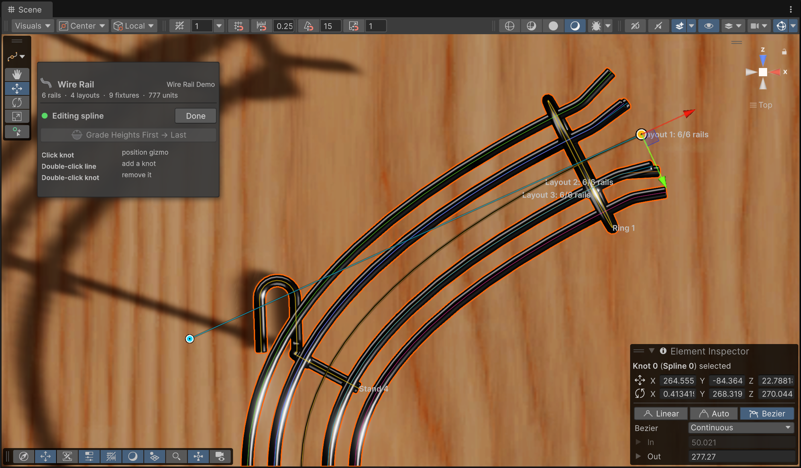
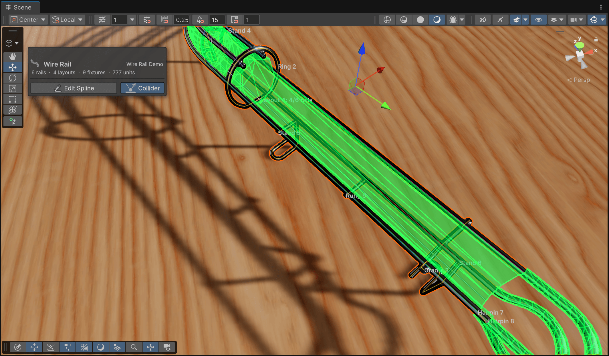

# The Route

The route is a Unity spline on a generated child GameObject called **Wire Rail Spline**. The Wire Rail component owns that child: its transform is what makes spline coordinates come out in VPX units, and the collider is mapped back through it. That transform is locked in the inspector for a reason. When the whole rail needs to move, move the parent.

## Editing knots

Click **Edit Spline** in *Scene View* in the inspector, or the **Edit Wire Rail Spline** button in the Scene view overlay.

<small>Knots are circles, the active one is gold. Tangent grips only appear on knots whose tangent mode allows manual control, i.e. if you switch to *Bézier* in the element inspector on the bottom right.</small>

- Drag a knot to move it freely. Click it first when you want the regular position gizmo to lock movement to an axis or a plane.
- Double-click the route to insert a knot there. Double-click a knot to remove it. An open route keeps at least two knots, a closed one three.
- Drag the smaller grips to shape Bézier tangents. Knots in *Auto Smooth* mode have no grips. Change the knot's tangent mode in Unity's spline inspector if you need them.

The route lives in three dimensions and the cross-section follows it: wire offsets are measured to the right of the tangent and upward from it. Rotating a knot rolls the cross-section around the route, which is how you bank a rail through a curve. A rail that merely rises needs nothing special. As long as the knots aren't rotated, the cross-section stays upright.

## Draw flat, then grade

Real rails are drawn in plan view and rise at a constant grade, and the workflow follows suit. Draw the whole route from the top, set the heights of the first and last knots, then click **Grade Heights First → Last**. Every knot in between lands on a straight grade, weighted by how far along the horizontal route it is, and the Bézier handles are tilted to match. The rail rises evenly instead of in steps.

Select exactly two knots and the button becomes **Grade Heights Between Selected Knots**. Only that interval is graded, the rest is untouched. With one knot or more than two selected, the button is disabled.

Grading changes only heights. The plan-view shape stays exactly as drawn. That is why knots in *Auto Smooth* mode are switched to *Continuous* (or *Broken* at the ends of a graded interval): Auto Smooth would recompute the handles and move the route sideways.

## Center Pivot

A new rail has its pivot at the first knot. **Center Pivot** moves the GameObject's pivot to the halfway point of the route (by traveled distance, not knot count) and shifts the knots the other way, so nothing moves in the scene. Do this before rotating or mirroring a rail as a whole. A pivot in the middle turns the way you expect.

## Reading the Scene view

Select the Wire Rail (or its spline child) and the Scene view overlays a preview on the generated tubes.

- Each wire has its own color, always in the same order. Wire 1 is cyan and wire 2 orange on every rail of the table. Wire 6 reuses wire 1's color.
- Every layout is labeled at its start with its number and how many of the available wires are active there, for example *Layout 2: 3/4 rails*. Selecting a layout in the inspector highlights its span in orange and marks the label with an arrow.
- Fixtures draw their centerline in amber, with their name.
- **Show Collider Preview**, in the Ball Channel Collider section, draws the generated channel in translucent green.

Line widths in the preview are for legibility. The tubes underneath show the real wire thickness, as do the wire circles in the inspector cross-section.

## Closed routes

A spline can be closed, and the wires and collider close with it. A closed route has no ends, so anything that attaches to an end is unavailable: hairpins, elbows, rail trims, and collider widening. The transition from the last layout back into the first is shown on the last layout's panel.

Only the first spline in the container is used. If you've added more, the inspector warns you. Remove them.
