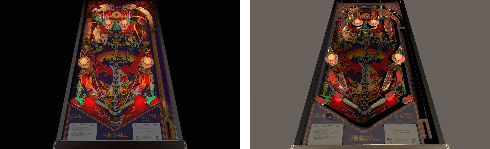
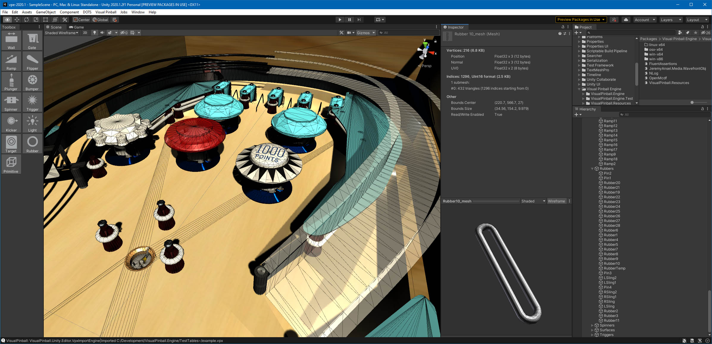
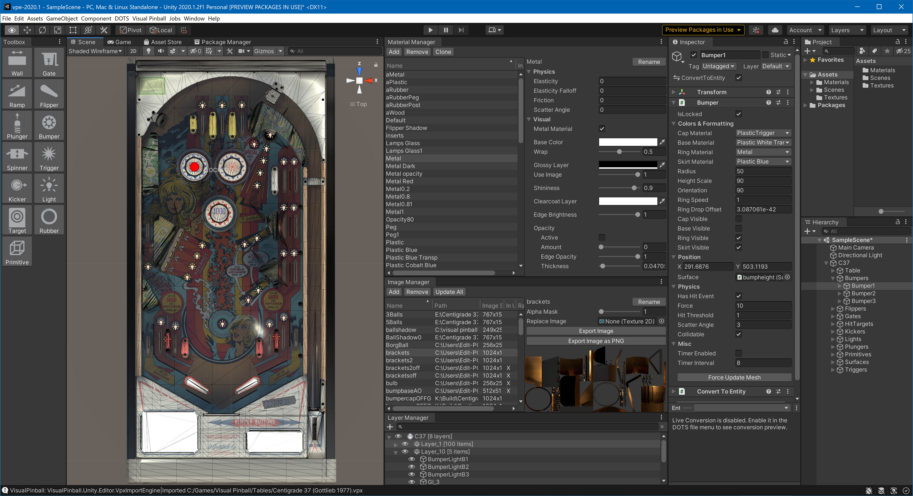
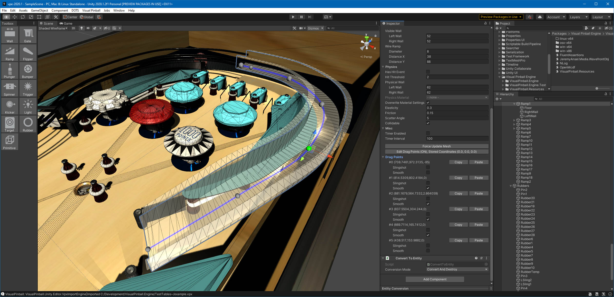
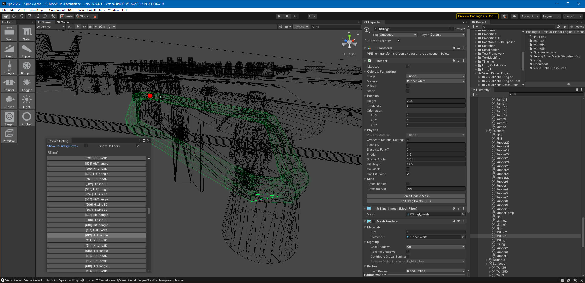

# Features

This section documents what's already working. If it's not, then that's a bug, and you should [let us know](https://github.com/freezy/VisualPinball.Engine/issues).

## Materials

We convert Visual Pinball's materials to materials compatible with the active render pipeline. That means  materials look similar to Visual Pinball by default, while there's still a lot of potential left to tweak materials using the full material configuration of Unity.



*Bord's Viking rendered in VPX (left) and imported as-is in VPE's built-in renderer (right).*

## Meshes

Visual Pinball dynamically generates meshes for most of the game items. VPE has ported that code and does the same when loading a table.



*A rubber mesh generated in the editor*

## Physics

We have nearly finished porting Visual Pinball's physics engine to VPE. That means the ball and flipper behavior should be identical to Visual Pinball.

> [!Video https://www.youtube.com/embed/S1DDY9iBBqo]

This includes physics-based movement from flippers, gates and spinners, as well as animated targets, triggers and plungers.

## Events

The physics engine emits the same events as Visual Pinball. That means you can subscribe to collision events and other game item-specific events. For example, for subscribing to the flip event of a flipper, you would do:

```cs
table.Flipper("LeftFlipper").LimitEos += (sender, args) => {
	// do something!
};
```

> [!NOTE]
> While it's not clear how we'll handle scripting, most events can probably be configured visually in the editor and don't need to be handled via scripting.

## Cross Platform

Unity supports [a lot of platforms](https://unity.com/features/multiplatform). Our continuous integration builds for Windows (x86/x64), macOS (x64) and Linux (x64). Besides Windows, some of our developers work on macOS, and we regularly test on Linux as well.

## File Format

We care about backwards-compatibility to Visual Pinball. VPE can read and write `.vpx` files and supports the full data set. This means that you can load a table into VPE, edit it, export it to `.vpx` and load it back into Visual Pinball.

> [!NOTE]
> VPE will at some point need to save additional data that isn't available in Visual Pinball. However, the `.vpx` structure is like a virtual file system, so we can do that without breaking backwards-compatibility.

## Editor Extensions

Unity allows full editor customization. So we're adding the managers, panels, and toolboxes from Visual Pinball into the Unity editor:



What you're seeing here is the toolbox as well as a few manager windows we've ported:

- Material Manager
- Image Manager
- Layer Manager
- Inspector acting as VP's Options Panel

You can dock these as you wish, or even undock them and move them to another monitor. Not in the above screenshot but also ported are:

- Collections Manager
- Sound Manager

VPE is also able to edit drag points. Moving those (in 3D!) re-generates the mesh on the fly:



Lastly, we can visualize the colliders of any object. This can be useful to debug, and also to check whether you may have objects set to collide which actually shouldn't (or vice versa)!



## Patching System

There are common patterns for VPX tables that are obsolete in VPE. For instance, VPE doesn't need a flipper shadow mesh, because it can do dynamic lighting out of the box. For that reason, we have a simple but sophisticated patcher system that allows us to apply changes to a table when imported.

Of course the changes don't apply to the table data itself but to how we convert it into the Unity scene. You can read more about it [here](https://github.com/freezy/VisualPinball.Engine/tree/master/VisualPinball.Unity/VisualPinball.Unity.Patcher#unity-patching-system).


# Missing Features

There are some things you might expect to work, but don't, because they're not yet implemented. Here's an incomplete list of those things.

## Key Assignments

Currently, we grab left and right shift and map it to `LeftFlipper` and `RightFlipper` respectively. If the flippers are named differently, it doesn't work.

VPE will provide a simple mapping mechanism where authors can link semantic key events to table logic and users can link keyboard keys to those key events.

## Performance

When building the table, performance is okay but still not satisfactory. We think we can still do better.

## Runtime Import

Right now, when you "build" your game and run it, Unity will compile it into binary assets. We want to avoid authors distributing those binaries, because they hide how things are done prevent further modding by other creators.

Both of these aspects are crucial in building an ecosystem, so the goal is to only compile the player itself and load the tables at runtime.

## Ball Destruction

Currently balls can't be destroyed during gameplay, so every drain will just leave them on the table, resulting in poor performance.

# Planned Features

This section will at some point contain a list of major new features.