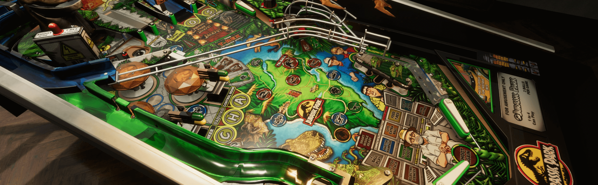

# Overview

The Visual Pinball Engine (which we call "VPE") is an open source pinball simulator that you can use to create pinball games for Windows, macOS, and Linux. It's based on the famous [Visual Pinball](https://sourceforge.net/projects/vpinball/) (often abbreviated "VP", or "VPX" for its latest version 10) meaning VPE's physics simulation matches that in VPX, and it can read and write the same file format.

VPE uses [Unity](https://unity.com/) for its underlying game architecture. Unity is one of the leading cross-platform game engines and provides VPE with an advanced render pipeline that produces high-quality visuals and is continuously maintained and updated to work with new hardware features. Unity also comes with an amazing editor, which VPE extends to make the table creation process as easy as possible.

> [!NOTE] 
> Technically, VPE is what we call a "library". A library is not executable per se, because it needs a host application. 
>
> We will provide such a host application in the future, but for now you will need to create a new Unity project and add VPE as a package in order to run it.

## Audience

This documentation is mainly aimed at table creators ("authors"). Since it covers table scripting as well, it also contains code-related documentation.

VPE is currently not in a state where it is usable by the general public ("players"). Documentation about how to setup VPE to play will follow at a later stage.
