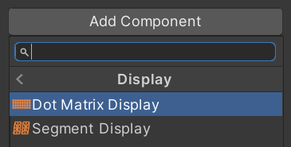

# Displays

Every pinball machine has one or more displays where the score and other important information is shown. In the 80s, mostly numeric [7-segment displays](https://en.wikipedia.org/wiki/Seven-segment_display) where used, which transitioned in the 90s to alpha-numeric [16-segment](https://en.wikipedia.org/wiki/Sixteen-segment_display) and [dot matrix](https://en.wikipedia.org/wiki/Dot-matrix_display) displays.

<small>*A dot matrix display used in the late 90s - Photo © 2009 by [ElHeineken](https://commons.wikimedia.org/wiki/File:Pinball_Dot_Matrix_Display_-_Demolition_Man.JPG)*</small>

VPE supports both segment displays and dot matrix displays (usually referred to as DMDs). During game play displays are driven by the [Gamelogic Engine](gamelogic-engine.md). VPE supports multiple displays per game.

> [!note]
> While the earliest electro-mechanical pinball machines used motorized score reels, and today's are using high resolution LCDs neither are yet supported in VPE.

## Setup

Displays are lazily bound, meaning that when the game starts the gamelogic engine announces its displays and VPE connects them to objects in your scene that actually render them. Matching is done with an ID and depends on how the gamelogic engine being used manages displays. 

For example, in [MPF](../../plugins/mpf/index.md) you name your displays yourself in the machine configuration, while PinMAME uses IDs like `dmd0` and `display0` to identify its DMDs and segment displays.

### Editor

VPE provides two display components, one for segment displays and one for DMDs. Both components create the underlying geometry and apply a shader that renders the content of the display. In order to create one, make an empty game object in your scene and add the desired component under *Visual Pinball -> Display*.

You can also create the game object with a component already assigned by right-clicking in the hierarchy and choosing *Visual Pinball -> Dot Matrix Display*. This will place the display into your scene right behind your playfield.

Selecting the game object will let you customize it in the inspector, and assign the ID that links it to the gamelogic engine.

### Runtime

The inspector allows you customize parameters controlling the geometry of the display like DMD resolution or number of segment columns in the editor. This is useful, because it allows you to see the correct geometry without running the game and place the display where it fits in the scene.

However, during runtime these parameters are provided by the gamelogic engine and the displays will be reconfigured as soon as they are received. This means that if you've set the wrong number of chars in your segment display, it will be resized at runtime and look different than the version in the editor.

> [!note]
> There are additional settings that don't affect geometry that aren't configurable in the editor but will be automatically set during gameplay, such as number of segments per column.
