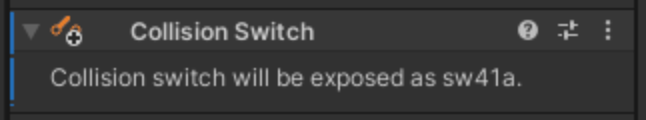
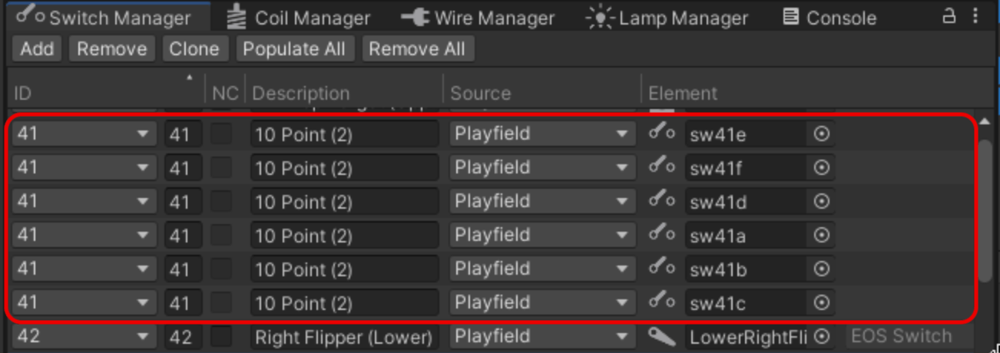

# Collision Switches

A Collision Switch turns a hittable game object into a switch device. Examples of hittable game objects are walls, rubbers, and primitives.

## Setup

To create a Collision Switch:

- Add the collision switch directly to a hittable game object. Select the game object you want to add it to, click on *Add Component* in the inspector and select *Visual Pinball -> Mechs -> Collision Switch*. 

To associate the collision switch with a game logic engine switch, use the [Switch Manager](xref:switch_manager) and select the switch in the *Element* column:

## Runtime

During gameplay, the inspector shows you the status of the switch. 
