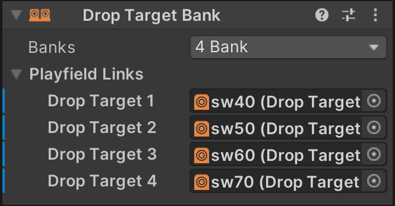
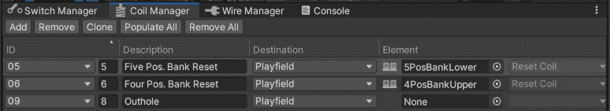
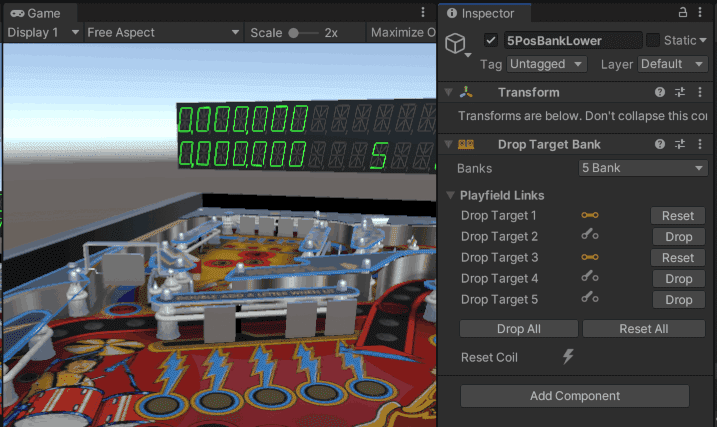
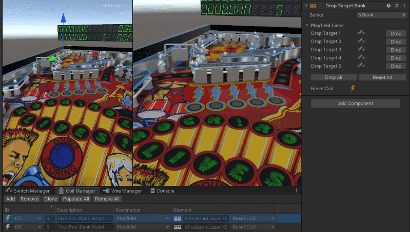

# Drop Target Banks

A Drop Target Bank is a collection of one or more drop targets that are reset (raised) when a coil is fired.

## Setup

You can create a Drop Target Bank in two different ways.

1. If your game has a single bank drop target, or multiple single bank drop targets, it is preferred to add it directly to the drop target. Select the drop target you want to add it to, click on *Add Component* in the inspector and select *Visual Pinball -> Game Item -> Drop Target Bank*. 
2. If your game has drop target banks with multiple drop targets, click on *Drop Target Bank* in the toolbox. This will add a *Drop Target Banks* hierarchy to the playfield and create a new GameObject with the right component assigned.

To configure the drop target bank, select the total number of drop targets from the *Banks* drop down. Then, under *Playfield Links*, select each drop target belonging to the bank.

To configure the reset coil, use the [Coil Manager](xref:coil_manager) and associate the corresponding game logic engine coil with the *Reset Coil* exposed by the drop target bank:

## Runtime

During gameplay, the inspector will show you switch information for each of the drop targets.  You can also drop or reset a drop target by using the *Drop* / *Reset button*. To drop or reset all drop targets, use the *Drop All* / *Reset All* buttons:

To test resetting a drop target bank from the *Coil Manager*, click the icon next to the corresponding reset coil:

