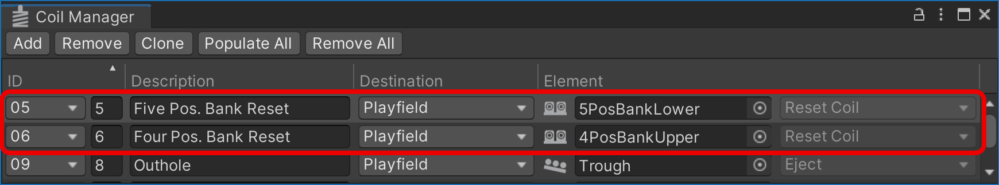

# Drop Target Banks

A Drop Target Bank is a collection of one or more drop targets that are reset (raised) when a coil is fired.

## Creating a Drop Target Bank

You can create a Drop Target Bank in two different ways.

If your game has a single bank drop target, or multiple single bank drop targets, it is preferred to add it directly to the drop target. Select the drop target you want to add it to, click on *Add Component* and select *Visual Pinball -> Drop Target Bank*. 

If your game has drop target banks with multiple drop targets, select *Drop Target Bank* from the toolbox. This will add a *Drop Target Banks* folder to the playfield. The name of each drop target bank added will be automatically incremented, ex. *DropTargetBank1*, *DropTargetBank2*. 

> [!NOTE]
> You can rename the drop target bank to whatever you want. Make sure all drop target banks have unique names.

## Configuring the Drop Target Bank size

To configure the drop target bank, select the total number of drop targets from the *Banks* drop down. 

## Linking to the Playfield

Under *Playfield links*, select each drop target belonging to the bank.

## Coil Setup

To configure the *Reset Coil*, use the *Coil Manager* and associate the corresponding game logic engine coil with the *Reset Coil* exposed by the drop target bank:

## Testing

During runtime, the inspector will show you switch information for each of the drop targets.  You can also drop or reset a drop target by using the *Drop* / *Reset button*. To drop or reset all drop targets, use the *Drop All* / *Reset All* buttons:

To test resetting a drop target bank from the *Coil Manager*, click the icon next to the corresponding reset coil:

