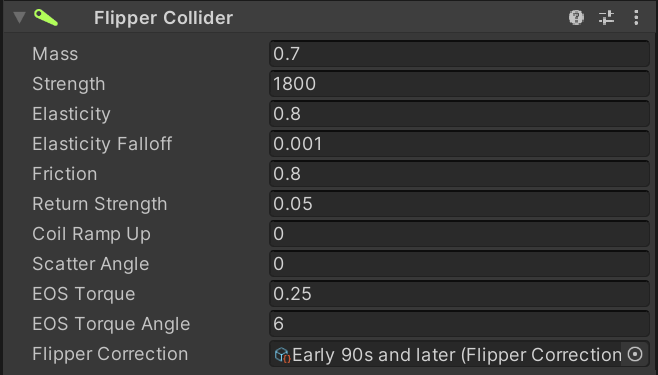
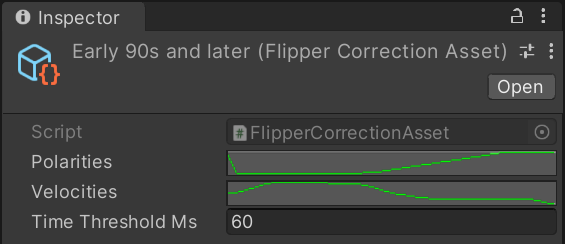
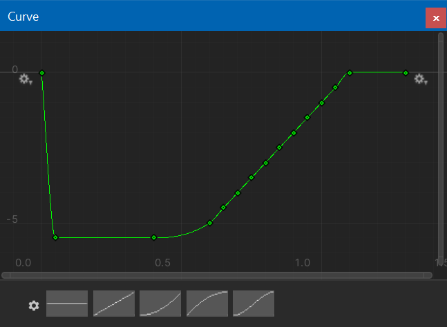
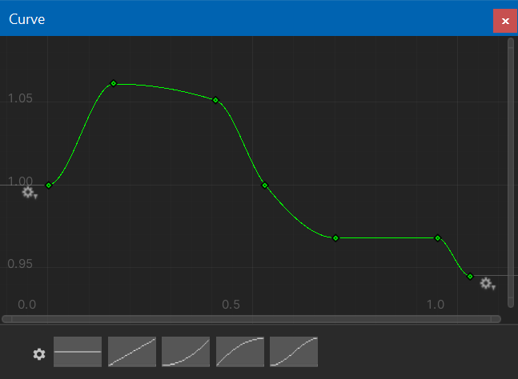

# Flipper

How flippers interact with the ball is what makes or breaks a pinball simulation. A few years ago, a community member named Mukuste spent time on improving Visual Pinball's flipper mechanics. The result was what has become known as the *physmod*, which provided a much more realistic simulation, and which was later merged into Visual Pinball's mainline. In his [own words](https://github.com/c-f-h/vpinball/wiki/VP10-Physics):

> Flippers are now simulated as true dynamic rigid bodies which have forces from the solenoid, the return spring and the ball acting on them and accelerate accordingly. They will also properly bounce off their stoppers instead of just moving to maximum extension and then stopping. In practice, this means that flipper/ball interaction is now much more realistic and less binary. Post passes, light taps, cradle separations, drop and live catches are now all possible. Furthermore, the simulation of the friction of the flipper rubbers greatly improves aiming.

Later, another member of the community named nFozzy managed to measure ball trajectory angles of real pinball machines, and developed a script where authors could provide a profile that would then slightly correct the ball trajectories during game play to match his measurements. This resulted in tables with the most realistic flipper behavior the community has produced yet.

VPE's flipper behavior is identical to Visual Pinball's. However, VPE also provides native support for the nFozzy corrections.

## Setup

The easiest way to create a flipper is clicking on the flipper icon in the toolbar. This will instantiate the prefab and place it on the playfield. 

### Mesh

VPE provides a procedurally generated flipper mesh. It consist of a *base mesh* (the plastic), and a *rubber mesh*.

It's possible to provide a custom mesh for the flipper by replacing the game objects that generate the procedural meshes with others. However, the physics simulation will still use the original colliders, so make sure to adapt the parameters to match the custom flipper's dimensions.

### Physics

Adding the *Flipper Collider* component to the flipper makes it part of the physics simulation. Here you can tweak the various parameters. Most of the following is taken directly from [Mukuste's Wiki](https://github.com/c-f-h/vpinball/wiki/VP10-Physics#flipper-parameters).

#### Mass

This is the mass of the flipper (where 1 corresponds to standard ball mass, 80g). It basically describes how much the flipper interacts with the ball. A very heavy flipper will barely feel the impact of the ball and keep moving at almost the same velocity as it was before the hit. A very light flipper, on the other hand, will move much slower with the ball on it than it does without the ball, and will be deflected by the impact of the ball significantly.

#### Strength

This is the force (actually, torque) with which the solenoid accelerates the flipper. The higher this value, the faster the flipper will move. But be aware that this is directly linked to flipper mass: if the flipper is twice as heavy, it also needs twice the force to get it to move at the same speed.

#### Elasticity and Elasticity Falloff

This is basically the bounciness of the flipper rubber. Since real rubber is less bouncy when it is hit at a higher velocity, the Falloff parameter allows decreasing the elasticity for faster impacts. A value of 0 for falloff means no falloff, i.e., elasticity does not depend on velocity, and a value of 1.0 means that elasticity is halved at an impact velocity of 1 m/s.

#### Friction

This describes how much the rubber "grips" the ball. This value is very important for enabling center shots on the playfield with a moving ball, as well as backhands. In general it affects the aiming on all shots, but also makes a spinning ball deflect off the flipper in the proper direction.

#### Return Strength Ratio

This is the force of the return spring which pulls the flipper back down, relative to the solenoid force which pulls the flipper forward. For instance, at 0.10, the force of the return spring will be 1/10th of that of the solenoid. Due to how acceleration and velocity work, the time the flipper needs to return to its home position is about three times longer than that for the forward stroke in this example (square root of 10, to be precise).

If you make this smaller, not only will the flipper return slower, but it will also pick up less speed if you briefly release the flipper and then press it again since it has less time to accelerate. A smaller value therefore makes it easier to do flipper tricks which involve light taps, such as cradle separations and flick passes.

#### Coil Ramp Up

This simulates the fact that the magnetic field in the flipper solenoid takes a while to build up when the flipper button is pressed, and to fall off again when the button is released (also known as hysteresis). This means that the flipper will not have its full acceleration immediately as the coil needs some time to ramp up to the full magnetic field.

At a value of 0, there is no ramp up, and the full acceleration takes effect immediately. At a nonzero value, this is the approximate time the solenoid needs to reach its full acceleration. For instance, if set to 3, the flipper coil will take around 30 ms to ramp up to full force.

Gameplay-wise, the effect of this parameter is most strongly felt in situations where the flipper button is pressed only for a very short time, or released for a short time and then pressed again. In other words, it will make light taps much easier and therefore help with moves such as cradle separations and flick passes. Even tap passes can be achieved with the proper setting.

Note that increasing this setting will decrease the speed of the flipper a bit and may need to be compensated with a higher Strength setting. Also, if this parameter is chosen too high, the flipper may feel sluggish and laggy.

#### EOS Torque and Angle

The "end of stroke" torque is the force that holds the flipper up once it reached the end position. The angle defines how many degrees before the end position that force is applied.

#### Flipper Correction

This is where you can set a profile for nFozzy's flipper physics. Profiles are files in your asset folder that you can create and modify. VPE ships with three profiles based on nFozzy's measurements that cover the solid state era of pinball machines. EM machines usually don't need flipper correction.

Clicking on a flipper correction profile in your project window shows this in the inspector:

You see that it consists of two curves, one describing the corrected velocity magnitude, and one the corrected x-axis of the velocity. Both curves are relative ball position on the flipper, normalized to the flipper length. Additionally, there is a threshold which defines after how many milliseconds since the flipper was fired, no corrections will be applied.

You can tweak these curves by clicking on them in the inspector. However, you cannot edit VPE's default profiles directly, so you need to copy it to the table's asset folder first (and of course, assign the new copy to your flippers).

<small><i>Polarity Correction Curve</i></small>

<small><i>Velocity Correction Curve</i></small>

When applying one of default profiles, you'll also need to adapt the flipper parameters in order to obtain realistic ball behavior. We've also added a column with good values for EM machines that don't need correction.

|                    | Late 70s to mid 80s | Mid 80s to early 90s | Mid 90s and later | EMs            |
|--------------------|---------------------|----------------------|-------------------|----------------|
| Mass               | 1                   | 1                    | 1                 | 1              |
| Strength           | 1400-1600 (1500)    | 2000-2600            | 3200-3300 (3250)  | 500-1000 (750) |
| Elasticity         | 0.88                | 0.88                 | 0.88              | 0.88           |
| Elasticity Falloff | 0.15                | 0.15                 | 0.15              | 0.15           |
| Friction           | 0.9                 | 0.9                  | 0.9               | 0.8-0.9        |
| Return Strength    | 0.09                | 0.07                 | 0.055             | 0.11           |
| Coil Ramp Up       | 2.5                 | 2.5                  | 2.5               | 2.5            |
| Scatter Angle      | 0                   | 0                    | 0                 | 0              |
| EOS Torque         | 0.3                 | 0.275                | 0.275             | 0.3            |
| EOS Torque Angle   | 4                   | 6                    | 6                 | 4              |

## Common Gotchas

### Flipper Length

A common mistake is incorrect flipper length. A 3-inch flipper with rubbers will be about 3.125 inches long. This translates to about 147 VP units. Therefore, the flipper start radius + the flipper length + the flipper end radius should equal approximately 147 VP units.

---

-> [API Reference](xref:VisualPinball.Unity.FlipperApi)