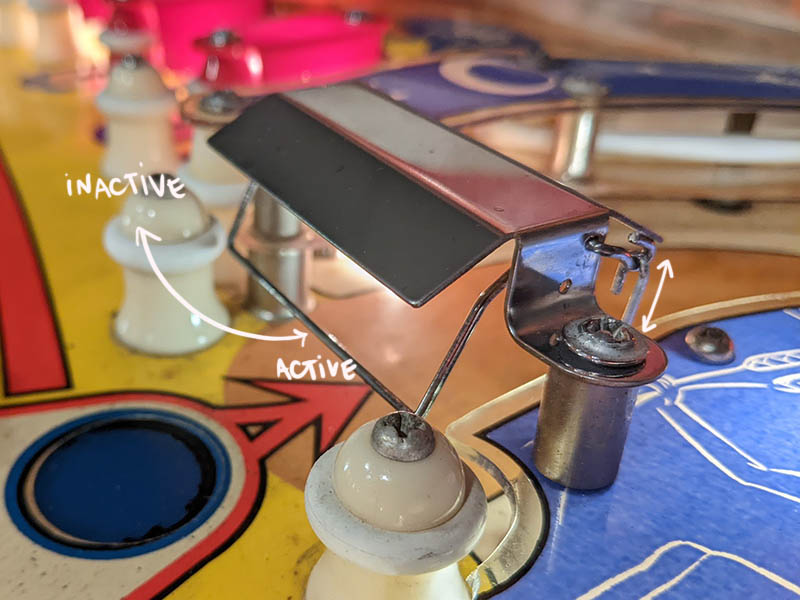
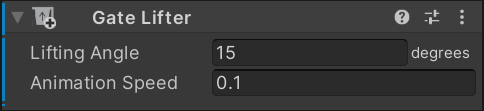

# Lifting Gates

	
	 
	<small><i>Photo © 2022 by bord</i></small>

Some Gottlieb and Bally games use gates that can be activated and deactivated. It does that by connecting a stem to the wire that lifts it up so the ball can pass through in both directions. The stem is attached to a relay. When the relay is turned on, the one-way gate becomes a two-way gate.

VPE provides a component that you can add to your existing gate. By doing that, it creates a new coil device that you can then map in the [Coil Manager](xref:coil_manager).

## Setup

In order to add the lifting gate feature to a gate, select the game object of the gate and click on *Add Component* in the inspector. Select it by searching or navigating to *Pinball -> Mechs -> Gate Lifter*. 

### Lifting Angle

How many degrees the wire rotates up to the deactivated position. About 15° should work well for most geometry.

### Animation Speed

How fast the gate rotates from and into the decativated position. Higher is faster. `0.1` seems a reasonable value.

## Usage

Adding the gate lifter component adds a coil input to the gate, i.e. you can map it to any of the gamelogic engine's coil outputs through the [Coil Manager](xref:coil_manager). 

> [!NOTE]
> If you're working on an EM game or an original game with [Visual Scripting](xref:uvs_index), don't forget to add the new coil to the [coil definitions](xref:uvs_setup#coils).
