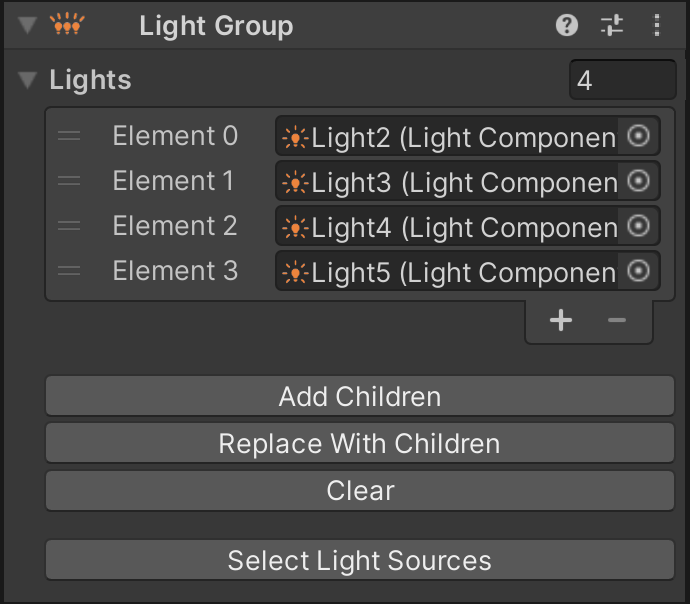

# Light Groups

Sometimes, a game addresses multiple physical lights as one logical lamp, i.e. all lights are always toggled or faded at the same time. Typical use cases are [GI strips](https://docs.missionpinball.org/en/latest/mechs/lights/gis.html). Instead of creating a link in the [Lamp Manager](xref:lamp_manager) for each light separately, VPE ships with a component called *Lamp Group*.

A light group is a component you can add to any GameObject. It's recommended to make it parent of the light objects it contains, but you can also keep it outside of the lights hierarchy, since it explicitly references the lights it contains.

## Setup

To create a new light group, select the GameObject you want to add your light group to, and in the inspector click on *Add Component* and choose *Visual Pinball -> Game Item -> Light Group*.

Then use the list control to add and remove lights. There are a few button that make this easier.

### Add Children

In case you have parented the light groups component to the light GameObjects it should include, this button adds all child lights to the list. Existing lights will remain.

### Replace With Children

Similar to *Add Children*, only that the list is cleared before adding new lights.

### Clear

Simply clears the list.

### Select Light Sources

When working with lights, the GameObject with the actual light source is nested within the main object. This can make adjusting light settings for multiple lights tedious, since you have to drill into each parent in order to select the source.

This button selects all the source GameObjects for the lights in the light group.