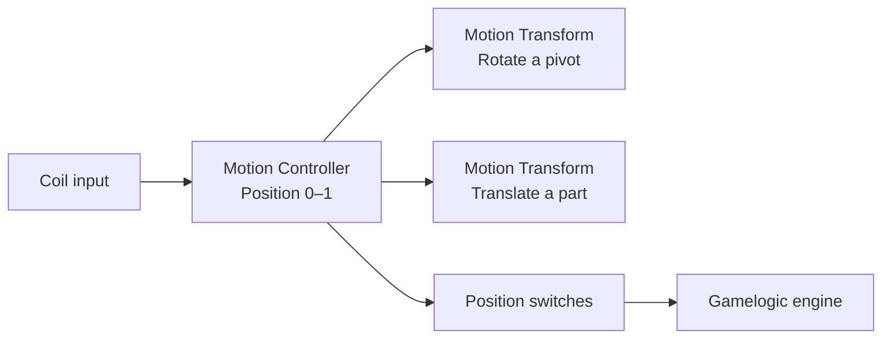
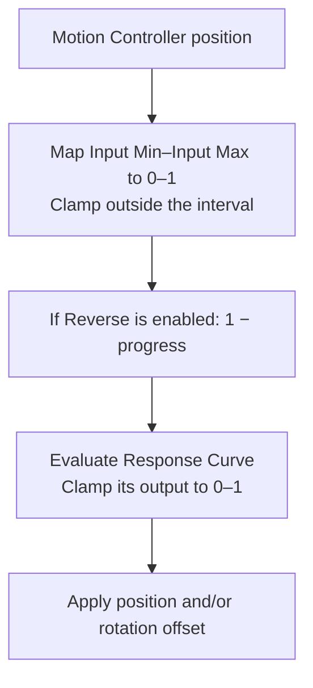

# Motion Controllers

A **Motion Controller** turns a coil signal into a position between **0** and **1**. **Motion Transform** components use that position to translate or rotate objects. One motion controller can drive several parts, each with its own travel, direction, and response curve.

The Motion Controller defines *when and how far the mechanism travels*. Its followers define *what that travel looks like*. Position switches report the motion controller's progress back to the gamelogic engine.



With the default follower settings, position **0** is the transform you author in the scene, and position **1** applies the full offset. An **Initial Position** of `0.5` starts the motion controller halfway through its travel; it does not redefine the authored transform.

## Motion Controller

Add **Pinball > Mechs > Motion Controller** to an active GameObject below the table's Player. It exposes one coil input, maintains the shared position, and optionally reports position switches. It does not move geometry by itself.

All connected Motion Transforms read the same position. Their individual offsets and response curves do not alter the controller's travel or switch feedback.

### Connect a coil and choose its behavior

For a mechanism that matches one of the modes below, open the [Coil Manager](xref:coil_manager), select its gamelogic output, and map it to the Motion Controller's **Motion Controller** coil item. Each motion controller exposes one coil input.

Choose **Coil Mode** according to what the electrical signal means:

| Mode | Coil Signal | Behavior | Typical mechanism |
| --- | --- | --- | --- |
| **Follow Coil** | Boolean (on/off) | A rising edge commands position 1. A qualified release commands position 0. | A held solenoid, such as a diverter that returns when released. |
| **Toggle On Pulse** | Boolean pulse | Each qualified rising edge swaps the target between 0 and 1. Release does not return it. | A pulse that changes a latched mechanism's state. |
| **One Shot** | Boolean pulse | A rising edge commands position 1, holds there for **One Shot Hold Duration**, then returns to 0. | A pulse that starts a complete out-and-back movement. |
| **Follow Value** | Float (`0`–`1`) | Each normalized input value becomes the target position. | A proportional position command. |

**Follow Coil** continues to its commanded endpoint; it does not integrate motor running time. **One Shot** produces one cycle from a held signal. Another rising edge after a qualified release can retrigger it, including during a return stroke.

In the three binary modes, a value is active only when it is **greater than Activation Threshold**. The default threshold is `0.001`. A reduced-strength value such as `0.25` still commands a full stroke; it does not mean quarter travel.

**Release Delay**, default `0.05 s`, is the time the input must remain inactive before VPE accepts its release. Short inactive gaps are ignored. In **Follow Coil**, this delays the return; in **Toggle On Pulse** and **One Shot**, it prevents a brief gap from rearming the trigger.

> [!TIP]
> **Follow Value** needs a plain coil mapping and a source that actually supplies proportional values. Wire and dynamic-wire paths carry boolean state, so they can only select 0 or 1. **Activation Threshold** and **Release Delay** do not apply in this mode.

<!-- MEDIA: motion-controller-coil-inspector.png

-->

### Tune the travel

| Motion Controller field | Meaning |
| --- | --- |
| **Initial Position** | Startup position, from 0 to 1. Default: `0`. Followers read it when they initialize. |
| **Activation Duration** | Full-stroke time toward 1, in seconds. Default: `0.3`. |
| **Release Duration** | Full-stroke time toward 0, in seconds. Default: `0.3`. |
| **Activation Curve / Release Curve** | Progress through the movement over normalized elapsed time. Both default to ease-in/ease-out. |
| **One Shot Hold Duration** | Time at position 1 before returning in **One Shot** mode. Default: `0.5 s`; shown only for that mode. |

Travel time scales with distance. With **Activation Duration** set to `0.4 s`, moving from `0.25` to `0.75` takes `0.2 s`. A reversal starts from the current position and uses the duration and curve for the new direction.

Author travel curves from `(0, 0)` to `(1, 1)`: the horizontal axis is elapsed progress through the move, and the vertical axis is progress from its starting position to its target. Linear gives constant progress; ease-in/ease-out softens the start and finish. The motion controller position stays within 0–1 and finishes at the target.

A zero duration moves the transform immediately. Use nonzero travel times when moving geometry needs to interact with balls.

### Add position feedback

Expand **Position Switches** on the Motion Controller and add an entry for each sensor the gamelogic engine expects. Give it a descriptive **Name**, select **Switch Type**, then map that item in the [Switch Manager](xref:switch_manager). Renaming an existing entry preserves its internal ID and mapping.

Switches use the motion controller's **actual position**, before any follower's input range, Reverse setting, or response curve.

| Switch Type | Settings | Behavior |
| --- | --- | --- |
| **Enable Between** | **Between** | Enabled while position is inside the inclusive range; disabled outside it. |
| **Pulse Between** | **Between**, **Pulse Every**, **Pulse Duration** | A pulse for each travel mark crossed inside the range, in either direction. |
| **Always Pulse** | **Pulse Every**, **Pulse Duration** | The same travel-based pulses over the entire 0–1 stroke. It does not pulse while stationary. |

For a generic mechanism with two end sensors, add **Home** with **Between** `0–0.02` and **End** with `0.98–1`. Both are disabled through the middle of travel. These are illustrative ranges, not T2 switch calibration. Maintained ranges report the current position; use pulse switches if every crossed mark must be counted even when crossed within one update.

**Pulse Every** is distance in normalized travel, not seconds or hertz. With **Always Pulse** and `0.1`, moving from 0 to 1 crosses ten marks: `0.1, 0.2, …, 1`. Returning crosses ten marks: `0.9, 0.8, …, 0`. Remaining on a mark does not emit more pulses.

For **Pulse Between**, marks start at the lower range boundary and repeat every **Pulse Every**. For example, **Between** `0.4–0.6` with an interval of `0.1` places marks at `0.4`, `0.5`, and `0.6`.

<!-- MEDIA: motion-controller-position-switches.png

-->

**Pulse Duration** is the minimum enabled time in milliseconds; the default is `20 ms`. Crossed marks are queued and emitted with distinct close/open edges on separate Unity updates. Output is therefore limited to at most roughly half the update rate, and longer pulses reduce it further. If travel produces marks faster than they can be emitted, feedback lags behind the movement. Each switch queues up to 1,024 pending pulses; further pulses are dropped with a warning.

Startup establishes maintained switch states without generating travel pulses. Editor preview never changes switches.

## Motion Transform

Add **Pinball > Animation > Motion Transform** directly to each independently moving visual. Its origin should already match the mechanical pivot. Assign the Motion Controller as its **Emitter**; each follower independently maps the shared position to its own movement:



### Translation and rotation

An explicitly assigned **Emitter** lets a Motion Transform live anywhere in the table hierarchy. When the field is empty, it searches itself and its parents for a compatible animation emitter.

Enable **Animate Position**, **Animate Rotation**, or both. These affect the GameObject carrying the follower.

| Follower field | Meaning |
| --- | --- |
| **Position Offset** | Displacement from the authored position at a follower response of 1. |
| **Translation Space: World** | The offset follows global axes and is measured in scene units. This is the default. |
| **Translation Space: Local** | The offset follows the follower's authored local gizmo axes and inherits its parent's scale. |
| **Rotation Offset** | Local Euler offset in degrees, applied relative to the authored rotation. |

A World offset remains world-aligned when a parent rotates, while the underlying authored position still follows that parent. A Local offset uses the follower's **authored** orientation; animating its rotation does not continually turn the translation direction.

Rotation interpolates between the authored orientation and the offset orientation along the shortest quaternion path. A `360°` offset does not create a full revolution. Scale animation is not supported.

For several independently moving parts, add a follower to each visual and assign the same motion controller. Use different offsets or curves for different travel. Keep one animation driver per transform so two behaviors do not overwrite the same pose.

### Response curves and Reverse

The motion controller's travel curves control movement over **time**. A follower's **Response Curve** controls its pose at a given **position**. These are separate controls: changing one follower's response does not change the motion controller's position or its switches.

With the default linear response, **Reverse** makes the follower start at its full offset when the motion controller is at 0 and return to its authored pose at 1. Reverse is applied **before** the response curve; with a custom curve, it reads that curve backwards.

The follower clamps the curve's output to 0–1. A curve can hold, accelerate, or reverse a part's travel within its offset, but cannot extend it beyond that range.

### Move during part of the stroke

Set **Input Min** and **Input Max** to the source positions where a follower's response begins and ends. For example, `0.25` and `0.75` with a linear response give:

| Motion Controller position | Follower response |
| --- | --- |
| 0–0.25 | 0: authored pose. |
| 0.5 | 0.5: halfway through its offset. |
| 0.75–1 | 1: full offset. |

This can delay a linkage's movement until another part has cleared it. Each follower evaluates the current position, so it tracks stops and reversals without a separate timer.

To move a part out and back within the interval, use response keys `(0, 0)`, `(0.5, 1)`, and `(1, 0)`. Outside the interval, the corresponding curve endpoint is held. **Input Min** must be less than **Input Max**, and both must be within 0–1; an invalid range keeps the authored pose and displays an Inspector error.

<!-- MEDIA: motion-controller-response-window.svg

-->

### Preview in edit mode

Select the Motion Controller and scrub **Animation Preview > Preview Position** to inspect all connected Motion Transforms. Preview applies each follower's input range, response curve, and Reverse setting directly; it does not play travel durations, run coil logic, or emit switches.

**Reset Preview** restores the authored transforms. Moving the slider to **0** also restores them, even if Reverse or a custom response curve would produce a different pose at runtime position zero. Use **Initial Position** to set the startup pose.

Reset preview before editing authored transforms. Temporary poses are also restored before saving the scene, entering Play Mode, reloading scripts, quitting Unity, undoing or redoing, or leaving the Motion Controller inspector. Prefab Mode objects are excluded from preview.

## Move collision with the visuals

For every rigid moving part, keep its render geometry and VPE collision geometry on the driven visual or below it. Make the moving collider objects active and enable **Kinematic** on their VPE collider components **before the table loads**. Configure every moving collider, including separate walls or rails.

Motion Transform moves a transform; it does not create colliders or configure their kinematic flags. VPE registers moving collision during initialization and derives linear and angular velocity from later pose changes. Making previously inactive geometry active or changing its kinematic flag during play is not a way to register new moving collision.

An motion controller prescribes movement. Ball impacts do not change its commanded travel. Ball capture, a loaded-ball switch, and firing behavior require their own mechanism setup; rotating the gun visuals alone does not implement those functions.

After checking poses in edit mode, test movement with balls in Play Mode, including the return stroke and any reversal. Check for fixed collision accidentally left inside the moving part.

## Example: preview the Terminator 2 gun

The rotating gun on *Terminator 2* demonstrates how to configure a Motion Transform and check its poses. Assume the visual's origin is already on the rotation axis.

> [!NOTE]
> This walkthrough demonstrates the gun's geometry. A complete T2 gun also needs a motor that repeatedly sweeps while powered and stops when power is removed. The current Motion Controller modes do not implement that behavior. Keep the PinMAME Mech Handler for the actual motor setup; use a separate copy of the gun visuals for this exercise. The Williams manual's [Gun Test, page 1-34](https://wwyss.ch/Arcades_Manuals/Manuals/Pinball/Terminator-2_Manual.pdf) describes its movement and alignment checks.

### 1. Select the moving visual

Create an active GameObject named **Gun Travel** below the table's Player and add **Pinball > Mechs > Motion Controller**. Place **Gun Visuals** below it, preserving the visual's world pose. Keep fixed mounting hardware outside the moving branch.

```text
Table (Player)
└── Gun Travel (Motion Controller)
    ├── Fixed Mount
    └── Gun Visuals (Motion Transform)
```

Add the Motion Transform directly to **Gun Visuals** in the next step. Any child meshes belonging to the same rigid part inherit its movement.

> [!TIP]
> If the visual's origin is not on the mechanical rotation axis, create an empty **Gun Pivot** GameObject at that axis and parent **Gun Visuals** below it, preserving the visual's world pose. Add **Motion Transform** to **Gun Pivot** instead. Put any collision geometry for the same rigid part below that pivot too.

<!-- MEDIA: motion-controller-t2-pivot.png

-->

### 2. Define the rotation

Add **Pinball > Animation > Motion Transform** to **Gun Visuals**, then configure it:

| Field | Setting for this exercise |
| --- | --- |
| **Emitter** | The Motion Controller on **Gun Travel**. |
| **Animate Position** | Off. |
| **Animate Rotation** | On. |
| **Rotation Offset** | The local rotation from the authored pose to the other end of the sweep, in degrees. |
| **Input Min / Input Max** | `0` / `1`. |
| **Response Curve** | Linear from `(0, 0)` to `(1, 1)`. |
| **Reverse** | Off. |

If the visual's local Y axis follows the shaft, try **Rotation Offset** `(0, -80, 0)` as an illustrative sweep, then adjust it to your model. This is a relative offset, not an absolute orientation or a calibration value from the manual.

<!-- MEDIA: motion-controller-t2-transform-inspector.png

-->

### 3. Preview the poses

Select **Gun Travel** and move **Animation Preview > Preview Position** through `0.25`, `0.5`, and `1`. Check that the gun turns around its shaft and clears the fixed hardware. With this linear follower, `0.5` applies half the rotation offset.

<!-- MEDIA: motion-controller-t2-preview.png

-->

Click **Reset Preview** to return to the authored pose. To start at a different pose in Play Mode, set the Motion Controller's **Initial Position**.

## Troubleshooting

| Symptom | Check |
| --- | --- |
| A follower does not move. | Assign the correct **Emitter**, enable position or rotation, set a nonzero offset, and check the input range. |
| A pivot orbits instead of turning in place. | Put the GameObject origin on the mechanical shaft and move the visuals beneath it. |
| Translation follows the wrong axes. | Check **Translation Space** and the follower's authored local orientation. |
| Preview zero differs from the runtime starting pose. | Preview zero restores the authored transform. Runtime also applies **Initial Position**, **Reverse**, and the response curve. |
| The mesh moves but collision stays behind. | Check that every moving VPE collider was active and **Kinematic** at table load and belongs to the driven hierarchy. |
| A pulse does not trigger another movement. | The input must fall to or below **Activation Threshold** for **Release Delay** before another rising edge is recognized. |
| Proportional control jumps between endpoints. | Check that the source sends fractional values through a plain coil mapping. |
| Encoder feedback continues after movement stops. | Reduce the number of travel marks, shorten pulse duration, or slow the movement so the pulse queue can keep up. |
