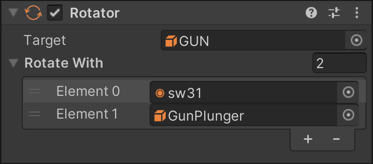

# Rotators

Sometimes during gameplay, you might need to rotate objects in order to recreate certain mechanisms. Like Visual Pinball, VPE doesn't support dynamic colliders (yet), but visually, objects can still be rotated.

**Rotators** in VPE are components that allow you to easily rotate objects around the Z-axis. It works by choosing a *target* which rotates around its local origin (typically the position on the playfield). Additional objects can be linked to rotate around the same axis at the same time.

## Setup

In order to create a rotator, add the *Rotator* component to a game object by clicking *Add Component* in the inspector, then choosing *Visual Pinball -> Game Item -> Rotator*. You can use any game object, although we recommend adding it to the target that you want to rotate.

### Target

Just adding the component to your target game object won't automatically rotate the target. You need to explicitly assign it in the **Target** field.

### Rotate With

Add other objects that rotate along with your target here. Currently, the following game items are supported:

- **Primitives** - Apart from the position, the *object rotation* of the primitive is updated. Note that in case your primitive has collision enabled, the colliders will not rotate along with the rendered object.
- **Kickers** - Rotating kickers applies the new angle to the kicker coils, and if a kicker contains a ball, the ball is rotated along as well.
- **Flippers** - Rotating flippers updates the start angle of the flipper.

## Usage

When adding a rotator component to a game object, it provides a float input that other components can use to rotate the object. Currently, only the step rotator mech makes use of this input. However, the step rotator will probably be replaced by a more generic system soon, so we won't go into more details here.