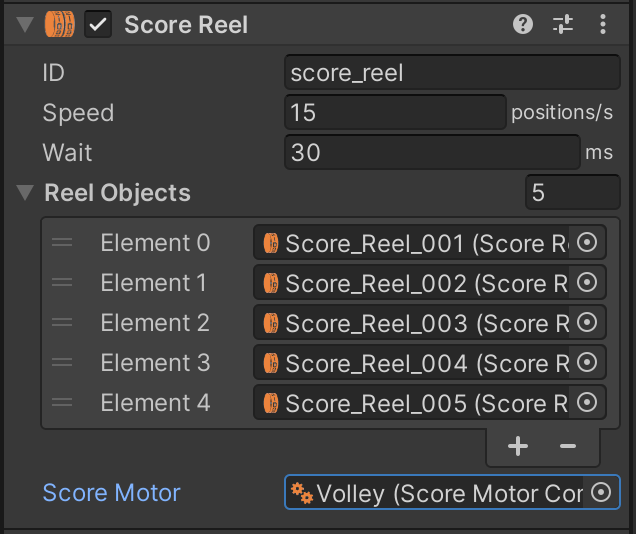

# Score Motors

Score Motors are used in EM games to add multiple points to a players score. For example, if a player scores 50 points, the score motor runs and enables a 10 point relay five times. With each pulse of the 10 point relay, the 10s score reel coil fires which advances the score reel one position.  

For an in depth look at score motors, check out the fantastic article [Animated Score Motor circuits from EM Pinball Machines](https://www.funwithpinball.com/learn/animated-score-motor-circuits) at [Fun With Pinball](https://www.funwithpinball.com/).

VPE comes with a score motor mechanism that simulates the behavior of a score motor. It handles score resets and add points all while performing accurate timing that can be specified by the table author.

# Setup

To setup a score motor, select the table, click on *Add Component* in the inspector and select *Visual Pinball -> Mechs -> Score Motor*.

Next, configure the score motor.

The Score Motor inspector shows the following options:

- **Steps** defines how many steps the score motor pulses for one turn.
- **Degrees** sets the number of degrees the score motor rotates for one turn.
- **Duration** defines the length of time (in milliseconds) it takes the score motor to rotate one turn.
- **Block Scoring** defines if single point scoring is blocked while the score motor is running.

Reel timing by increase:

- **Increase by #** defines the `Wait` (pause) or `Increase` (add points) actions to use based on 2, 3, 4, or 5 increases. 

> [!NOTE]
> The minimum amount of `Steps` for a score motor is `5`. `Increase by 5` will not be shown under `Reel timing by increase` if `Steps` is set to 5, as all actions would be `Increase`.  

By default, the score motor is configured to:

- 6 Steps
- 120&deg;
- 769 ms

Next, associate the score motor with the score reel display by selecting it in the Score Reel Display inspector:

Optionally, use the [Switch Manager](xref:switch_manager) to associate the `Motor Running` and `Motor Step` switches the score motor exposes:

# Usage

If a score reel display is [cleared](xref:uvs_node_reference#displays) or [updated](xref:uvs_node_reference#displays), the associated score motor will be automatically activated. 
