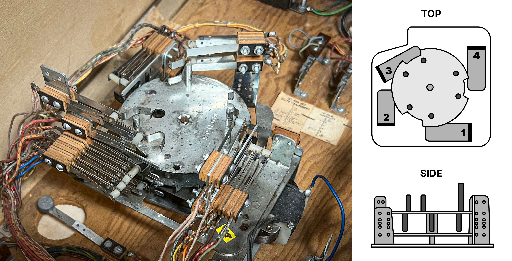
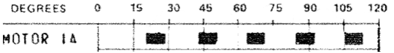

# Score Motors

Score Motors are used in electro-mechanical games to add points to a player's score. They consist of multiple cams that are stacked on top of each other. Each cam has different patterns around the edges, and switches sit a different positions in order to open or close at specific times when the motor runs and thus the cams rotate.

<small>*A typical score motor, found in Gottlieb and early Bally machines.*</small>

The score motor assembly sits typically at the bottom of the cabinet. The produced switch sequences are used when the game needs to do several things in a specific order. Although its main purpose is triggering the score reel relays, it is often used to drive other mechanisms as well.

## Scoring in an EM

There are two different modes of operation:

1. The player scores **single points**, e.g. one, ten, hundred, and so on. In this case, a pulse is directly sent to the coil driving the corresponding score wheel, which increases its position by one.
2. The player scores **multiple points**, like five, twenty, or 300. In this case, the score motor starts and the appropriate numbers of coil pulses are triggered by the switches around cams. For example, if a player scores fifty points, the score motor runs and enables a ten point relay to pulse five times. With each pulse of the ten point relay, the 10's score reel coil fires, which advances the score reel one position. 

Another property of a score motor is that it has no state, i.e. it doesn't know the actual score. This means that while the motor is running and the player scores *multiple* points, they are ignored. For *single* points, it depends on the machine, some allow single-point scoring while the motor is running, some don't.

> [!NOTE]
> For an in depth look at score motors, check out the fantastic article [Animated Score Motor circuits from EM Pinball Machines](https://www.funwithpinball.com/learn/animated-score-motor-circuits) at [Fun With Pinball](https://www.funwithpinball.com/).

## Player Experience

The way the scoring works results in a very particular timing of when exactly the score reels move during the game. Since in most games, chimes and bells are fired when the reel position changes, the player not only sees but also hears when points are scored. This means that accurate timing is essential for an authentic gaming experience.

# Setup

VPE comes with a component that accurately simulates the behavior described above. It handles score resets and add points all while performing accurate timing that can be specified by the table author.

To setup a score motor, select the table, click on *Add Component* in the inspector and select *Visual Pinball -> Mechs -> Score Motor*.

Next, configure the score motor.

The Score Motor inspector shows the following options:

- **Steps** defines how many steps the score motor pulses for one turn.
- **Duration** defines the length of time (in milliseconds) it takes the score motor to completely cycle.
- **Block Scoring** defines if single point scoring is blocked *while the score motor is running*. As mentioned before, multiple point scores are always blocked while the score motor is running.

Reel timing by increase:

- **Increase by #** defines the behavior of the score motor for all of its the possible outputs. This give the table author control over the timing and execution of `Wait` (pause) or `Increase` (add points) actions. For example, if the schematic shows that the table scores 30 points by pulsing on the first three actions of the score motor then the author can set the score motor like this:

 

> [!NOTE]
> The minimum amount of `Steps` for a score motor is `5`. `Increase by 5` will not be shown under `Reel timing by increase` if `Steps` is set to 5, as all actions would be `Increase`.  

By default, the score motor is configured to:

- 6 Steps
- 769 ms total run time

Next, associate the score motor with the score reel display by selecting it in the Score Reel Display inspector:

Optionally, use the [Switch Manager](xref:switch_manager) to associate the `Motor Running` and `Motor Step` switches the score motor exposes:

# Usage

If a score reel display is [cleared](xref:uvs_node_reference#displays) or [updated](xref:uvs_node_reference#displays), the associated score motor will be automatically activated. 
