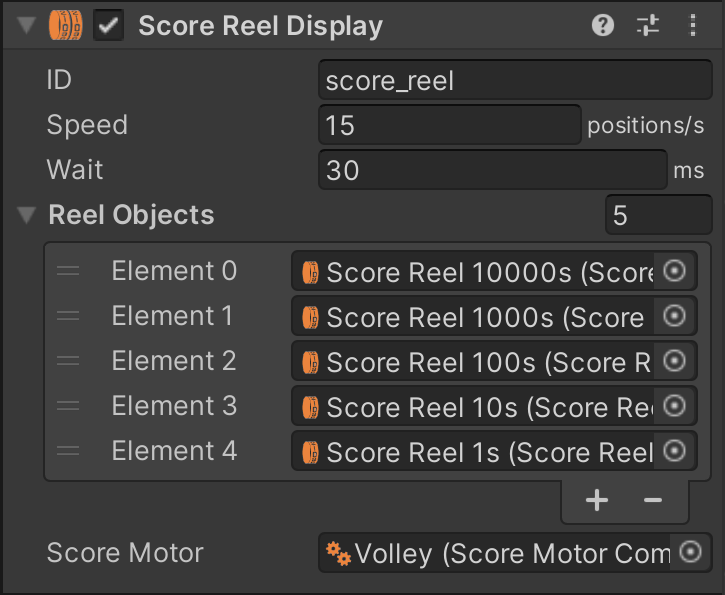

# Score Reel Displays

In electro-mechanical games, score reels are very common for displaying the player score. Typically, four to six units are mounted behind the backglass. Each reel is driven by a coil that advances the reel by one position when pulsed. The coils are driven by the playfield elements in the game, often indirectly through a score motor for multi-point scoring.

VPE includes components that simulate the [score motor](xref:score-motors) and render the score reel animation. This page is about the score reel, which presents itself to the [GLE](xref:gamelogic_engine) as a [display](xref:displays) that takes in the "numerical" frame format (i.e. numbers only). The score motor is an optional component that provides accurate timing when animating the reels.

## Setup

Typically you would drop the desired score reel variant from the asset library into your scene. But you can also set it up manually:

A score reel display consists of two separate components.

1. The *Score Reel Display* component, which represents the logical display that takes in a number and then sets the reels to display that number.
2. The *Score Reel* component, which represents one single reel and handles the animation.

### Model

The best geometry for a score reel is a simple, open cylinder. Make sure the local origin is in the middle, and that it rotates around the Z-axis.

The texture should contain the numbers 0-9, each taking up 36°. The order (and thus the direction of rotation) depends on the game, so both are valid, and can be configured later.

### Scene

In your scene, drop in your reel model and add the *Score Reel* component (not the *Score Reel Display* component) to the game object. You can find it under *Visual Pinball -> Display*. Since you'll need the same reel for each position, the best approach is to create a [prefab](https://docs.unity3d.com/Manual/Prefabs.html) for the reel and instance it for each position. Then, parent them under a game object that acts as your display. To this object, add the *Score Reel* component (also under *Visual Pinball -> Display*).

### Components

#### Score Reel

The *Score Reel* component is quick to set up. There is only one option, which is the *rotation direction*. What the score reel component gets from the display component is "turn to position X", where X is between 0 and 9, and the component's job is to animate the reel to that position.

Internally, it also takes in the rotation speed, and how long it rests at the final position before it can advance to the next position. However, those parameters are not exposed in the inspector but retrieved from the display component described in the next section.

#### Score Reel Display

This is the component on the parent game object that receives score numbers from the game and tells the individual reels to which position they need to turn to. 

- **ID** defines the display ID. Remember that displays are [connected at runtime](xref:displays#setup), so this is the identifier that the GLE uses to send data to it.
- **Speed** defines how quickly the reels should rotate.
- **Wait** indicates the time the reels stand still before they can go to the next position.
- Under **Reel Objects** you define your reels (they are not automatically retrieved from the children). The order is from largest to smallest, i.e. from left to right.
- The **Score Motor** is an optional reference to a [score motor component](xref:score-motors).

## Usage

### Gamelogic Engine

Score reels are primarily used in EMs, so they are typically driven by [Visual Scripting](xref:uvs_index). As with every display, the first step is to define the display in the GLE component.

Add a new display under *Displays* and set the same ID as you did in the display component. The *Width* and *Height* properties are ignored, since they are managed by the display component (contrarily to the other displays, where the size is given by the GLE).

Next, add *Numeric* under *Supported Formats*.

### Visual Scripting

In Visual Scripting, use the [Update Display](xref:uvs_node_reference#update-display) node to set a new score. It's up to you whether to use a separate [event](xref:uvs_setup#events) or to subscribe to a [player variable](xref:uvs_variables) directly.

If you're using a score motor, read how to set it up correctly [here](xref:score-motors#usage).