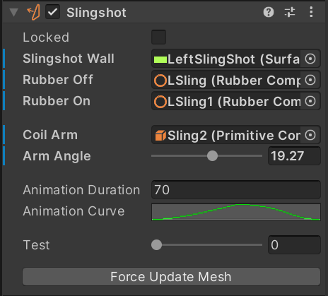
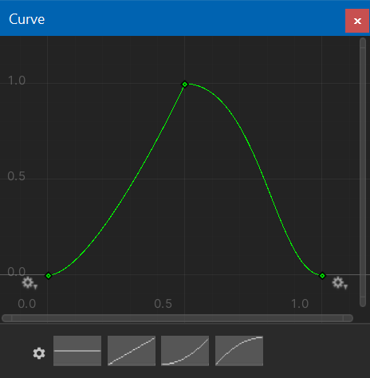

# Slingshots

Slingshots are most commonly located just above the flippers. They usually consist of two "blade" switches on the inner side of a triangular rubber. Between the switches there is a coil driven arm that propels the ball away from the slingshot when either switch closes.

Visual Pinball doesn't have an explicit slingshot element. Instead, it relies on walls with a segment marked as *slingshot*, which generates an additional force being applied to the ball when the segment is hit. However, the rubber animation is up to the table script to implement.

VPE does provide a slingshot component that implements the rubber animation during runtime. This allows for functional slingshots without any additional code. However this approach isn't ideal and will be replaced with a proper slingshot element in the future.

# Setup

### Slingshot Wall

In order to trigger the animation, the slingshot component needs a reference to the wall which has one of the control points set to *slingshot*. 

### Rubbers

VPE animates the control points of the rubber by interpolating between a start position to an end position and then back to the start over the duration of the animation. 

To set the start and end positions of the control points, we reference two rubber elements (which must have the same number of control points.) In the inspector, *Rubber Off* indicates the rubber representing the start position, and *Rubber On* the end position.

> [!NOTE]
> In VPX, tables often come with three rubbers elements that are toggled in order to fake an animation. When using VPE's slingshot component, you can delete the rubber at mid position, since only the start and end rubbers are used. The interpolation is calculated in real time depending on the speed of the slingshot.

### Coil Arm

On physical machines, the rubber is moved by an arm attached to the coil. VPE can simulate the movement of that arm by rotating a primitive across the X-axis. In the *Coil Arm* field, a reference to the primive can be set, and the total angle of rotation under *Arm Angle*.

### Animation

The animation has two parameters: The duration in milliseconds, and the curve. The curve represents the position in function of time and covers both directions of travel. This allows non-linear movement of the rubber.

### Test

With the test slider you can easily preview how the rubber and arm are animated.

# Howto

## Set Up a Slingshot from an Imported Table

This howto uses the blank table, but other tables should be similar. Usually, slingshots consist of three rubbers for the animation, plus a wall for the physics. We need the following elements:

1. The wall with a segment set to *slingshot*
2. The rubber at idle position
3. The rubber at *activated* position
4. Optionally, the coil arm that pushes the rubber

Note that both rubbers *must* have the same number of drag points. This is because during the animation, the rubber is linearly interpolated between the two drag points positions, which isn't possible if the number differs. When converting a table from Visual Pinball, that means that you may need to add additional drag points to the rubber at idle position.

### 1. Identify and clean up the elements

Zoom in to the slingshot you want to set up. You'll probably want to temporily hide the plastic that covers up the rubbers and the wall. Find the rubber at idle position and at activated position. Delete the rubber in-between, we don't need that one.

Note the names of those rubbers. Here it's `LSling` and `LSling1`. Also look for the the coil arm, which is called `Sling2`, as well as wall that acts as the physical slingshot, here `LeftSlingShot`.

> [!Video https://www.youtube.com/embed/rL2uZyYXBHk]

### 2. Add additional control points if necessary

Now, since `LSling1` is bent and thus contains three additional control points, we'll add the same points to `LSling`.

We can now also can hide the meshes of the rubbers.

> [!Video https://www.youtube.com/embed/Yie1Pby8iGs]

### 3. Add the slingshot component

In the Toolbox, click on the *Slingshot* icon, which will create a new element in the scene. Rename it and link the elements we've identified in step 1:

- *Slingshot Wall* links to `LeftSlingShot`
- *Rubber Off* links to `LSling`
- *Rubber On* links to `LSling1`

The slingshot component is now able to create the mesh. The animation can be tested with the *Test* slider.

> [!Video https://www.youtube.com/embed/421gesRScYo]

### 4. Setup the coil arm animation

Since the rubber is pushed inside by the arm, the arm should be animated along with the rubber. This can be a bit fiddly, since the arm should be as close to the rubber as possible without clipping through it.

Move the *Test* slider all to the right, and play with the *X-Rotation* of the coil arm. Once you're happy, copy the angle to the clipboard. Then, select the slingshot. In the inspector, set the following fields:

- *Coil Arm* links to the primitive, in our case `Sling2`.
- *Arm Angle* is the angle when the coil is enabled. Paste the angle you've copied before.

Now, when moving the *Test* slider, the arm should animate along with the rubbers.

> [!Video https://www.youtube.com/embed/Q1jeJHRIziM]

### 5. Wrap-up and test

Before final testing, there are two things left to do:

1. Select the coil arm and disable the collider
2. Enable the plastic we hid in step 1.

Then hit play and have a game!

> [!Video https://www.youtube.com/embed/dNS4YPdRXTc]
