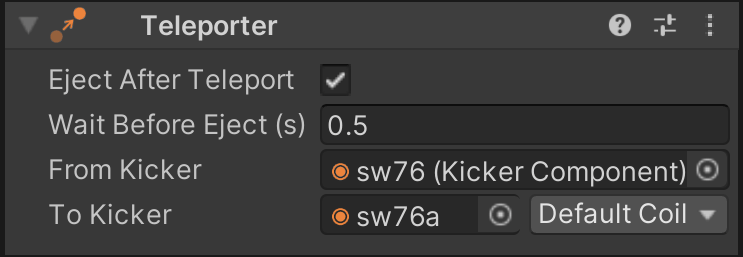

# Teleporters

Sometimes it's easier to teleport the ball from one place to another instead of setting up the physical environment to simulate the actual movement. VPE provides a simple component that destroys a ball at kicker A and creates a new one at kicker B.

> [!NOTE]
> Please note that you shouldn't be using teleporters when the ball is visible, because it breaks the natural flow of the ball and looks choppy. 

## Setup

In order to create a new teleporter, select the GameObject you want to add it to, click on *Add Component* and select *Visual Pinball -> Game Item -> Teleporter*. You can choose any GameObject, although we recommend putting it on same GameObject as the source kicker.

> [!NOTE]
> The teleporter's features are very basic. If there is need, we will add more features like teleportation to multiple types of game elements or the possibility to teleport in both directions.

### Eject After Teleport

Once the ball is created at the destination kicker, it can be ejected immediately or after a delay (see next section), or it can stay in the kicker.

If disabled, this option makes the destination kicker keep the ball until it's explicitly ejected through the kicker's coil.

### Wait Before Eject

You should use teleporters only for trajectories that are hidden and that emulate a physical ball going from A to B. In that case, the time it would take for the ball to travel from A to B can be simulated by waiting for the destination kicker to pop out the ball.

This is the time in seconds that is waited before the ball is ejected from the destination kicker, but only if *Eject After Teleport* is enabled.

### From Kicker

A reference to the source kicker. Note that if you use this kicker for teleportation only, it's recommended to remove any coils from the kicker, since it will make it easier to select the right element when linking to it in the Coil Manager.

### To Kicker

The destination kicker. Here you also select a coil in case the ball is ejected after teleportation.
