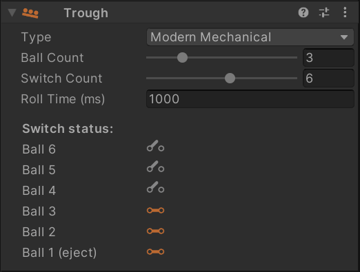
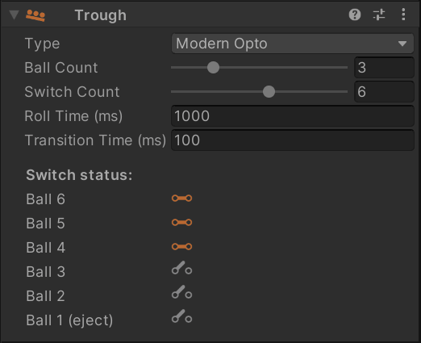
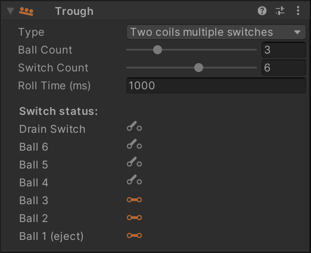
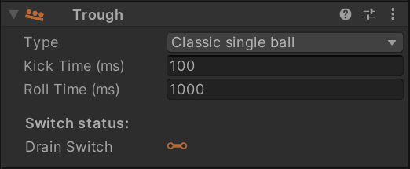

# Troughs / Ball Drains

If you are unfamiliar with ball troughs, have a quick look at [MPF's documentation](https://mpf-docs.readthedocs.io/en/latest/mechs/troughs/), which does an excellent job explaining them.

VPE comes with a trough mechanism that simulates the behavior of a real-world ball trough. This is especially important when emulating existing games, since the [gamelogic engine](xref:gamelogic_engine) expects the trough's switches to be in a plausible state, or else it may have errors.

## Creating a Trough

When importing a `.vpx` file that doesn't have any troughs (which is likely, because Visual Pinball doesn't currently handle them in the same way as VPE) or creating a new table, VPE will automatically add a main trough to the root of the table. In order to create a trough manually, click on the *Trough* button in the toolbox.

## Linking to the Playfield

To interact with the game, you must set up an **input switch** to drain the ball into the trough, and an **exit kicker** to release a new ball from the trough. This terminology may seem weird, since the ball *exits* the playfield when draining, but from the trough's perspective, that's where the ball *enters*. 

You can setup these links under *Playfield Links* by selecting the trough in the hierarchy panel and linking them to the desired items using the inspector.

> [!NOTE]
> Both the input switch and the exit kicker are not related to the gamelogic engine. Their goal is purely to link the physics simulation to the trough logic, whose behavior is not physically simulated. 
>
> Many games *do* have an input switch (which we call *drain switch*) and an exit kicker (we that one *eject coil*).  They are simulated by the trough itself and show up in the switch- and coil manager under the trough device.

The inspector also lets you configure other options:

- **Ball Count** defines how many balls the trough holds when the game starts.
- **Switch Count** sets how many ball switches are available. This is usually the same number as the ball count.  The drain switch and the jam switch are excluded from this count.
- **Has Jam Switch** defines if the trough has a jam switch. This switch is often called *eject switch* as well.
- **Roll Time** sets how long it takes the ball to roll from one switch to the next.
- **Kick Time** defines how long it takes the ball to get kicked from the drain into the trough.
- **Transition Time** is only relevant for opto switches and defines how long the switch closes between balls.

## Trough Types

VPE supports several variants of troughs found on real machines. You can configure the behavior of the trough by changing the *Type* in the inspector when the trough is selected in the hierarchy.

In this section we'll again link to the excellent MPF documentation explaining each of the different types. We'll also provide an animation of the trough inspector during gameplay showing how the switches and coils behave in real time.

### Modern Mechanical

[Modern troughs with mechanical switches](https://docs.missionpinball.org/en/latest/mechs/troughs/#option-2-modern-trough-with-mechanical-switches) are covered by this type.

The ball drains from the playfield directly into the ball stack, and every ball slot has an associated switch. When a ball gets ejected, the remaining balls move down simultaneously to the next position. During that movement, their switches get first opened and then closed again when they reach the next position. The time of this movement is defined by *Roll Time*.

*The animation on the right shows a 6-ball trough filled with three balls. It starts by ejecting a ball, followed by draining that ball, rolling back onto the stack.*

### Modern Opto

[Modern troughs with optical switches](https://docs.missionpinball.org/en/latest/mechs/troughs/#option-1-modern-trough-with-opto-sensors) work similar similar to their mechanical counterparts. However there are two differences:

1. Opto switches have the inverse value of mechanical switches. That means per default, an opto switch is *closed*, and when a ball rolls through, it opens. It's kind of logical, because the ball *blocks* the beam of light thus *opening* the circuit, while a mechanical switch gets *closed* by the ball's weight.
2. Timings are different. When a ball approaches an opto switch, the switch gets triggered as soon as the ball's *front* hits the beam, while a mechanical switch gets triggered when the ball's *center* is over it. This results in very short closing times when the ball stack moves to the next position after a ball eject.

We call this closing time the *transition time* - it's the time during stack transition when all switches briefly close.

*Like before, the animation shows a 6-ball trough filled with three balls. It starts by ejecting a ball, followed by draining that ball, rolling back onto the stack.*

> [!NOTE]
> When a transition time is set to `0`, only the first and the last switch of the stack change value (as opposed to each position opening and closing immediately).

### Two coils and multiple switches

[Troughs of this type](https://docs.missionpinball.org/en/latest/mechs/troughs/#option-3-older-style-with-two-coils-and-switches-for-each-ball) can be found in older machines from the 80s and early 90s. They consist of two parts:

1. A drain, the ball rolls into when leaving the playfield
2. A ball stack, where the out of play balls are held.

In terms of switches, they still include a switch per ball in the stack, but also an additional drain switch to trigger kicking the ball from the drain into the stack.

*The animation shows a 6-ball trough filled with three balls. It starts by ejecting a ball, followed by draining that ball. The ball stays in the drain until the entry coil activates, which makes the ball roll over to the ball stack.*

### Two coils and one switch

A trough can also have [only one switch](https://docs.missionpinball.org/en/latest/mechs/troughs/#option-4-older-style-with-two-coils-and-only-one-ball-switch) in the ball stack.

Instead of a *Switch Count* like the previous types, you select a *Switch Position*, which is the position in the ball stack at which the ball farthest away from the eject coil sits.

*The animation shows a 6-ball trough filled with six balls. It starts by ejecting a ball, followed by draining that ball. The ball stays in the drain until the entry coil activates, which makes the ball roll over to the ball stack.*

### Classic single ball

A single ball trough may work [with](https://docs.missionpinball.org/en/latest/mechs/troughs/#option-5-classic-single-ball-single-coil) or [without](https://docs.missionpinball.org/en/latest/mechs/troughs/#option-6-classic-single-ball-single-coil-no-shooter-lane) a shooter lane. The principle is simple: After draining, the ball is kept on the drain coil, which ejects the ball either directly into the plunger lane or back onto the playfield.

*The animation shows single ball trough that ejects a ball and drains it a few seconds later.*

## Switch Setup

The number of simulated switches in the trough depends on the type of trough and the *Switch Count* property in the inspector panel. For recreations, you can quickly determine the number of trough switches by looking at the switch matrix in the operation manual, it usually matches the number of balls installed in the game.

To configure the switches, open the [switch manager](xref:switch_manager) and add the trough switches if they're not already there. For *Destination* select "Device", under *Element*, select the trough you've created and which switch to connect. For a modern five-ball trough, it will look something like this:

## Coil Setup

VPE's trough supports up to two coils, an entry coil which drains the ball from the outhole into the trough, and an eject coil which pushes a new ball into the plunger lane. To configure the coils, open the [coil manager](xref:coil_manager), find or add the coils, and link them to the trough like you did with the switches:

> [!NOTE]
> Depending on which trough type is set, different coils and switches show up under the trough device.
