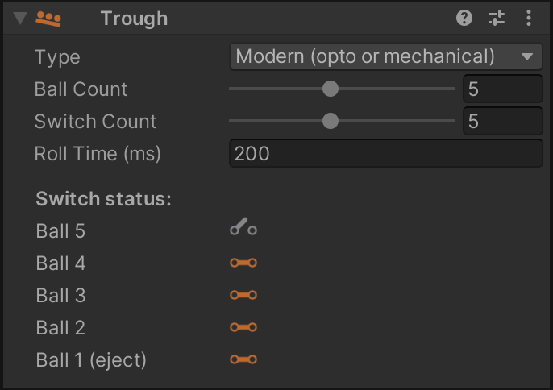
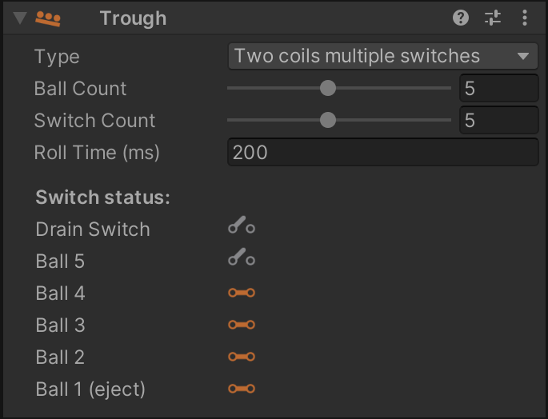
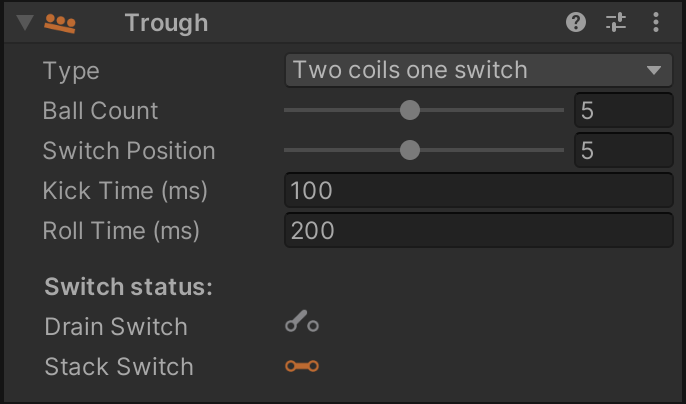
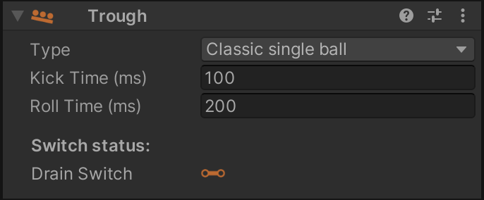

# Troughs / Ball Drains

If you are unfamiliar with ball troughs, have a quick look at [MPF's documentation](https://mpf-docs.readthedocs.io/en/latest/mechs/troughs/), which does an excellent job explaining them.

VPE comes with a trough mechanism that simulates the behaviour of a real-world ball trough. This is especially important when emulating existing games, since the [gamelogic engine](../gamelogic-engine.md) expects the trough's switches to be in a plausible state, or else it may have errors.

## Creating a Trough

When importing a `.vpx` file that doesn't have any troughs (which is likely, because Visual Pinball doesn't currently handle them in the same way as VPE) or creating a new table, VPE will automatically add a main trough to the root of the table. In order to create a trough manually, click on the *Trough* button in the toolbox.

## Linking to the Playfield

To interact with the game, you'll need to setup an **entry switch** to drain the ball into the trough, and an **exit kicker** to release a new ball from the trough. This terminology may seem weird, since the ball *exits* the playfield when draining, but the links are labelled in relation to the trough.

You can setup these links under *Playfield Links* by selecting the trough in the hierarchy panel and linking them to the desired items using the inspector.

The inspector also lets you configure other options:

- **Ball Count** defines how many balls the trough can hold.
- **Switch Count** sets how many ball switches are available. This is usually the same number as the ball count.
- **Roll Time** sets how long it takes the ball to roll from one switch to the next.
- **Kick Time** defines how long it takes the ball to get kicked from the drain into the trough.

## Trough Types

VPE supports several variants of troughs found on real machines. You can configure the behavior of the trough by changing the *Type* in the inspector when the trough is selected in the hierarchy.

In this section we'll again link to the excellent MPF documentation explaining each of the different types.

### Modern (opto or mechanical)

Modern troughs with both [optical](https://docs.missionpinball.org/en/latest/mechs/troughs/#option-1-modern-trough-with-opto-sensors) and [mechanical](https://docs.missionpinball.org/en/latest/mechs/troughs/#option-2-modern-trough-with-mechanical-switches) switches are covered by this type.

The ball drains from the playfield directly into the ball stack, and every ball slot has an associated switch.

During gameplay, if you select the trough in the hierarchy, it displays the status of every switch in real time for debug purposes.

### Two coils and multiple switches

[Troughs of this type](https://docs.missionpinball.org/en/latest/mechs/troughs/#option-3-older-style-with-two-coils-and-switches-for-each-ball) can be found in older machines from the 80s and early 90s. They consist of two parts:

1. A drain, the ball rolls into when leaving the playfield
2. A ball stack, where the out of play balls are kept.

In terms of switches, they still include a switch per ball in the stack, but also an additional drain switch to trigger kicking the ball from the drain into the stack.

### Two coils and one switch

A trough can also have [only one switch](https://docs.missionpinball.org/en/latest/mechs/troughs/#option-4-older-style-with-two-coils-and-only-one-ball-switch) in the ball stack.

Instead of a *Switch Count* like the previous types, you select a *Switch Position*, which is the position in the ball stack at which the ball farthest away from the eject coil sits.

### Classic single ball

A single ball trough may work [with](https://docs.missionpinball.org/en/latest/mechs/troughs/#option-5-classic-single-ball-single-coil) or [without](https://docs.missionpinball.org/en/latest/mechs/troughs/#option-6-classic-single-ball-single-coil-no-shooter-lane) a shooter lane. The principle is simple: After draining, the ball is kept on the drain coil, which ejects the ball either directly into the plunger lane or back onto the playfield.

## Switch Setup

The number of simulated switches in the trough depends on the type of the trough and the *Switch Count* property in the inspector panel. For recreations, you can quickly determine the number of trough switches by looking at the switch matrix in the operation manual, it usually matches the number of balls installed in the game.

To configure the switches, open the [switch manager](../../editor/switch-manager.md) and add the trough switches if they're not already there. For *Destination* select "Device", under *Element*, select the trough you've created and which switch to connect. For a modern five-ball trough, it will look something like this:

## Coil Setup

VPE's trough supports two coils, an entry coil which drains the ball from the outhole into the trough, and an eject coil which pushes a new ball into the plunger lane. To configure the coils, open the [coil manager](../../editor/coil-manager.md), find or add the coils, and link them to the trough like you did with the switches:

