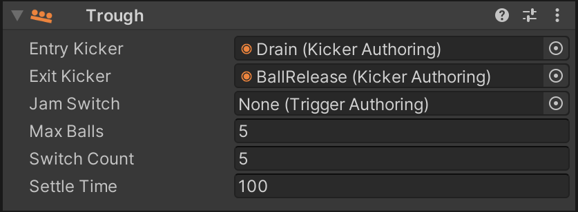

# Troughs / Ball Drains

If you have never heard about ball troughs, have a quick look at [MPF's documentation](https://mpf-docs.readthedocs.io/en/latest/mechs/troughs/), they do an excellent job explaining it.

VPE comes with a trough mechanism that simulates like a real-world trough behaves. This is important, because when emulating real-world games, the [gamelogic engine](../gamelogic-engine.md) expects the trough's switches to be in a certain state, or else it will complain.

## Creating a Trough

When importing a `.vpx` file that doesn't have a trough (chances are high, because Visual Pinball doesn't handle troughs like VPE does), VPE will automatically add a trough under the root of the table. If you're creating a new game, click on the *Trough* button in the toolbox.

## Linking to the Playfield

In order to interact with the game, you'll need to setup your entry kicker (the one that drains the ball), and the exit kicker (the one that releases a new ball). This terminology seems weird, because the ball *exits* the playfield when draining, but from the the trough's perspective, that's where the ball *enters*.

You can setup the kickers by selecting the trough in the hierarchy panel and linking them to the desired kickers in the inspector panel.

## Switch Setup

The number of switches of the trough depends on the *Switch Count* property in the inspector panel. For recreations, you can quickly determine the number of trough switches by looking at switch matrix in the operation manual.

Open the [switch manager](../../editor/switch-manager.md) and add the trough switches if they're not already added. As *Destination* select "Device". Under *Element*, select the through you've created and which switch of the trough to connect. For a five-ball trough, it would look something like that:

## Coil Setup

VPE's trough supports up to two coils, an entry coil which pushes the ball from the drain into the trough, and an eject coil which pushes a new ball into the plunger lane. Open the [coil manager](../../editor/coil-manager.md), find or add the eject coil and link it to the trough's eject like you did with the switches before:

