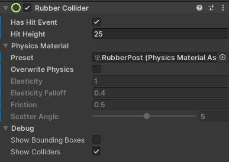
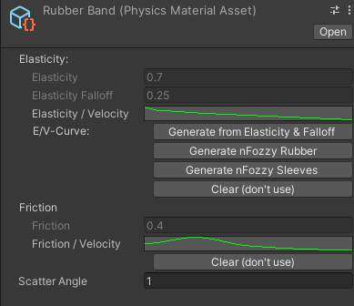
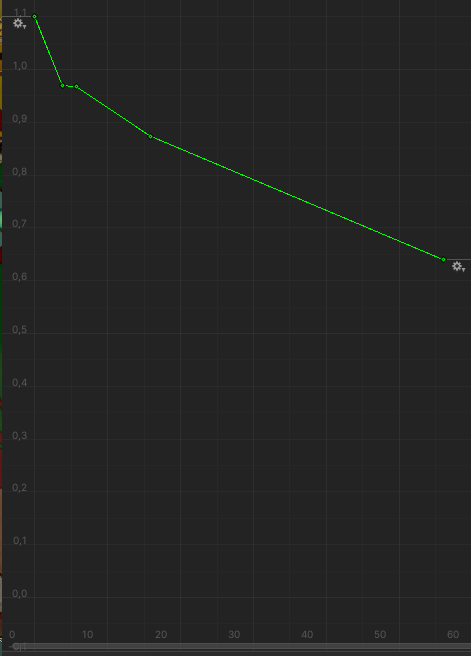

# Physics Engine

When playing pinball, physics are very important. Playfield elements impact the ball. These elements can not only be changed in size and shape but also how the influence the balls movement, so it's important to be able to control them.

Compared to Visual Pinball, VPE uses the same physics engine for almost all parts of the game, but there are differences.

This document will try to describe the differences to the physics engine at first glance, but will try to describe important aspects of the physics engine when they are needed to understand concepts.

## Introduction and general topics

### Visual Pinball and VPE's physics engine

Some (unsorted) facts about the physics engine:

- running at 1000 Hz plus CCD-iterations
- CCD: uses Continuous Collision Detection for collisions
- Uses a quadtree in a broad phase
- is highly optimized for pinball (i.e. optimizied more for static than dynamic objects)
- translates the objects internally on the playfield into "Colliders" like circles, Lines, Planes, Points, Triangles
- VPE's physics mostly use Unity's DOTS (Data-Oriented Technology Stack) and should therefore be multithreaded (which Visual Pinball is not).
- is by no means a accuraty system to describe physics (no game physics engine is). Physics in Pinball are much more complicated as one might think. Imagine a spinning ball hitting a flexible rubber -> should the spin vanish, get reversed, get conservated, and if, how much? - It depends... 

### Different coordinate systems

In VPE's (and Visual Pinball) physics engine, a different coordinate system is used as it is used in unity.

For the following explanation, imagine looking at the playfield from above:
In physics engine, 
- positive X is right
- positive Y is down (to the drain)
- positive Z is pointing to my eye
	
In Unity also looking from above onto the playfield:
- positive X is right
- positive Y is pointing to my eye
- positive Z is pointing from the drain into the backglass

## Settings of different components 

### Walls and Rubbers

Playfield elemets may have collider components, such as a rubber collider:

In general, you can set 
- Elasticity, 
- Elasticity Falloff,
- Friction,
- Scatter Angle

Targets, metal wire guides, primitives, ramps, rubbers also have the ability to set a Physics Materials Asset as a preset. 

You can create a new Physics Materials Asset in any Asset Folder in the project view by "right click, create, visual pinball, physics material".

A physics material asset has more options compared to the collider components themselves. 

While you can set the options from above, you also can set curves for elasticity over velocity and friction over velocity. 
Many people think  the the physics settings and scripts proposed by nFozzy come closest to real pinball. 

While nFozzy wrote Visual Basic Scripts which optimized the Visual Pinball physics. While it would be possible to implement exactly the same behaviour as nFozzy proposed in his scripts, VPE deviates from the original implementation slightly:

nFozzy felt the elasticity and elasticity fall-off settings were somewhat limited in simulating the correct behaviors for these objects so he defined new curves for elasticity of objects for different ball speeds:  

(original nFozzy curve for a rubber band)

What nFozzy did, was adjusting the XY-velocity of a ball from before collision to a new velocity after collision. According to different speeds, different factors were used for reduction of the velocity.
In the example above: a ball with the speed of approximately 30 (Physics Units per Second) should come out of the collision with slightly less than 80% of it's original speed. 

VPE's implementation of this behaviour slightly differs: 
- Not the XY-Speed is taken as basis for the calculation, but the perpendicular (normal) speed to the Wall/Target/Rubber.
- Not the XY-Speed is reduced, but only elasticity of the object is overwritten by the value (0.8), thus reducing the perpendicular (normal) bounce of the ball to 80%.
- The velocity of the ball along the target (tangent) is not reduced artificially by the curve, but it may be reduced by friction or scatter-angle.
The reason for this is, that we think that nFozzy just was not able to do so (because in VP-VBS the impact angle is simply not given to the script), and would have done the same.

Nevertheless nFozzy (maybe without wanting to) also reduced friction based effects on the ball. 
To take this into account,  there is another parameter curve introduced in VPE: Friction over Velocity. It works the same, as the elasticity over velocity curve, but may dampen the friction according to velocity. 

### Flipper correction (Part 1, Polarity / Velocity)
-> [Flippers](xref:VisualPinball.Unity.Flippers)

### Flipper correction (Part 2, Flipper Tricks)
(coming soon to VPE (TM))

