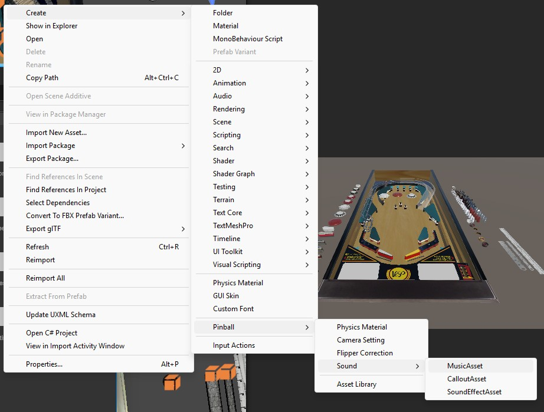
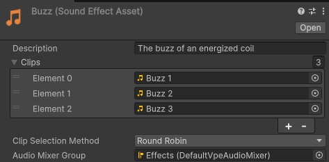
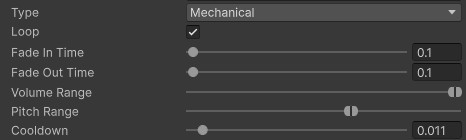

# Sound

Unity, the general purpose game engine VPE is built on top of, provides many
useful audio features out of the box. It can import and play several common
audio file formats, it supports directional audio and surround sound and
provides mixing and mastering functionality. For a comprehensive overview, refer
to the
[Unity documentation](https://docs.unity3d.com/6000.0/Documentation/Manual/Audio.html).
On top of this built in functionality, VPE provides some features specific to
pinball.

## Sound Assets

When you import a sound file into Unity by adding it to your project folder, you
get an
[Audio Clip](https://docs.unity3d.com/6000.0/Documentation/Manual/class-AudioClip.html).
You could create an
[Audio Source](https://docs.unity3d.com/6000.0/Documentation/Manual/class-AudioSource.html)
in your scene and play this clip directly, but VPE allows you to construct
different types of sound assets out of one or multiple of these audio clips to
produce variation and customize how the sound is played with pinball in mind.
VPE differentiates between sound effects, music and callouts.

To create a sound asset, navigate to the folder where you want to create it in
your Unity project panel, right click, select _Create -> Pinball -> Sound_
and choose the type of sound asset you want to create. All sound asset types
have the following properties:

- **Description**: You can enter any text here. This field is only for diplay.
  Use it to describe the sound, when it should be used, how it was recorded, or
  just leave it blank.
- **Clips**: A list of audio clips that may be selected for playback. For
  frequently played sounds, such as that of a bumper, you should provide
  multiple samples here.
- **Clip Selection Method**: How VPE decides which clip to choose each time the
  sound is played.
  - Round Robin: The clips will be played first to last in a fixed order.
  - Random: Clips are selected at random.
- **Audio Mixer Group**: The audio mixer group whose effects and settings will
  be applied to the sound asset when played. VPE comes with a default audio
  mixer group for each type of sound asset. This enables the VPE player
  application to provide global volume settings to end users across all tables.
  The default audio mixer is also responsible for reducing the volume of sound
  effects and music whenever a callout plays. Your table will lose these
  benefits if you use your own audio mixer groups.

### Sound Effects

Sound effects are the most common type of sound asset. You should generally
choose this type for any sounds other than callouts and music. In addition to
those described above, sound effect assets have the following properties:

- **Type**: In a real pinball machine, would this sound come from a mechanism
  (Mechanical) or from the speakers (Synthetic)? When a mechanical sound effect
  is played, VPE uses Unity's spatial audio system to position it in the scene
  according to the object that triggered it.
- **Loop**: Causes the sound to loop until it is stopped according to table
  logic. When enabled, additional options for fading in and out are available.
- **Volume Range** and **Pitch Range**: Two sliders with two control knobs each
  that indicate a range within which volume and pitch will be randomized each
  time the sound is played. This is a cheap way to produce variation if only one
  audio clip is available, but it will not sound as good as multiple samples.
- **Cooldown**: If the sound effect is triggered again before the specified
  number of seconds passes, it will not be played. This is to prevent sound
  effects from playing twice at the same time, for example when the ball hits
  two drop targets at once.

### Callouts

Callouts are short voice lines that are typically triggered when the player does
something special, like triggering multiball. The reason for the distinction
between callouts and sound effects is that callouts tend to be much more
significant to the player than other sounds. As such, their playback is managed
by a table-wide _Callout Coordinator_ component at the root of the table
hierarchy that ensures callouts are played one at a time. When triggering a
callout, you can select a priority. Whenever a callout is triggered while
another is playing, it will be placed in a queue to be played later. New
callouts will 'cut in line' in front of any lower priority callouts already in
the queue. Callouts also have their own audio mixer group that lowers the volume
of sound effects and music whenever a callout is played. (This is called
"ducking" in audio technician lingo.)

### Music

Like callouts, music is played indirectly through requests to a table-wide
_Music Coordinator_ at the root of the table hierarchy. This ensures your table
never plays multiple tracks at once, so you don't have to worry about that in
your game logic. Requests to the music coordinator are made with a priority. If
multiple requests are active at the same time, the one with the highest priority
will play. If multiple requests have the same priority, the most recent one is
played. If a new track starts while another is playing, the music coordinator
will cross-fade between them according to the _Fade Duration_ setting on the
music coordinator component. Music assets always loop: When an audio clip from a
music asset finishes, the next clip is chosen according to the clip selection
method specified in the asset. This allows you to build playlists using music
assets.

## Playback

Regardless of which game logic engine you use, VPE provides a few Unity
components to trigger the playback of sound assets. _Hit Sound_, _Coil Sound_
and _Switch Sound_ are intended to trigger mechanical sound effects when the
ball hits something, a coil is energized, or a switch is closed, respectively.
You can add these components to any game objects that have another component to
supply the appropriate events. For example, a bumper component supplies all
three, because bumpers can get hit and have both a coil and a switch. If the
coil or switch that should trigger the sound is part of a device with other
coils or switches, you must select it in the drop down menu on the sound
component. You can have as many sound components on one object as you want. If
you expect a sound to be triggered in quick succession, you may be interested in
the _Multi Play Mode_ setting. It specifies what to do when the sound is still
playing when it is triggered again. These are the options:

- **Play In Parallel**: Keep playing the previous sound and start another one at
  the same time.
- **Do Not Play**: Keep playing the previous sound and don't start another one.
- **Fade Out Previous**: Fade out the previous sound while starting a new one.
  If the sound is not a looping sound or its fade out time is zero, this is the
  same as _Stop Previous_.
- **Stop Previous**: Immediately stop the previous sound and start a new one.

Any sound that would come out of the speakers in a real pinball machine should
be driven by your game logic engine, but there is technically nothing stopping
you from triggering music or a callout when a switch is closed, for example.
Additionally, VPE provides the _Music Requester_ and _Callout Requester_
components for testing purposes. These components will trigger callouts and
music as soon as they are enabled and cancel the request when they are disabled.
To get some music playing as quickly as possible, simply add a music requester
component to an enabled object in your table hierarchy and assign a reference to
the music asset you want to play.
