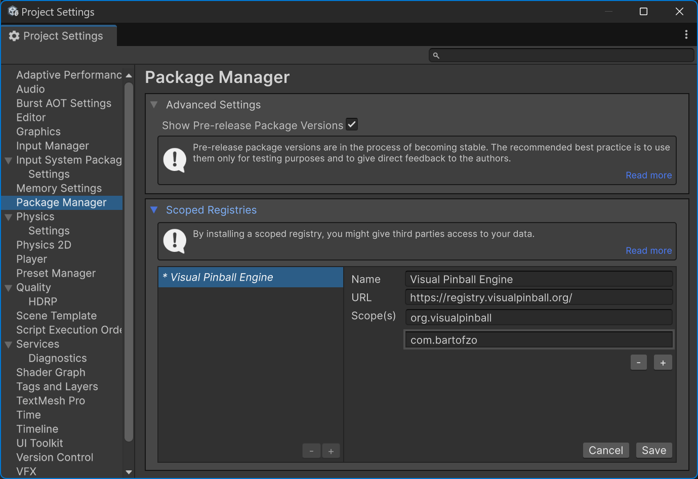
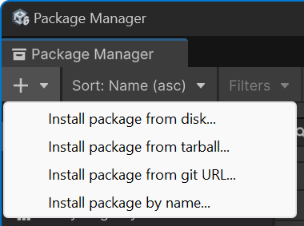

# Installing VPE

## Unity

In order to start creating or modifying tables with VPE, the first thing you'll need to do is install [Unity](https://unity3d.com/get-unity/download). You will need a Unity developer account, which is free.

> [!NOTE]
> As long as you don't use Unity for a game that makes $100K or more in revenue or funding a year, the free [Personal](https://store.unity.com/compare-plans) plan is sufficient for you.

Unity uses an application called *Unity Hub* to update itself and provide quick access to your projects. The install process is straight-forward and documented [here](https://docs.unity3d.com/Manual/GettingStartedInstallingHub.html) if you run into troubles.

When installing Unity, use the latest **2021.2** version. You can leave all the other options unchecked.

Once Unity is downloaded and installed, you're ready to create a new VPE project. Click on *New Project*, be sure to have selected the 2021.2 version at the top, and you'll see the following choices:

The relevant options for VPE are:

- **3D** - Unity's original built-in renderer.
- **3D (URP)** - Unity's [Universal Render Pipeline](https://docs.unity3d.com/Packages/com.unity.render-pipelines.universal@8.2/manual/index.html) is aimed at mobile and low-end platforms.
- **3D (HDRP)** - Unity's [High Definition Render Pipeline](https://docs.unity3d.com/Packages/com.unity.render-pipelines.high-definition@0.0.0/manual/index.html) used for high-end platforms.

We recommend using HDRP. It's what we're using when developing and should be the most stable pipeline. Alternatively if you're on a laptop don't have a beefy GPU, use the URP. The built-in renderer is legacy not recommended.

Next, enter a project name and a location for your project. We recommend putting the render pipeline into the name, because in the future you might want to test out other pipelines in their own projects.

Clicking *Create project* launches the Unity editor, pulls in all the dependencies for the new project, and compiles them. This will take a few minutes.

### HDRP Setup

Once the editor has opened you can click away the HDRP Wizard that opens. You should now see an empty scene:

Click on *File -> New Scene* and select the *Basic Indoors (HDRP)* template. Save it in your *Assets/Scenes* folder as `TestTable.unity`.

In this base scene there's a plane that will [Z-fight](https://en.wikipedia.org/wiki/Z-fighting) with our imported table later. Select it in the *Hierarchy* and move it down a little by setting the *Y Position* under *Transform* in the *Inspector* to `-0.1`. Your scene should now look like this:

Hit *Ctrl+S* to save your scene.

## VPE Package

Now that you have your project and scene set up, let's bring in the VPE libraries. VPE ships as a package that you can install using the [Package Manager](https://docs.unity3d.com/Manual/Packages.html) inside of Unity directly. However, since Unity's package registry is only used for official Unity content, we need to add our own registry first.

To do that, go to *Edit -> Project Settings*, and select the *Package Manager* panel on the left. Under *Scoped Registries*, add the following:

- Name: `Visual Pinball Engine`
- URL: `https://registry.visualpinball.org/`
- Scope(s): `org.visualpinball`

Also check *Enable Pre-release Packages* (and confirm), as well as *Show dependencies*. Your settings page should now look like this:

Hit *Save* and close the window. Now you'll add VPE's HDRP package, which will automatically pull in the core package and the assets package. 

Open the package manager by clicking on *Window -> Package Manager*. Then click on the "plus" icon on the top left corner of the window, and choose *Add package by name..*. 

There, enter `org.visualpinball.engine.unity.hdrp` and click *Add*. This will take a moment as Unity downloads and compiles all of VPE's dependencies and parses all the assets that we ship in our library. If during this time, you see the following warning about the input system:

Click *Yes*. 

> [!WARNING]
> Our patcher, which is currently part of the main package, depends on the PinMAME package. Until we move the patcher into a separate package, you will have to install the PinMAME package as well. To do that, click on the plus button again and enter `org.visualpinball.engine.pinmame`, then click on *Add*.

When complete, you should now have a *Visual Pinball* menu in the editor, and you should see the following new packages in the package manager (version numbers will vary):

Now that VPE is installed let's [import a table](xref:setup_running_vpe)!
