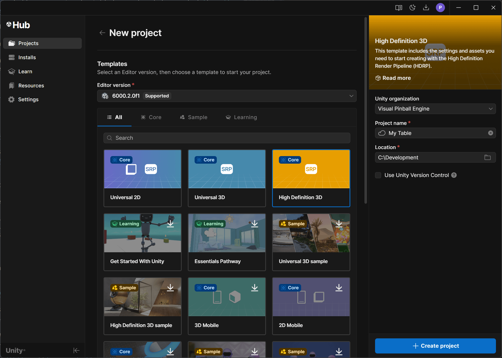

# Installing VPE

## Unity

In order to start creating or tweaking tables with VPE, the first thing you'll need to install is [Unity](https://unity3d.com/get-unity/download). You will need a developer account, which is free.

> [!NOTE]
> As long as you don't use VPE for a game that makes $100K or more in revenue or funding a year, the free [Personal](https://store.unity.com/compare-plans) plan is sufficient for you.

Unity uses an application called *Unity Hub* to update itself and provide quick access to your projects. The install process is straight-forward and documented [here](https://docs.unity3d.com/Manual/GettingStartedInstallingHub.html) if you run into troubles.

When installing Unity, use the latest **2020.1** version. You can leave all the other options unchecked.

Once Unity is downloaded and installed, you'll need to create a new project. Unity has multiple render pipelines, and you'll be asked which render pipeline to use in your project:

You'll have the choice between:

- **2D** - For 2D games. VPE doesn't support this renderer.
- **3D** - Unity's original built-in renderer.
- **High Definition RP** - Unity's new [HDRP](https://docs.unity3d.com/Packages/com.unity.render-pipelines.high-definition@0.0.0/manual/index.html), used for high-end platforms.
- **Universal Render Pipeline** - Unity's [URP](https://docs.unity3d.com/Packages/com.unity.render-pipelines.universal@8.2/manual/index.html) is aimed at mobile and low-end platforms.

We recommend using HDRP. It's not as mature as the built-in renderer, but it's able to achieve better visuals, and it's what Unity will be focusing on in the future.

> [!NOTE]
> If you're just creating a throw-away project for testing out gameplay, the built-in renderer is more tested and faster to set up. We also support the URP, but it's not as well tested as the other two pipelines.

Next, enter a project name and a location for your project. We recommend putting the render pipeline into the name, because in the future you might test out other pipelines and thus need to create additional projects.

> [!TIP]
> We recommend creating a `VPE` folder in your user directory (which is called `%userprofile%`), to contain all the VPE-related files. In this example that would be `%userprofile%\VPE\Test Table - HDRP`, which usually resolves to `C:\Users\{username}\VPE\Test Table - HDRP`.
>
> You're of course free to set this up however you want, but that's what we'll be referring to in the rest of the documentation.

Clicking *Create* launches the Unity editor, pulls in all the dependencies for the new project, and compiles them. This can take a minute or two.

### HDRP Setup

If you create an HDRP project, Unity provides you with a sample scene: 

It's best to start by removing the unneeded objects. In the hierarchy, select:

and press `delete`.

Similarly, to clean up the project, get rid of the extra assets in the project view:

## VPE Source Code

Now you have your project and scene set up, let's bring VPE into the project. Go to the GitHub page and [download the source code](https://github.com/freezy/VisualPinball.Engine). You can do that by clicking on the green *Code* button, and choosing *Downlaod ZIP*.

As mentioned above, we recommend extracting this into the `%userprofile%\VPE\VisualPinball.Engine` folder:

In Unity, go to *Window -> Package Manager*. Click on the "plus" icon on the top left corner of the window, and choose *Add package from disk*. Choose `package.json` in the root folder of the extracted VPE source code.

This will take a moment as Unity downloads and compiles all of VPE's dependencies. If during this time, you see the following warning:

Click *Yes*. When complete, you should now have a *Visual Pinball* menu in the editor.
