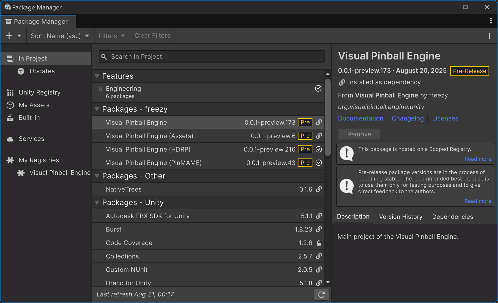

# Installing VPE

## Unity

In order to start creating or modifying tables with VPE, the first thing you'll need to do is install [Unity](https://unity3d.com/get-unity/download). You will need a Unity developer account, which is free.

> [!NOTE]
> As long as you don't use Unity for a game that makes $100K or more in revenue or funding a year, the free [Personal](https://store.unity.com/compare-plans) plan is sufficient for you.

Unity uses an application called *Unity Hub* to update itself and provide quick access to your projects. The install process is straight-forward and documented [here](https://docs.unity3d.com/Manual/GettingStartedInstallingHub.html) if you run into troubles.

When installing Unity, use the latest **2020.3** version. You can leave all the other options unchecked.

Once Unity is downloaded and installed, you're ready to create a new VPE project. Unity has multiple render pipelines, and you'll be asked which render pipeline to use:

You'll have the choice between:

- **2D** - For 2D games. VPE doesn't support this renderer.
- **3D** - Unity's original built-in renderer.
- **High Definition RP** - Unity's new [HDRP](https://docs.unity3d.com/Packages/com.unity.render-pipelines.high-definition@0.0.0/manual/index.html), used for high-end platforms.
- **Universal Render Pipeline** - Unity's new [URP](https://docs.unity3d.com/Packages/com.unity.render-pipelines.universal@8.2/manual/index.html) is aimed at mobile and low-end platforms.

We recommend using HDRP. It's not as mature as the built-in renderer, but it's able to achieve better visuals, and it's what Unity will be focusing on in the future.

> [!NOTE]
> If you're just creating a throw-away project for testing out gameplay, the built-in renderer is more mature and faster to set up. We also support the URP, but it's not as well tested as the other two pipelines.

Next, enter a project name and a location for your project. We recommend putting the render pipeline into the name, because in the future you might want to test out other pipelines in their own projects.

Clicking *Create* launches the Unity editor, pulls in all the dependencies for the new project, and compiles them. This will take a few minutes.

### HDRP Setup

If you create an HDRP project, Unity provides you with a sample scene: 

The sample scene is impressive but contains lots of content we don't need, so we're going to discard it and create a new one. Click on *File -> New Scene* and select the *Basic Indoors (HDRP)* template. Save it in your *Assets/Scenes* folder as `TestTable.unity`.

In this base scene there's a plane that will [Z-fight](https://en.wikipedia.org/wiki/Z-fighting) with our imported table later. Select it in the *Hierarchy* and move it down a little by setting the *Y Position* under *Transform* in the *Inspector* to `-0.1`. Your scene should now look like this:

Hit *Ctrl+S* to save your scene.

## VPE Package

Now that you have your project and scene set up, let's bring in the VPE libraries. VPE ships as a package that you can install using the [Package Manager](https://docs.unity3d.com/Manual/Packages.html) inside of Unity directly. However, since Unity's package registry is only used for official Unity content, we need to add our own registry first.

To do that, go to *Edit -> Project Settings*, and select the *Package Manager* panel on the left. Under *Scoped Registries*, add the following:

- Name: `Visual Pinball Engine`
- URL: `https://registry.visualpinball.org/`
- Scope(s): `org.visualpinball`

Your settings page should now look like this:

Hit *Save* and close the window. Now you'll add VPE's HDRP package, which will automatically pull in the core package and the assets package. 

Open the package manager by clicking on *Window -> Package Manager*. Then click on the "plus" icon on the top left corner of the window, and choose *Add package from git URL*. 

There, enter `org.visualpinball.engine.unity.hdrp` and click *Add*. This will take a moment as Unity downloads and compiles all of VPE's dependencies. If during this time, you see the following warning about the input system:

Click *Yes*. When complete, you should now have a *Visual Pinball* menu in the editor, and you should see the following new packages in the package manager (version numbers may vary):

Now that VPE is installed let's [import a table](xref:setup_running_vpe)!
