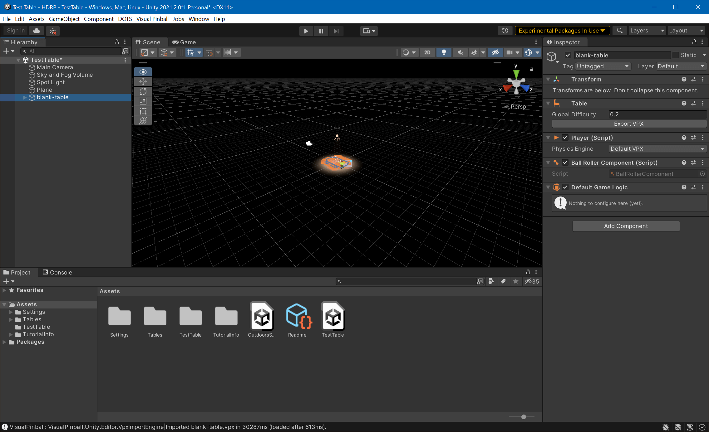
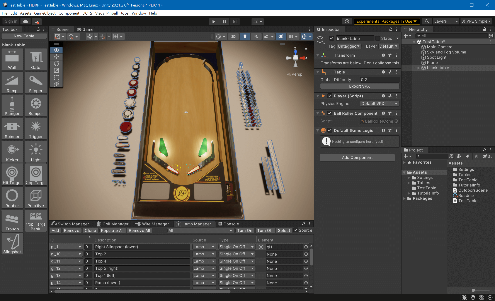

# Running VPE

Now we can get begin with some simple game play. Open [Visual Pinball](https://github.com/vpinball/vpinball), create a new "blank" table, and save it somewhere. In Unity, go to *Visual Pinball -> Import VPX* and choose the `.vpx` file you've just created.

You should now see Visual Pinball's blank table in the Editor's scene view:

Now, we don't see much of our table. That's because the scene view's camera doesn't really point on it. Using the right mouse button in the *Scene View* and the `A` `W` `S` `D` keys while keeping right mouse button pressed, fly somewhere you have a better view of the table.

> [!TIP]
> Check Unity's documentation on [Scene view navigation](https://docs.unity3d.com/Manual/SceneViewNavigation.html) for a more complete list of ways to move the camera around the scene.

Now that we have the camera of the scene view somewhat aligned, we still can't see much!

These orange artifacts are what Unity calls [Gizmo Icons](https://docs.unity3d.com/Manual/GizmosMenu.html). They are enabled by default, and since VPE uses icons for its playfield elements, they are all over the place. Unity's default gizmo size is adapted for rather large scenes and we're dealing with a pinball table, let's make them smaller by clicking on the gizmo icon in the *Scene* view, and pull the size *3D Icons* slider down until you're happy. You can additionally hide the VPE icons by clicking on *Visual Pinball -> Editor -> Disable Gizmo Icons*. 

And while we're at it, choose *Visual Pinball -> Editor -> Setup Layouts* to populate a bunch of pre-made editor layouts that give you easy access to the tooling we've added to the editor. Then, click on the top right drop down in the editor where it says *Default*, and choose *3) VPE Simple*.

Now that's better!

The view in the scene tab is not the camera used in game. The *Scene View* really allows you to fly anywhere, zoom in on things you're working on, switch from orthagonal view to perspective, and so on. It's where you get work done.

During game play, another camera is used. It's the one already in your scene hierarchy (called *Main Camera*), and you can look through it by switching to the [Game View](https://docs.unity3d.com/Manual/GameView.html) window.

This camera can be moved [using Unity's gizmos](https://docs.unity3d.com/Manual/PositioningGameObjects.html), by selecting it in the hierarchy and moving and tilting it around. 

> [!TIP]
> A quick way to fix the game camera is to align it with the scene view camera. To do that, select the camera in the hierarchy, then click on the *GameObject* menu and select *Align with view*.

Let's start the game by clicking on the play button. This will run your scene. Test that the shift keys move the flippers. `ENTER` will launch a ball. If you expand *Table1* in the hierarchy and select the *Trough*, you can watch its status in the inspector in real time. Cool!

You can also right-click on the scene view tab and select *Maximize*.

> [!TIP]
> If you want to enter play mode more quickly, you can check the experimental play mode option described [here](https://blogs.unity3d.com/2019/11/05/enter-play-mode-faster-in-unity-2019-3/).

One last thing: The game view is pretty static now. You can change that by dropping an [orbit script](https://gist.github.com/freezy/cd6a2371c90a84a7af850cab3b07b1ed) on the camera that lets you rotate and zoom in. If you're a Unity beginner, that would be your first exercise!
