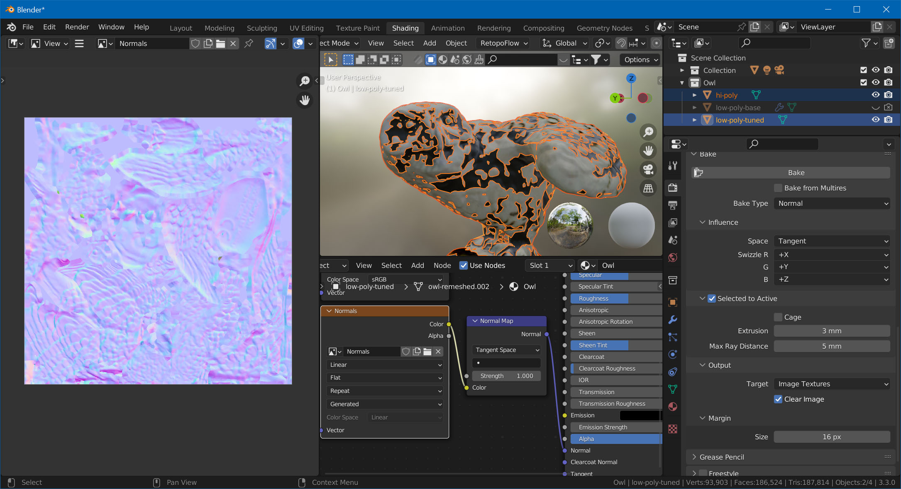

# Texture Baking

In this last part, we'll use the original mesh to bake the details of the geometry into a normal map. We'll also project the original texture (diffuse map) onto our new model.

## UV-Unwrap

But first, we need to UV-unwrap our low-poly mesh. Change to the *UV Editing* workspace in Blender, select the low-poly model, `TAB` into Edit Mode, hit `A` to select all, and choose *UV -> Smart UV Project*.

## Set Up Material

Before we bake anything, we'll set up the material. Go to the *Shading* workspace and assign a new material to the low-poly mesh. Then, set up the two maps we're going to bake. In the node editor:

1. Hit `Shift+A`, choose *Texture -> Image Texture*.
2. With the image texture selected, hit *Shift+D* to duplicate
3. On the first texture, click *New*, name it "Diffuse", and set the size to the same size as the texture of your original 3D scan.
4. On the second texture, also click *New*, name it "Normals", same size, but enable *32-bit Float*.
5. Hit `Shift+A` again, and add a *Normal Map* node.
6. Connect the "Diffuse" texture's *Color* to the principled BSDF node's *Base Color* input.
7. Connect the "Normal" texture's *Color* to the normal map's *Color* input.
6. Connect the normal map's *Normal* output to the BSDF node's *Normal* input.

Your graph should now look like this:

## Bake Normal Map

In the Outliner, make sure both the high-poly and the low-poly mesh are visible. Also, make sure that the low-poly object doesn't have any modifiers added (RetopoFlow might have added a *Mirror* and *Displace* modifier). Select in this order, while holding `Ctrl`:

1. The high-poly mesh
2. The low-poly mesh

Go to *Render Properties* and make sure *Cycles* is selected as the render engine. Then, scroll down to the *Bake* section.

- Set *Bake Type* to *Normal*
- Check *Selected to Active*
- In the node editor, select the "Normals" node.
- Hit *Bake*.

Depending on the size of your mesh, you'll also need to set *Extrusion* and *Max Ray Distance*. Values on 3mm and 5mm respectively worked for this example.

## Bake Diffuse Map

Now, select the "Diffuse" node in the node editor. Change *Bake Type* to *Diffuse*, uncheck *Direct* and *Indirect*, and hit *Bake* again.

That's it! Hide the high-poly mesh, and you've got your game-ready model!

