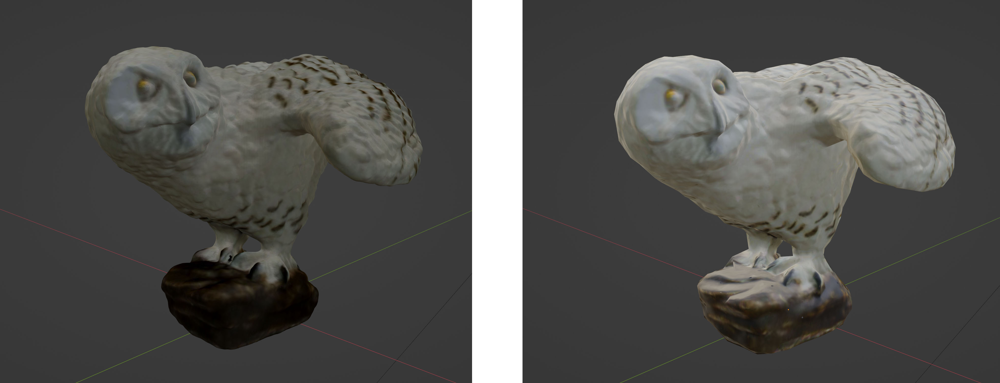

# Make a 3D Scan Game-Ready

In this tutorial we describe how to convert a 3D scan of toy into something that can be used as a game asset. It's not necessarily linked to VPE or even Unity, but there are many ways of doing it, and this flow has been working great so far.

## Overview

In general, there are multiple characteristics of a 3D scan that make it unsuitable for importing directly into a game engine:

- There is often noise, i.e. elements that aren't part of the actual object.
- Depending on the method of the 3D scan, the poly count of the model can be extremely high.
- The topology of the scanned mesh often isn't ideal.

This tutorial addresses all of those issues, by explaining how to:

- Clean up the mesh
- Reduce the poly count
- Retopologize the geometry
- Bake the lost geometry details into a normal map

We'll be using an owl toy that you can download [here](https://vpuniverse.com/files/file/11638-magic-girl-owl/) (props to Dazz for ordering and scanning the model).

<small><i>Left: Original scan, 1.86 mio triangles, right: Game-ready conversion, 1,400 triangles.</i></small>

## Prerequisites

- The 3D model you're converting.
- You should have a intermediate level in Blender.

## Workflow

1. [Clean up the mesh](xref:tutorial_3d_scan_1)
2. [Retopologize the mesh](xref:tutorial_3d_scan_2)
3. [Bake a normal map and a diffusion map](xref:tutorial_3d_scan_3)

