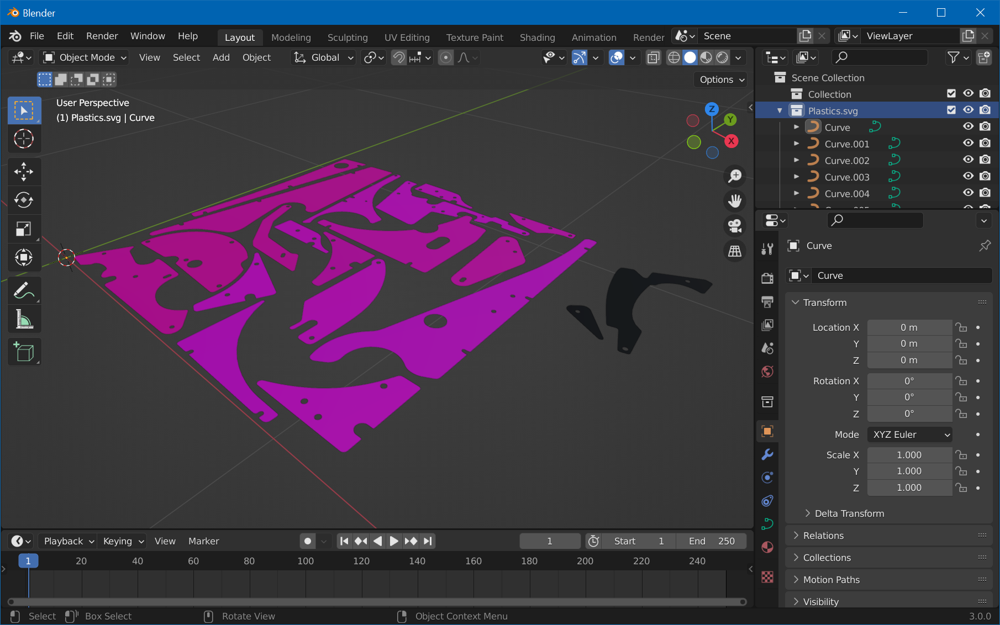
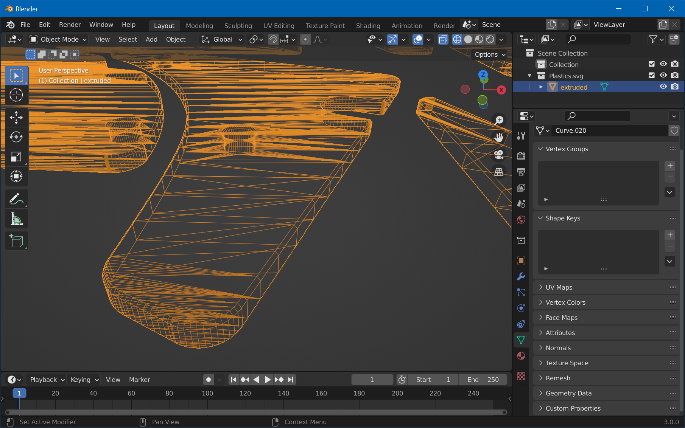
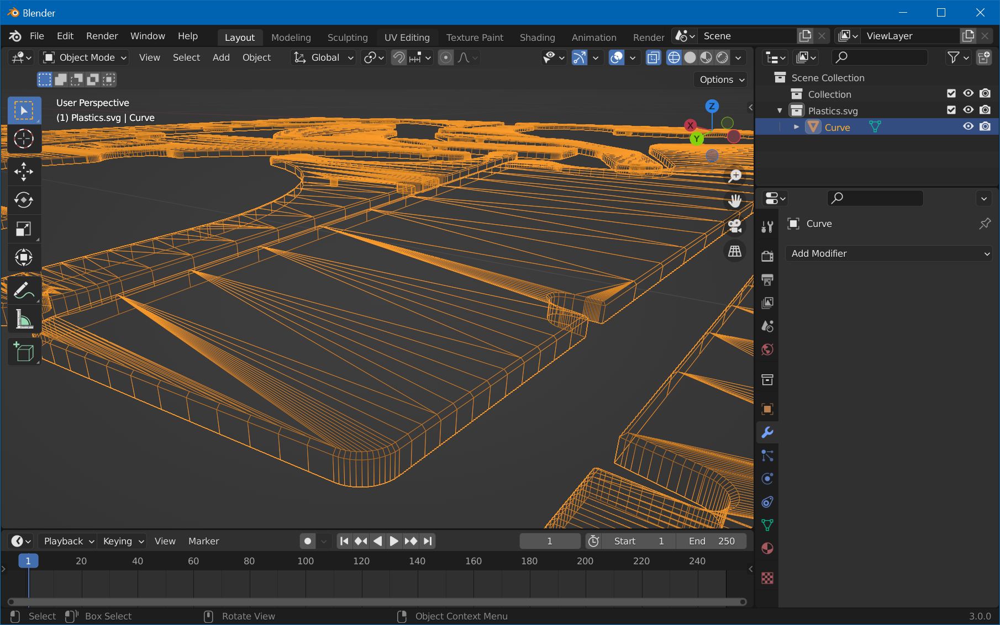
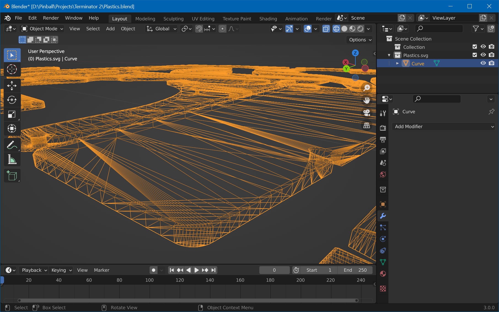

# Create Mesh

We're now going to import the SVG created in the [previous step](xref:plastics_with_blender_1) and create a mesh that is beveled on the top.

## Step 1: Import

Open Blender, clear the scene with `A`, `X`, `Enter`. Then, click on *File -> Import -> Scalable Vector Graphics (.svg)*, navigate to where you've saved the SVG in the previous step, select `Plastics.svg`, and hit *Import*.

You probably won't see much due to the imported size. If there were no errors, you should see your imported plastics in the Outliner. Select them and press numpad `.` while hovering over the 3D viewport to zoom in. 

> [!note]
> You might run into another issue due to the size of the plastics: Camera clipping. To fix that, press `N` with your cursor over the 3D Viewport, select *View* and set something like 0.001m for *Clip Start*.

Your viewport should look like this now:

## Step 2: Extrude

Before we start extruding, let's make it one single object so we can easily apply everyting we do in one step. Hit `A` for select all, then `Ctrl`+`J` for joining all curves.

Then, select the curve and click on the *Object Properties* tab in the *Properties* view on the right side. Under *Geometry*, there is an *Extrude* field, and a bit below a *Bevel* section.

Now, the *Extrude* value is difficult to judge. If you have access to the physical plastics, you can calculate the scale between the real world and the object in Blender by physically measuring the size of a plastic and dividing it by the measured value in Blender. Then, also measure the thickness of the real-world plastic and multiply it by that factor. Personally, I just eyeballed it and ended up with 0.004m for the *Extrude* value.

However, this when beveling, Blender actually adds the bevel depth to the object, so the size will grow. We recommend beveling about a fourth of the thickness, so if you measured the actual thickness, set the *Bevel Depth* under *Bevel* to about a fourth and multiply the *Extrude* value by 0.8.

Also be sure to set the *Resolution* of the bevel to 0. In wireframe mode, your mesh should now look like this:

## Step 3: Remove Lower Bevel

Next step is to convert the extruded curve to a mesh. Select the mesh, then *Object -> Convert -> Mesh*. 

We'll now remove the lower bevel by subtracting a cube from our mesh. Click on *Add -> Mesh -> Cube*. Resize the cube so it covers all plastics and move so it just covers the lower edges:

Select the plastics object, go to the *Modifiers* tab, *Add Modifier -> Boolean*. Make sure *Difference* is selected, then either pick or select the cube under *Object*. Then hit `Ctrl`+`A` to apply it. Select the cube and hit `X`, `Enter` to delete it.

The geometry of your meshes should now look like that:

## Step 4: Clean Up

Now, when extruding, Blender duplicated some of the geometry. In order to fix that,select the plastics, press `Tab` for edit mode, `A` to select all, and choose *Mesh -> Clean Up -> Merge by Distance*. Be sure to put a low enough value so you don't lose any geometry.

Secondly, you notice that the bottom planes have no geometry anymore. To fix that, enter object mode with *Tab*, select the *Modifier* tab in the properties window, press *Add Modifier* and choose *Triangulate*. Then press `Ctrl`+`A` to apply.

Your geometry should now look like that:

If that's the case, congrats, you're done with the meshes! Maybe now it's a good moment to save your Blender file. `Ctrl`+`S` and enter `Plastics.blend`. Now, let's [UV-Map them](xref:plastics_with_blender_3)!