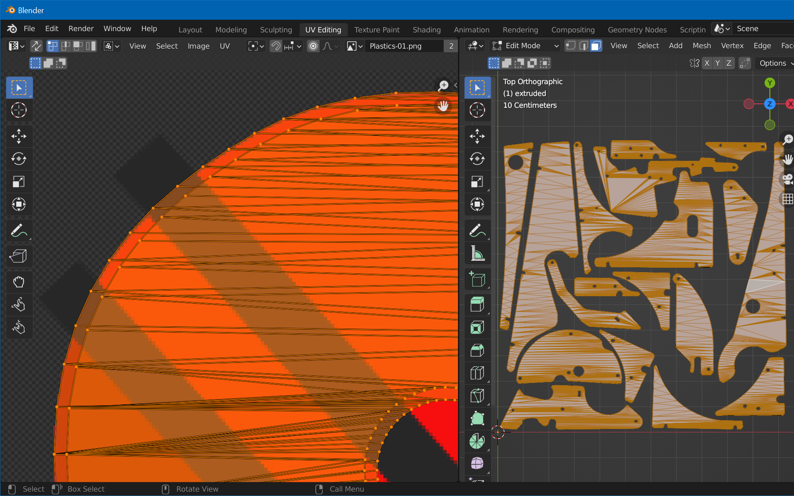

# UV-Map Mesh

## Step 1: Create Material Slots

 We need three material slots, for the top and bottom faces, as well as for the edges. We'll split the vertices by firstly assigning everything to an "edge" slot, and the re-assigning the top and bottom faces to their own slots.

In object mode, open *Materials* properties and remove the current material slot (hit `-`). Add three new slots (press `+`), and for each slot, create a new material by hitting the *New* button when the slot is selected. Name them "top", "bottom" and "edge" and set their base color to red, green and blue respectively. Your slots should now look like in the screenshot.

Set the 3D viewport to *Material Preview*. Select your mesh, press `Tab` to switch to edit mode. Press `A` to select all vertices, select the "edge" material slot, and hit *Assign*. Your plastics should turn blue. Press `A` twice to deselect everything.

Then, press `7` on the numpad to switch to top view, zoom in a bit so you can clearly see the triangles, switch to *Face Select* and click on one face of the top surface:

Click on *Select -> Select Similar -> Coplanar*, which should result in all top faces of all plastics being selected. However, that's probably not the case, since there's a threshold that might be too large. So expand the parameters and set it to a small enough value. Then, select the "top" material slot and hit *Assign*. The surfaces should turn red.

For the bottom faces, hit `7`, `9` on the numpad to switch to bottom view, and select again one face. Like before, select all faces with the same normal, click the "bottom" material slot, and *Assign*. You should see the bottom faces turn green.

Now, the "edges" material slot should only contain the edges. Check by unselecting all (`A` `A`), then selecting the "edge" material slot and hitting *Select*. This should only select the edges, like here:

In *Material Preview* mode, your meshes should now be colored like this (from top / bottom):

## Step 2: UV-Map

Switch to the *UV Editing* workspace. In the left *UV Editor*, choose *Image -> Open*, and select the exported `Plastic-01.png` you've created in part one. On the right, enter edit mode, click on the "top" material slot in the *Materials* property tab, and hit *Assign*. Select "bottom" and click on *Assign* again.

We're now going to UV-map both the top and bottom surface at once. Move your cursor to the left side, hit `A` and use the `G` and `S` keys to align the **outer** contour on top of your texture, like so:

## Step 3: Export

We still have a single object, so before exporting, let's split it. Still in edit mode in the 3D viewport, hit `A` to select all and choose *Mesh -> Separate -> By Loose Parts*.

Hit `Tab` to exit edit mode. Select *File -> Export -> FBX*. Name it `Plastics.fbx` and hit *Export FBX*.

Now let's import this into Unity!